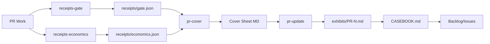

# Audit Path (15 Minutes)

This repo optimizes for **trusted change**: large diffs are normal; review happens via **bounded scope + receipts**, not line-by-line diff reading.

---

## 1. Run the Canonical Gate

The local gate is canonical. GitHub Actions are optional/advisory.

```bash
nix develop
cargo xtask selftest
```

If selftest is green, the governance contracts are intact. That's the first trust anchor.

---

## 2. Validate the Contracts (Schema + Docs)

```bash
cargo xtask check          # fmt, clippy, unit tests
cargo xtask docs-check     # version alignment, doc_index sync
```

These validate that documentation matches code and specs match implementation.

---

## 3. Read the Exhibits

Start with the curated exhibits in:

- [`docs/audit/CASEBOOK.md`](CASEBOOK.md) — Best examples of governed change
- [`docs/audit/FAILURE_MODES.md`](FAILURE_MODES.md) — What went wrong and how we hardened

---

## 4. How to Review Any PR

Every PR should have a **Cover Sheet** section with:

- **Scope map** — what changed (by directory/domain)
- **Receipts links** — paths to gate outputs, test results, evidence
- **Known limits / errata** — what's incomplete or was wrong
- **Reproduce command** — how to verify locally

See [`docs/audit/PR_COVER_SHEET.md`](PR_COVER_SHEET.md) for the canonical format.

---

## 5. Truth Surface Rules

This repo follows explicit rules about what can be claimed:

### Claims Must Be Backed by Receipts

A PR body can state:
- Absolute measurements + links to receipts
- Gate outcomes + links to receipts
- Bounded known limits

A PR body **cannot** state:
- Multipliers ("10x faster")
- "Enterprise-grade" / "production-ready" without a receipt
- Quality claims without falsifiable evidence

### Wrongness Is First-Class

If something was wrong, we record:
- **What** — the incorrect claim or behavior
- **How detected** — gate, reviewer, receipt that caught it
- **Fix** — commit/PR link
- **Prevention** — new gate/contract/test added

See the Errata section in PR cover sheets.

---

## 6. Receipt Locations

| Receipt Type | Location | Purpose |
|--------------|----------|---------|
| Gate outputs | `.runs/pr/<n>/<run-id>/receipts/gate.json` | Gate pass/fail evidence |
| Economics | `.runs/pr/<n>/<run-id>/receipts/economics.json` | DevLT + compute tracking |
| Dossiers | `.runs/pr/<n>/<run-id>/receipts/dossier.json` | Structured PR analysis |
| Exhibits | `docs/audit/EXHIBITS/PR-<n>.md` | Version-controlled cover sheets |

`.runs/` is ephemeral (gitignored). `docs/audit/` is durable (committed).

---

## 7. Quick Verification Commands

```bash
# Environment health
cargo xtask doctor

# Quick smoke test (validates template baseline)
cargo xtask kernel-smoke

# AC coverage (what's tested)
cargo xtask ac-status

# Full governance (11 steps)
cargo xtask selftest
```

---

## 8. What "Trusted" Means Here

**Local gate is canonical.** We do not rely on GitHub UI checkmarks.

- `cargo xtask selftest` is the final arbiter
- Receipts generated by xtask are the evidence
- PR cover sheets link to receipts, not prose claims

If you see "checks passed" language without receipt links, that's a red flag.

---

## 9. Generate/Update PR Cover Sheet

Mini-walkthrough for generating and publishing PR cover sheets:

```bash
# 1. Run gates and generate gate receipt
cargo xtask receipts-gate --pr 123

# 2. Record economics (time, compute, iterations)
cargo xtask receipts-economics --pr 123 \
  --author-minutes 30 --author-confidence estimated \
  --compute-usd 5.00 --compute-confidence estimated

# 3. Generate cover sheet from receipts (preview)
cargo xtask pr-cover --pr 123

# 4. Update PR body and save exhibit to docs/audit/EXHIBITS/
cargo xtask pr-update --pr 123 --save-exhibit

# Or dry-run first to see what would change
cargo xtask pr-update --pr 123 --dry-run
```

### Pipeline Diagram



Key points:
- `receipts-gate` runs validation gates and emits `receipts/gate.json`
- `receipts-economics` records DevLT + compute in `receipts/economics.json`
- `pr-cover` generates a cover sheet from receipts (stdout or file)
- `pr-update --save-exhibit` updates the PR body AND saves to `docs/audit/EXHIBITS/`
- Exhibits feed into the casebook and inform future work

---

## Next Steps

- **Review a PR:** Look for the Cover Sheet block and receipt links
- **Audit the factory:** Read `FAILURE_MODES.md` to see what's been hardened
- **Validate claims:** Run the reproduce commands yourself
