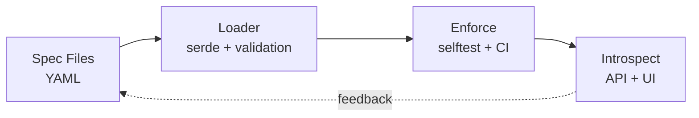
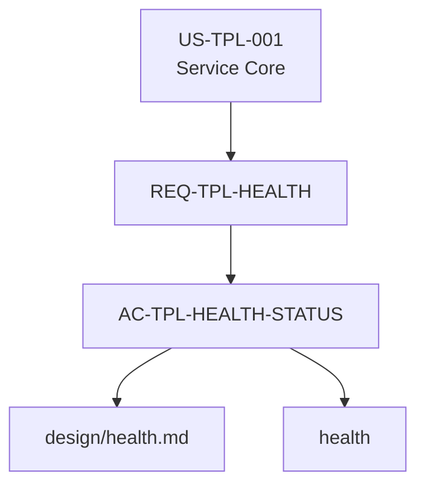

# Rust-as-Spec: Technical Overview

## Abstract

This template demonstrates a **specification-driven architecture** where runtime behavior, documentation, developer workflows, and governance policies are all derived from a single set of structured specs, enforced automatically by CI, and introspectable via HTTP APIs and a web UI.

The core insight: **if specs are machine-readable and type-checked, then the gap between "what we documented" and "what we built" becomes a compile error, not a documentation bug.**

---

## The Four-Phase Pipeline

Every aspect of governance flows through the same pipeline:



### Phase 1: Spec (The Source of Truth)

All governance contracts live in `specs/`:

| File | Purpose | Schema |
|------|---------|--------|
| [`spec_ledger.yaml`](file:///home/steven/code/Rust/Rust-Template/specs/spec_ledger.yaml) | Stories → Requirements → ACs | `SpecLedger` struct |
| [`devex_flows.yaml`](file:///home/steven/code/Rust/Rust-Template/specs/devex_flows.yaml) | Developer workflows (flows + commands) | `DevExFlows` struct |
| [`doc_index.yaml`](file:///home/steven/code/Rust/Rust-Template/specs/doc_index.yaml) | Documentation inventory with metadata | `DocIndex` struct |
| [`tasks.yaml`](file:///home/steven/code/Rust/Rust-Template/specs/tasks.yaml) | Work units with recommended sequences | `TasksSpec` struct |
| [`service_policies.yaml`](file:///home/steven/code/Rust/Rust-Template/specs/service_policies.yaml) | Compliance policies (OPA/Rego references) | Policy enforcement config |

**Key Constraint:** Specs are **not free-form**. They deserialize into Rust structs via `serde`, making invalid specs a compile error (or runtime parse error caught by `selftest`).

### Phase 2: Loader (Type-Safe Deserialization)

The [`spec-runtime`](file:///home/steven/code/Rust/Rust-Template/crates/spec-runtime) crate provides loaders for each spec:

```rust
// crates/spec-runtime/src/lib.rs
pub fn load_spec_ledger(path: &Path) -> Result<SpecLedger>;
pub fn load_devex_flows(path: &Path) -> Result<DevExFlows>;
pub fn load_doc_index(path: &Path) -> Result<DocIndex>;
pub fn load_tasks(path: &Path) -> Result<TasksSpec>;
```

**Validation happens here:**
- Required fields present?
- IDs unique?
- References valid (e.g., AC references existing REQ)?
- Schema constraints met (e.g., `must_have_ac` requirements have ACs)?

**Result:** If loading succeeds, the spec is structurally valid. If it fails, `selftest` fails, preventing merge.

### Phase 3: Enforce (7-Step Selftest + CI)

The [`cargo xtask selftest`](file:///home/steven/code/Rust/Rust-Template/crates/xtask/src/commands/selftest.rs) command is the **single mandatory gate** for all changes:

```bash
$ cargo xtask selftest
======================================
  Template Self-Test Suite
======================================

[1/7] Running core checks (fmt, clippy, tests)...
[2/7] Running BDD acceptance tests...
[3/7] Running AC status mapping & ADR references...
[4/7] Testing LLM context bundler...
[5/7] Running policy tests...
[6/7] Checking DevEx contract...
[7/7] Checking governance graph invariants...

✓ All self-tests passed!
```

Each step enforces a different contract:

| Step | What It Checks | Why It Matters |
|------|----------------|----------------|
| **1. Core** | `cargo fmt`, `cargo clippy`, `cargo test` | Code quality baseline |
| **2. BDD** | Cucumber scenarios in `specs/features/` | Behavior matches AC text |
| **3. AC Mapping** | Every AC has test tags; every ADR referenced exists | Traceability |
| **4. Bundle** | LLM context bundles generate without error | Agent safety |
| **5. Policies** | OPA/Rego policies pass against test data | Compliance |
| **6. DevEx** | Required commands exist and are reachable via flows | Usability |
| **7. Graph** | Governance graph has no orphans/missing ACs | Structural integrity |

**Critical Insight:** Step 7 (graph invariants) catches drift that humans miss:
- Requirements with `must_have_ac: true` but no ACs → **blocked**
- Required commands not part of any flow → **blocked**
- Docs referenced but missing from disk → **blocked**

### Phase 4: Introspect (APIs + UI)

The same specs loaded by `selftest` are exposed at runtime via [`app-http`](file:///home/steven/code/Rust/Rust-Template/crates/app-http):

**HTTP APIs** (`/platform/*`):
```bash
GET /platform/status       # Governance health metrics
GET /platform/graph        # Full dependency graph (JSON)
GET /platform/tasks        # Available work units
GET /platform/tasks/suggest-next?task=X  # Context-aware guidance
GET /platform/devex/flows  # Developer workflows
GET /platform/docs/index   # Documentation inventory
```

**Web UI** (`/ui`):
```bash
GET /ui                    # Dashboard (health + metrics)
GET /ui/graph              # Interactive Mermaid visualization
GET /ui/flows              # Flows + tasks explorer
```

**Key Property:** UI never maintains state. It calls the same `load_spec_ledger` / `load_devex_flows` functions that `selftest` uses. **If the UI shows it, CI enforces it.**

---

## Comparison to Alternatives

### vs. SpecKit / OpenAPI / AsyncAPI

| Feature | SpecKit/OpenAPI | Rust-as-Spec |
|---------|-----------------|--------------|
| **Scope** | API contracts only | End-to-end governance (behavior + docs + workflows) |
| **Validation** | Linting tools (separate from CI) | Embedded in CI (selftest) |
| **Governance** | Optional | Mandatory (graph invariants) |
| **Agent Interface** | Swagger UI | `/platform/*` + `suggest-next` + skills |
| **Type Safety** | JSON Schema (runtime) | Rust `serde` (compile time) |

**When to use SpecKit:** You only need API contract validation.  
**When to use Rust-as-Spec:** You need full governance (AC ↔ code ↔ docs ↔ policies).

### vs. Backstage / Port / OpsLevel

| Feature | Backstage | Rust-as-Spec |
|---------|-----------|--------------|
| **Deployment** | Centralized SaaS/self-hosted portal | Embedded in each service |
| **Catalog** | Manual YAML or API syncs | Auto-derived from specs (no drift) |
| **Governance** | Scorecards (manual scoring) | Selftest (auto-enforced) |
| **Adoption** | Org-wide rollout | Per-service clone |
| **Cost** | Heavy (infrastructure + maintenance) | Zero (compiles into binary) |

**When to use Backstage:** You need a **fleet-wide** service catalog.  
**When to use Rust-as-Spec:** You need a **per-service** governance cell that maintains itself.

*Note:* These are complementary. You could build a Backstage plugin that reads `/platform/*` APIs from multiple Rust-as-Spec services.

### vs. Zero to Production in Rust (zero2prod)

| Feature | zero2prod | Rust-as-Spec |
|---------|-----------|--------------|
| **Focus** | Production-ready patterns | Governance-first patterns |
| **BDD** | Not emphasized | Core workflow |
| **Policies** | Not included | OPA/Rego enforced |
| **Specs** | Informal (comments/docs) | Formal (YAML → structs) |
| **Agent Interface** | None | `/platform/*` + skills |

**When to use zero2prod:** You want production Rust patterns without governance overhead.  
**When to use Rust-as-Spec:** You're in a regulated/multi-team environment where governance is non-negotiable.

---

## Deep Dive: The Governance Graph

The **governance graph** is the centerpiece of phase 3 (Enforce).

### What Is It?

A directed graph where:
- **Nodes** = Stories, Requirements, ACs, Docs, Commands, Flows
- **Edges** = Relationships (`contains`, `implements`, `uses`, `documents`)

Built in [`spec-runtime/src/graph.rs`](file:///home/steven/code/Rust/Rust-Template/crates/spec-runtime/src/graph.rs):

```rust
pub struct Graph {
    pub nodes: Vec<Node>,
    pub edges: Vec<Edge>,
}

pub struct Node {
    pub id: String,
    pub node_type: String,  // "story", "requirement", "ac", etc.
    pub label: String,
    pub meta: NodeMeta,     // e.g., must_have_ac flag
}

pub struct Edge {
    pub source: String,
    pub target: String,
    pub edge_type: String,  // "contains", "implements", etc.
}
```

### Why It Matters

The graph enables **structural invariant checks** that catch drift:

1. **REQ_HAS_NO_AC**: Requirements with `must_have_ac: true` must have at least one AC
2. **COMMAND_UNREACHABLE**: Required DevEx commands must be part of at least one flow
3. *(Future)* **DOC_ORPHANED**: Docs must be linked to at least one REQ/ADR

**Example violation:**

```yaml
# specs/spec_ledger.yaml
- id: REQ-TPL-NEW-FEATURE
  must_have_ac: true
  acceptance_criteria: []  # ❌ EMPTY
```

**Selftest output:**

```
[7/7] Checking governance graph invariants...
  ✗ Graph invariants failed

Violations:
  [REQ_HAS_NO_AC] Requirement REQ-TPL-NEW-FEATURE has no ACs in graph
```

**Result:** Cannot merge until AC is added.

### Visualization

The graph is rendered as Mermaid via `graph.to_mermaid()`:



This powers the `/ui/graph` view, making governance **visible**, not just **enforced**.

---

## Deep Dive: Context-Aware `suggest-next`

Traditional task systems tell you "what to do" but not "what's already done."

`suggest-next` tracks **step status**:

```rust
pub enum StepStatus {
    Pending,
    Satisfied,
}

pub enum Action {
    Command {
        cmd: String,
        summary: String,
        status: StepStatus,
    },
    Edit {
        hint: String,
        summary: String,
        status: StepStatus,
    },
}
```

**Stateful checks** (in [`tasks.rs`](file:///home/steven/code/Rust/Rust-Template/crates/spec-runtime/src/tasks.rs)):

| Step | Check | Satisfied If |
|------|-------|--------------|
| `ac-new` | Does AC exist in ledger? | `spec_ledger.yaml` contains AC ID |
| `bundle` | Does bundle file exist? | `.llm/bundle/{task}.md` exists |
| `sbom-local` | Does SBOM exist? | `sbom.spdx.json` exists |
| `Edit specs/spec_ledger.yaml` | AC present? | Same as `ac-new` |

**Result:**

```bash
$ cargo xtask suggest-next --task implement_ac
  1. ✓ cargo xtask ac-new ...         (satisfied)
  2. ✓ Edit specs/spec_ledger.yaml   (satisfied)
  3.   Edit specs/features/*.feature  (pending)
  4. ✓ cargo xtask bundle ...         (satisfied)
  5.   cargo xtask bdd                (pending)
  6.   cargo xtask selftest           (pending)
```

**Agent Benefit:** An LLM can call `/platform/tasks/suggest-next?task=implement_ac` and immediately know:
- What steps remain
- What artifacts already exist
- What commands to run next

No hallucination. No redundant work.

---

## Deep Dive: Self-Healing UI

The Web UI is **not a separate product**. It's a **projection** of the specs.

### Architecture

```
┌─────────────────────────────────────────┐
│  Browser (htmx + mermaid.js)            │
└────────────────┬────────────────────────┘
                 │ GET /ui, /ui/graph, etc.
                 ▼
┌─────────────────────────────────────────┐
│  app-http (maud templates)              │
│  ┌─────────────────────────────────┐   │
│  │ ui::dashboard() {                │   │
│  │   let specs = load_all_specs();  │   │
│  │   let tasks = load_tasks();      │   │
│  │   render_html(specs, tasks)      │   │
│  │ }                                 │   │
│  └─────────────────────────────────┘   │
└────────────────┬────────────────────────┘
                 │ calls
                 ▼
┌─────────────────────────────────────────┐
│  spec-runtime                           │
│  ┌─────────────────────────────────┐   │
│  │ load_spec_ledger()               │   │
│  │ load_devex_flows()               │   │
│  │ load_tasks()                     │   │
│  │ build_graph()                    │   │
│  └─────────────────────────────────┘   │
└────────────────┬────────────────────────┘
                 │ reads
                 ▼
┌─────────────────────────────────────────┐
│  specs/*.yaml (on disk)                 │
└─────────────────────────────────────────┘
```

**Key Property:** The UI has **no database**, **no cache**, **no state**.

Every page load calls `load_spec_ledger()` fresh. This means:
- UI never shows stale data
- UI can't drift from CI (both use same loaders)
- Editing specs → refresh page → changes visible immediately

### Type Safety via Maud

HTML is generated via Rust macros:

```rust
html! {
    .card {
        h2 { "Platform Health" }
        .metrics {
            .metric {
                .metric-label { "Stories" }
                .metric-value { (specs.ledger.stories.len()) }
            }
        }
    }
}
```

**Benefits:**
- Typo in CSS class? → Compile error (if checked by linter)
- Wrong data type? → Compile error (e.g., can't pass `String` where `usize` expected)
- Missing field? → Compile error (specs must have `.ledger.stories`)

**Contrast with traditional templates (Jinja/ERB):**
- Runtime errors for typos
- No type checking of data passed to template
- Easy to render stale/invalid data

---

## Deep Dive: Policy as Code (OPA/Rego)

Governance policies are **declarative** and **testable**.

### Policy Structure

Each policy area has:
1. A `.rego` file defining rules ([`policy/ledger.rego`](file:///home/steven/code/Rust/Rust-Template/policy/ledger.rego))
2. Test fixtures in [`policy/testdata/`](file:///home/steven/code/Rust/Rust-Template/policy/testdata)
3. A `conftest` runner invoked by `cargo xtask policy-test`

### Example: Ledger Policy

```rego
# policy/ledger.rego
package ledger

# Every AC must have at least one test
deny[msg] {
    ac := input.stories[_].requirements[_].acceptance_criteria[_]
    count(ac.tests) == 0
    msg := sprintf("AC %v has no tests", [ac.id])
}
```

**Test fixtures:**

```yaml
# policy/testdata/ledger_valid.json
{
  "stories": [{
    "requirements": [{
      "acceptance_criteria": [{
        "id": "AC-001",
        "tests": [{"type": "bdd"}]
      }]
    }]
  }]
}
```

```yaml
# policy/testdata/ledger_missing_tests.json
{
  "stories": [{
    "requirements": [{
      "acceptance_criteria": [{
        "id": "AC-001",
        "tests": []  # ❌ Violates policy
      }]
    }]
  }]
}
```

### Enforcement

`cargo xtask policy-test`:
1. Loads policy files
2. Runs `conftest test` against each fixture
3. Expects `_valid` fixtures to pass, `_invalid` to fail
4. Writes `target/policy_status.json` with results
5. Exposes status via `/platform/status`

### Why This Matters

Policies are:
- **Versionable**: Lives in Git, not a separate system
- **Testable**: Unit tests for compliance rules
- **Portable**: Same OPA/Rego used by K8s, Terraform, Envoy

---

## Risks and Limitations

### Current Gaps

1. **No multi-service orchestration**: This template governs a **single service**. Fleet-wide governance requires Backstage or similar.
2. **No rollback**: If a bad spec merges, you must revert the commit. No "undo" button in UI.
3. **No auth/authz**: UI assumes local-only or trusted network. Multi-tenant use requires adding authentication.
4. **Limited policy coverage**: Current policies are examples. Real compliance (PCI-DSS, HIPAA) requires domain experts.

### Known Trade-offs

| Decision | Benefit | Cost |
|----------|---------|------|
| YAML for specs | Human-readable | Verbose; easy to make structural errors |
| Rust for runtime | Type-safe; fast | Less accessible to non-Rust teams |
| Selftest as single gate | Simple CI config | Long feedback loop if step 7 fails |
| No GraphQL | Simple APIs | Clients fetch more data than needed |
| Server-side UI (maud) | Zero build step | Less rich interactivity than SPA |

### Anti-Patterns to Avoid

> [!CAUTION]
> **Do not bypass selftest.** The entire architecture assumes specs → runtime is validated before merge.

> [!CAUTION]
> **Do not add state to the UI.** The moment the UI has a database or cache, it can drift from specs.

> [!CAUTION]
> **Do not make graph invariants too strict.** Overly rigid rules will frustrate developers. Use pilot feedback to calibrate.

---

## Future Enhancements (Tier 2+)

Based on pilot feedback, we may add:

**Tier 2: Enhanced UI**
- Kanban board (columns derived from AC/test status)
- Code tree view (modules mapped to ACs)
- Inline spec editing (generates patches, not direct writes)

**Tier 3: Agent Skills**
- `.claude/skills/` for LLM-native, governance-bounded workflows
- `AGENT_GUIDE.md` as system prompt
- Skill validation via selftest

**Tier 4: Fleet Governance**
- Backstage plugin reading `/platform/*` from multiple services
- Cross-service drift detection
- Centralized policy enforcement

**Tier 5: Advanced Policies**
- PCI-DSS / HIPAA compliance packs
- Supply chain security (SBOM validation)
- License compliance automation

---

## Conclusion

**Rust-as-Spec** is not just a template. It's a **reference architecture** for:

- **Type-safe governance**: Specs are code; invalid specs are compile errors
- **Self-healing systems**: UI/API derived from same source as CI; no drift possible
- **Agent-friendly platforms**: Structured APIs + deterministic validation = safe LLM augmentation

The four-phase pipeline (Spec → Loader → Enforce → Introspect) provides a **systematic answer** to:
- How do we keep docs current?
- How do we prevent governance bypass?
- How do we make systems legible to both humans and LLMs?

**Next step:** Pilot this architecture in real services and refine based on friction log.

---

## References

- [ROADMAP.md](file:///home/steven/code/Rust/Rust-Template/docs/ROADMAP.md) - Strategic direction and pilot plan
- [ADR-0004](file:///home/steven/code/Rust/Rust-Template/docs/adr/0004-platform-introspection-contract.md) - Platform introspection API design
- [ADR-0006](file:///home/steven/code/Rust/Rust-Template/docs/adr/0006-graph-first-governance.md) - Graph-based governance rationale
- [Selftest Command](file:///home/steven/code/Rust/Rust-Template/crates/xtask/src/commands/selftest.rs) - Implementation of 7-step validation
- [Spec Runtime](file:///home/steven/code/Rust/Rust-Template/crates/spec-runtime) - Core loaders and graph logic
