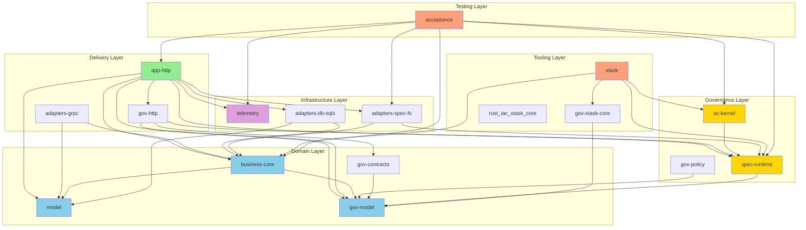

# Rust-Template Architecture Assessment

**Version:** v3.3.12 | **Kernel Baseline:** v3.3.9-kernel  
**Date:** 2025-12-26 | **Assessment Type:** Release Readiness

---

## Executive Summary

The Rust-Template project implements a sophisticated "Rust-as-Spec Platform Cell" with opinionated defaults for regulated/multi-team environments. The architecture demonstrates strong adherence to hexagonal/clean architecture principles with comprehensive governance, spec-as-code, and BDD testing frameworks.

**Overall Assessment:** The architecture is well-structured, mature, and ready for release. The modular design, clear separation of concerns, and comprehensive governance framework provide a solid foundation for regulated environments.

---

## 1. Workspace Structure

### 1.1 Workspace Configuration

The workspace uses Cargo resolver v2 with 18 crates organized under [`crates/`](../crates/):

- **Edition:** Rust 2024
- **MSRV:** 1.89.0
- **License:** Apache-2.0 OR MIT (dual-licensed)
- **Publish:** Private (workspace crates are internal)

### 1.2 All Crates and Purposes

| Crate | Purpose | Layer |
|-------|---------|-------|
| [`app-http`](../crates/app-http/) | HTTP application layer with Axum | Adapter (Delivery) |
| [`xtask`](../crates/xtask/) | Development tooling CLI | Tooling |
| [`acceptance`](../crates/acceptance/) | BDD tests (Cucumber/Gherkin) | Testing |
| [`ac-kernel`](../crates/ac-kernel/) | AC governance logic and status tracking | Governance |
| [`business-core`](../crates/business-core/) | Domain logic and ports | Domain |
| [`model`](../crates/model/) | Shared domain types | Domain |
| [`telemetry`](../crates/telemetry/) | Cross-cutting observability | Infrastructure |
| [`spec-runtime`](../crates/spec-runtime/) | Spec loading and validation | Infrastructure |
| [`adapters-db-sqlx`](../crates/adapters-db-sqlx/) | PostgreSQL adapter | Adapter (Infrastructure) |
| [`adapters-grpc`](../crates/adapters-grpc/) | gRPC adapter (Tonic) | Adapter (Delivery) |
| [`adapters-spec-fs`](../crates/adapters-spec-fs/) | File system spec adapter | Adapter (Infrastructure) |
| [`gov-model`](../crates/gov-model/) | Governance domain types | Domain |
| [`gov-policy`](../crates/gov-policy/) | Rego policy bundle and runner | Governance |
| [`gov-http`](../crates/gov-http/) | Platform HTTP router | Adapter (Delivery) |
| [`gov-contracts`](../crates/gov-contracts/) | Governance contracts and schemas | Domain |
| [`gov-xtask-core`](../crates/gov-xtask-core/) | Governance xtask utilities | Tooling |
| [`rust_iac_config`](../crates/rust_iac_config/) | YAML-based IaC config library | Infrastructure |
| [`rust_iac_xtask_core`](../crates/rust_iac_xtask_core/) | IaC xtask orchestration | Tooling |

---

## 2. Dependency Graph

### 2.1 Dependency Flow



### 2.2 Key Dependency Observations

1. **Correct Inward Flow:** [`app-http`](../crates/app-http/Cargo.toml) → [`business-core`](../crates/business-core/Cargo.toml) (correct, never reverse)
2. **Governance Independence:** [`gov-model`](../crates/gov-model/Cargo.toml) has minimal dependencies (only serde, thiserror)
3. **Spec Runtime Centrality:** [`spec-runtime`](../crates/spec-runtime/Cargo.toml) is used by both delivery and governance layers
4. **Clean Separation:** [`business-core`](../crates/business-core/Cargo.toml) has no HTTP, database, or infrastructure dependencies

---

## 3. Architecture Quality Assessment

### 3.1 Modularization and Separation of Concerns

#### Strengths

1. **Hexagonal Architecture (ADR-0001)**
   - Clear separation between adapters, domain, and infrastructure
   - Ports defined in [`business-core`](../crates/business-core/src/lib.rs) (e.g., [`TaskRepository`](../crates/business-core/src/lib.rs:29))
   - Adapters implement ports (e.g., [`adapters-spec-fs`](../crates/adapters-spec-fs/src/lib.rs))
   - Dependency direction enforced by Cargo workspace

2. **Layered Structure**
   ```
   Delivery Layer (app-http, adapters-grpc, gov-http)
         ↓
   Domain Layer (business-core, model, gov-model, gov-contracts)
         ↓
   Infrastructure Layer (telemetry, spec-runtime, adapters-*)
         ↓
   Governance Layer (ac-kernel, gov-policy)
         ↓
   Tooling Layer (xtask, gov-xtask-core, rust_iac_xtask_core)
   ```

3. **Governance as First-Class Concern**
   - Dedicated governance crates: [`ac-kernel`](../crates/ac-kernel/), [`gov-model`](../crates/gov-model/), [`gov-policy`](../crates/gov-policy/), [`gov-http`](../crates/gov-http/)
   - State machine for task status with enforced transitions ([`TaskStatus`](../crates/gov-model/src/lib.rs:49))
   - Repository pattern for governance persistence ([`GovernanceRepository`](../crates/gov-model/src/lib.rs:154))

4. **Spec-as-Code (ADR-0003)**
   - [`spec_ledger.yaml`](../specs/spec_ledger.yaml) as single source of truth
   - BDD features in [`specs/features/`](../specs/features/)
   - AC-to-test mapping enforced by [`ac-status`](../crates/xtask/src/commands/ac_status.rs) command

#### Concerns

1. **Dual Task Models**
   - [`model::TaskStatus`](../crates/model/) (3-state: Pending/InProgress/Completed) for CRUD examples
   - [`gov-model::TaskStatus`](../crates/gov-model/src/lib.rs:49) (4-state: Todo/InProgress/Review/Done) for production governance
   - This creates potential confusion about which to use

2. **Re-exports in business-core**
   - [`business-core`](../crates/business-core/src/lib.rs) re-exports [`gov-model`](../crates/gov-model/) types for backward compatibility
   - This creates a dependency that may be unnecessary

### 3.2 Proper Layering

#### Adapters Layer
- [`app-http`](../crates/app-http/src/lib.rs): HTTP adapter with Axum, handles routing, middleware, serialization
- [`adapters-grpc`](../crates/adapters-grpc/): gRPC adapter with Tonic (optional)
- [`adapters-db-sqlx`](../crates/adapters-db-sqlx/): PostgreSQL adapter with SQLx
- [`adapters-spec-fs`](../crates/adapters-spec-fs/): File system adapter for specs

#### Domain Layer
- [`business-core`](../crates/business-core/src/lib.rs): Pure business logic, defines ports
- [`model`](../crates/model/): Shared domain types
- [`gov-model`](../crates/gov-model/src/lib.rs): Governance domain types
- [`gov-contracts`](../crates/gov-contracts/): Governance contracts and schemas

#### Infrastructure Layer
- [`telemetry`](../crates/telemetry/): Observability (tracing, metrics, OTLP)
- [`spec-runtime`](../crates/spec-runtime/src/lib.rs): Spec loading, validation, graph building

#### Governance Layer
- [`ac-kernel`](../crates/ac-kernel/src/lib.rs): AC governance logic, coverage parsing
- [`gov-policy`](../crates/gov-policy/): Rego policy bundle and runner

#### Tooling Layer
- [`xtask`](../crates/xtask/): Development CLI with 60+ commands
- [`gov-xtask-core`](../crates/gov-xtask-core/): Governance utilities
- [`rust_iac_xtask_core`](../crates/rust_iac_xtask_core/): IaC orchestration

### 3.3 Architecture Support for Stated Goals

The architecture effectively supports the stated goals:

1. **Regulated Environments:** Comprehensive governance, AC tracking, policy enforcement
2. **Multi-Team Environments:** Clear boundaries, spec-as-code, automated validation
3. **Spec-as-Source-of-Truth:** [`spec_ledger.yaml`](../specs/spec_ledger.yaml), BDD features, automated mapping
4. **LLM/Agent-First:** Bundles, Skills, Agents, `/platform/agent/hints` endpoint
5. **IDP Integration:** `/platform/*` introspection APIs, [`idp-snapshot`](../crates/xtask/src/commands/idp_snapshot.rs) command

---

## 4. Configuration and Specifications

### 4.1 Specs Directory Structure

```
specs/
├── ac_report.schema.json          # AC report schema
├── config_schema.yaml            # Configuration schema
├── contracts_manifest.yaml        # Contracts manifest
├── devex_flows.yaml             # Developer flows and commands
├── doc_index.yaml                # Documentation index
├── doc_policies.yaml             # Documentation policies
├── friction_schema.yaml          # Friction log schema
├── platform_schema.yaml          # Platform schema
├── privacy.yaml                  # Privacy policy
├── questions_schema.yaml         # Questions schema
├── required_checks.yaml           # Required CI checks
├── service_metadata.yaml         # Service metadata
├── service_policies.yaml         # Service policies
├── spec_ledger.yaml              # Main spec ledger (stories/REQs/ACs)
├── tasks_state.yaml              # Machine-managed task state
├── tasks.yaml                   # Task definitions
├── ui_contract.yaml              # UI contract
├── version_manifest.yaml         # Version manifest
├── xtask_commands.yaml          # xtask command specs
├── db/                          # Database schemas
├── events/                       # Event schemas
├── features/                     # BDD features
├── governance/                   # Governance specs
├── graphql/                      # GraphQL schemas
├── openapi/                      # OpenAPI specs
├── proto/                        # Protocol buffers
└── userstories/                  # User story specs
```

### 4.2 Key Architectural Decision Records (ADRs)

| ADR | Title | Status |
|-----|-------|--------|
| [ADR-0001](../docs/adr/0001-hexagonal-architecture.md) | Hexagonal Architecture via Workspace Crates | Accepted |
| [ADR-0002](../docs/adr/0002-nix-first-dev-env.md) | Nix-First Development Environment | Accepted |
| [ADR-0003](../docs/adr/0003-spec-and-bdd-as-source-of-truth.md) | Spec Ledger and BDD as Source of Truth | Accepted |
| [ADR-0004](../docs/adr/0004-policy-and-llm-governance.md) | Policy and LLM Governance | Accepted |
| [ADR-0005](../docs/adr/0005-xtask-selftest-single-gate.md) | xtask Selftest Single Gate | Accepted |
| [ADR-0006](../docs/adr/0006-supply-chain-hardening.md) | Supply Chain Hardening | Accepted |
| [ADR-0007](../docs/adr/0007-dependency-security-health.md) | Dependency Security Health | Accepted |
| [ADR-0016](../docs/adr/0016-idp-tiles-json-contracts.md) | IDP Tiles JSON Contracts | Accepted |
| [ADR-0017](../docs/adr/0017-tier1-selftest-gate.md) | Tier1 Selftest Gate | Accepted |
| [ADR-0019](../docs/adr/0019-governance-repository-and-fs-adapter.md) | Governance Repository and FS Adapter | Accepted |
| [ADR-0020](../docs/adr/0020-claude-code-skills-governance.md) | Claude Code Skills Governance | Accepted |
| [ADR-0021](../docs/adr/0021-claude-code-agents-governance.md) | Claude Code Agents Governance | Accepted |
| [ADR-0022](../docs/adr/0022-platform-metadata-and-test-isolation.md) | Platform Metadata and Test Isolation | Accepted |
| [ADR-0023](../docs/adr/0023-ac-coverage-jsonl-as-primary-truth-source.md) | AC Coverage JSONL as Primary Truth Source | Accepted |
| [ADR-0024](../docs/adr/0024-ac-evidence-and-kernel-gate.md) | AC Evidence and Kernel Gate | Accepted |

### 4.3 Configuration Management

- Schema-driven configuration via [`config_schema.yaml`](../specs/config_schema.yaml)
- Validation at startup via [`spec-runtime::validate_config`](../crates/spec-runtime/src/config.rs)
- Environment-based configuration support
- Security headers, CORS, and platform auth configurable

---

## 5. Architectural Gaps and Concerns

### 5.1 Potential Release Blockers

**None identified.** The architecture is well-structured and mature.

### 5.2 Architectural Debt

1. **Dual Task Models (Minor)**
   - Two different `TaskStatus` enums exist
   - Recommendation: Document when to use each, or consolidate if possible

2. **Re-exports in business-core (Minor)**
   - Creates unnecessary dependency on gov-model
   - Recommendation: Consider removing re-exports and using direct imports

3. **State Separation Complexity (ADR-0019)**
   - Human-authored definitions vs machine-managed state requires merging
   - Currently documented as future work (Sprint 2)

### 5.3 Areas for Improvement

1. **Documentation for Crate Boundaries**
   - Add explicit documentation about which crates can depend on others
   - Consider adding architectural linting rules

2. **Testing Strategy Documentation**
   - Document the testing pyramid (unit → integration → BDD)
   - Clarify when to use each type of test

3. **Performance Considerations**
   - File I/O with locking for governance state (ADR-0019 acknowledges this)
   - Consider caching strategies for frequently accessed specs

---

## 6. Recommendations for Architectural Improvements

### 6.1 Before Release

1. **Document Dual Task Models**
   - Add clear guidance in [`business-core`](../crates/business-core/src/lib.rs) documentation
   - Explain when to use `model::TaskStatus` vs `gov-model::TaskStatus`

2. **Validate Dependency Graph**
   - Run `cargo xtask ac-status` to ensure all mappings are correct
   - Verify no circular dependencies exist

3. **Complete ADR-0024 Implementation**
   - Ensure AC evidence and kernel gate are fully implemented
   - Verify kernel coverage summary is accurate

### 6.2 Post-Release

1. **Consolidate Task Models**
   - Evaluate if dual models are necessary
   - Consider migration path if consolidation is desired

2. **Add Architectural Linting**
   - Implement custom clippy lints for layering violations
   - Add Rego policy to validate dependency graph

3. **Performance Optimization**
   - Add caching for spec loading
   - Consider in-memory storage for frequently accessed governance state

4. **Enhanced Documentation**
   - Add architecture diagrams for each layer
   - Create onboarding guide for new developers

---

## 7. Conclusion

The Rust-Template architecture is well-designed, mature, and ready for release. The hexagonal architecture pattern is correctly implemented with clear separation of concerns, proper layering, and comprehensive governance. The spec-as-code approach, combined with BDD testing and automated validation, provides a strong foundation for regulated and multi-team environments.

**Key Strengths:**
- Clean hexagonal architecture with proper dependency flow
- Comprehensive governance framework with AC tracking
- Spec-as-code with automated validation
- LLM/agent-first design with bundles and hints
- Extensive xtask CLI for all workflows

**Minor Concerns:**
- Dual task models (documented, not blocking)
- Re-exports creating unnecessary dependencies
- State separation complexity (acknowledged in ADR-0019)

**Overall Assessment:** **Ready for Release**

The architecture demonstrates strong engineering practices and provides a solid foundation for building governed Rust services in regulated environments.
