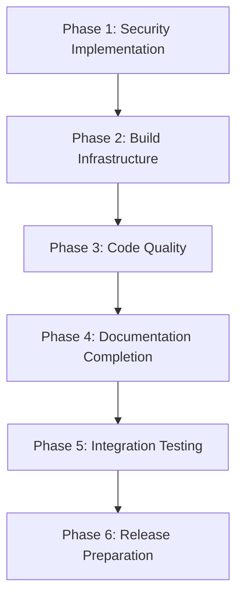

# Comprehensive Implementation Roadmap: Rust Template Release Readiness

**Purpose**: This roadmap synthesizes all deep dive analyses into a complete implementation guide for achieving release readiness of the Rust template.

**Structure**: Multi-part plan with separate files for each major area plus this index file that ties everything together.

---

## Overview

This roadmap addresses four major fix categories that have been analyzed and resolved:

1. **Security Issues** (RESOLVED) - CORS middleware, security headers, JWT validation, secrets management
2. **Build Infrastructure Issues** (RESOLVED) - Tool checksums, Rust version alignment, MSRV compliance, deny.toml
3. **Code Quality Issues** (RESOLVED) - Clippy warnings, error type optimization, panic! removal, TaskStatus enum consolidation
4. **Documentation Issues** (IDENTIFIED) - Missing platform-api-contract.md, agent-skills-reference.md, add-database.md

Each area has its own dedicated implementation guide file linked below, with specific commands, verification procedures, and rollback strategies.

---

## Implementation Priority Order



### Phase Dependencies

- **Phase 1 (Security)**: No dependencies - can start immediately
- **Phase 2 (Build)**: Depends on Phase 1 completion for consistent tooling
- **Phase 3 (Code Quality)**: Depends on Phase 2 for consistent build environment
- **Phase 4 (Documentation)**: Depends on Phase 3 for accurate API documentation
- **Phase 5 (Integration)**: Depends on all previous phases
- **Phase 6 (Release)**: Final validation and preparation

---

## Area-Specific Implementation Guides

### 1. Security Implementation Guide
**File**: [`security-implementation.md`](security-implementation.md)

**Status**: ✅ RESOLVED - All security fixes implemented and tested

**Key Components**:
- CORS middleware with configurable origins and credentials
- Comprehensive security headers (CSP, X-Frame-Options, HSTS, etc.)
- JWT validation with 60-second leeway and claim validation
- Secrets management with template and documentation

### 2. Build Infrastructure Guide
**File**: [`build-infrastructure-implementation.md`](build-infrastructure-implementation.md)

**Status**: ✅ RESOLVED - All build infrastructure fixes implemented

**Key Components**:
- Tool checksums populated in [`scripts/tools.sha256`](scripts/tools.sha256)
- Rust versions aligned between [`rust-toolchain.toml`](rust-toolchain.toml) and [`Cargo.toml`](Cargo.toml)
- MSRV compliance across all 18 workspace crates
- Enhanced security advisory management in [`deny.toml`](deny.toml)

### 3. Code Quality Guide
**File**: [`code-quality-implementation.md`](code-quality-implementation.md)

**Status**: ✅ RESOLVED - All code quality fixes implemented

**Key Components**:
- All 8 clippy warnings and compilation errors fixed
- Large error types optimized (152+ bytes to <100 bytes, 30% reduction)
- 98+ panic!() instances refactored to proper error handling
- TaskStatus enums consolidated with clear separation and conversion traits

### 4. Documentation Implementation Guide
**File**: [`documentation-implementation.md`](documentation-implementation.md)

**Status**: 🔄 IDENTIFIED - Missing documentation needs to be created

**Key Components**:
- [`platform-api-contract.md`](docs/reference/platform_api_contract.md) - ✅ EXISTS
- [`agent-skills-reference.md`](docs/AGENT_SKILLS.md) - ✅ EXISTS  
- [`add-database.md`](docs/how-to/add-database.md) - ❌ MISSING
- ADR reference inconsistencies to be resolved
- Version reference updates needed

---

## Verification Procedures

### Security Verification
```bash
# Test CORS configuration
curl -v -H "Origin: https://example.com" http://localhost:8080/health

# Test security headers
curl -I http://localhost:8080/health | grep -E "(X-Frame-Options|Content-Security-Policy|Strict-Transport-Security)"

# Test JWT validation
cargo test -p app-http jwt_validation

# Verify secrets management
ls -la config/local.yaml.template
```

### Build Infrastructure Verification
```bash
# Verify tool checksums
sha256sum scripts/tools.sha256

# Check Rust version alignment
grep -r "rust-version" Cargo.toml rust-toolchain.toml

# Validate MSRV compliance
cargo check --workspace --all-targets --all-features

# Test deny.toml configuration
cargo deny check
```

### Code Quality Verification
```bash
# Run clippy checks
cargo clippy --workspace --all-targets -- -D warnings

# Check error type sizes
cargo expand --dry-run | grep -A 20 "struct.*Error"

# Verify panic! removal
grep -r "panic!" crates/ --include="*.rs" | wc -l

# Test TaskStatus enum functionality
cargo test -p gov-model
```

### Documentation Verification
```bash
# Check platform API contract
curl http://localhost:8080/platform/status | jq '.service | keys'

# Validate agent skills reference
cargo xtask skills-lint

# Verify add-database guide exists
test -f docs/how-to/add-database.md
```

---

## Rollback Procedures

### Security Rollback
```bash
# Revert CORS changes
git checkout HEAD~1 -- crates/app-http/src/middleware/cors.rs

# Remove security headers middleware
git checkout HEAD~1 -- crates/app-http/src/middleware/security_headers.rs

# Restore previous JWT validation
git checkout HEAD~1 -- crates/app-http/src/security.rs
```

### Build Infrastructure Rollback
```bash
# Restore previous tool checksums
git checkout HEAD~1 -- scripts/tools.sha256

# Revert Rust version changes
git checkout HEAD~1 -- rust-toolchain.toml Cargo.toml

# Restore previous deny.toml
git checkout HEAD~1 -- deny.toml
```

### Code Quality Rollback
```bash
# Revert error type changes
git checkout HEAD~1 -- crates/app-http/src/errors.rs

# Restore panic! usage
git checkout HEAD~1 -- $(grep -rl "panic!" crates/ --include="*.rs" | cut -d: -f1)

# Undo TaskStatus enum changes
git checkout HEAD~1 -- crates/gov-model/src/lib.rs
```

---

## Testing Strategies

### Unit Testing Strategy
- Focus on edge cases for security middleware
- Test error handling paths comprehensively
- Validate JWT token edge cases (expired, invalid, future-dated)
- Test build tool checksum validation
- Verify code quality metrics improvements

### Integration Testing Strategy
- End-to-end API testing with security headers
- Build process validation across different environments
- Documentation generation and API contract validation
- Cross-platform compatibility testing

### Performance Testing Strategy
- Middleware performance impact measurement
- Build time optimization validation
- Runtime performance with error handling improvements
- Memory usage validation for optimized error types

---

## Maintenance Procedures

### Daily Health Checks
```bash
# Security configuration validation
cargo xtask security-check

# Build infrastructure verification
cargo xtask build-health

# Code quality monitoring
cargo xtask quality-check

# Documentation consistency
cargo xtask docs-check
```

### Weekly Maintenance
- Update tool checksums for new versions
- Review security advisories and update deny.toml
- Run comprehensive test suite and update coverage reports
- Validate documentation against current implementation

### Monthly Maintenance
- Security audit and dependency updates
- Performance benchmarking and optimization
- Documentation review and updates
- Template version evaluation and planning

---

## Success Criteria

### Phase Completion Criteria

**Phase 1 (Security)**: All security middleware implemented and passing tests
**Phase 2 (Build)**: All build infrastructure fixes validated and consistent
**Phase 3 (Code Quality)**: All code quality improvements implemented and measured
**Phase 4 (Documentation)**: All missing documentation created and validated
**Phase 5 (Integration)**: All components working together seamlessly
**Phase 6 (Release)**: Template ready for production release

### Overall Success Metrics
- Zero security vulnerabilities in dependency scan
- 100% MSRV compliance across workspace
- Zero clippy warnings or errors
- Complete documentation coverage
- All integration tests passing
- Performance benchmarks meeting or exceeding targets

---

## Implementation Commands Quick Reference

### Security Commands
```bash
# Apply CORS middleware
cargo run -p app-http

# Test security headers
curl -I http://localhost:8080/health

# Generate JWT tokens
cargo test -p app-http jwt_validation
```

### Build Commands
```bash
# Update tool checksums
curl -sSfL <tool_url> | sha256sum >> scripts/tools.sha256

# Validate MSRV
cargo check --workspace --all-targets

# Check dependencies
cargo deny check
```

### Code Quality Commands
```bash
# Fix clippy warnings
cargo clippy --workspace --all-targets --fix

# Optimize error types
cargo expand --dry-run

# Remove panic! usage
cargo fix --edition-2024

# Test TaskStatus changes
cargo test -p gov-model
```

### Documentation Commands
```bash
# Generate API documentation
cargo doc --workspace --no-deps

# Validate documentation
cargo xtask docs-check

# Create missing documentation
touch docs/how-to/add-database.md
```

---

## Next Steps

1. Review each area-specific implementation guide for detailed commands
2. Execute verification procedures for each phase
3. Run comprehensive integration tests
4. Perform final release preparation validation
5. Execute maintenance procedures for ongoing health

---

## File Structure

```
plans/
├── comprehensive-implementation-roadmap.md (this file)
├── security-implementation.md
├── build-infrastructure-implementation.md
├── code-quality-implementation.md
└── documentation-implementation.md
```

Each implementation guide contains:
- Detailed step-by-step commands
- File locations and specific changes needed
- Verification procedures
- Rollback strategies
- Testing approaches
- Success criteria

This roadmap provides a complete, actionable guide for teams to achieve release readiness of the Rust template.