# Microcrate Architecture Plan

## Executive Summary

This document outlines a comprehensive plan for breaking down the Rust-Template project into microcrates. The current workspace contains 20 crates, several of which are large and could benefit from decomposition into smaller, more focused microcrates.

**Current Crate Count:** 20 crates  
**Proposed Microcrate Count:** 35-40 crates  
**Primary Goals:** Improved compilation times, clearer domain boundaries, enhanced reusability

---

## 1. Current Crate Analysis

### 1.1 Existing Crates Overview

| Crate | Purpose | Lines (est) | Dependencies | Status |
|-------|---------|-------------|--------------|--------|
| `acceptance` | BDD testing with Cucumber/Gherkin | ~300 | ac-kernel, adapters-spec-fs, app-http, business-core, spec-runtime, telemetry, testing | Keep |
| `ac-kernel` | Core AC governance logic | ~200 | spec-runtime | Keep |
| `adapters-db-sqlx` | PostgreSQL database adapter | ~150 | business-core, model, sqlx | Keep |
| `adapters-grpc` | gRPC adapter | ~100 | business-core, model, prost, tonic | Keep |
| `adapters-spec-fs` | Filesystem adapter for specs | ~100 | business-core, spec-runtime | Keep |
| `app-http` | HTTP application (large) | ~800+ | adapters-db-sqlx, adapters-spec-fs, business-core, gov-http, gov-model, model, spec-runtime, telemetry | **Split** |
| `business-core` | Business logic core | ~130 | gov-model, model | Keep |
| `gov-contracts` | Governance contracts and schemas | ~50 | gov-model | Keep |
| `gov-http` | Governance HTTP handlers | ~200 | axum, gov-contracts, gov-model, spec-runtime | Keep |
| `gov-model` | Governance models and context | ~330 | (minimal) | Keep |
| `gov-policy` | Rego policy bundle and runner | ~50 | gov-model | Keep |
| `gov-receipts` | Governance receipts (7 modules) | ~400 | (minimal) | **Split** |
| `gov-xtask-core` | Governance xtask utilities | ~50 | gov-model | Keep |
| `model` | Core models | ~60 | (minimal) | Keep |
| `rust_iac_config` | IaC configuration management | ~150 | (minimal) | Keep |
| `rust_iac_xtask_core` | XTask core commands | ~100 | (minimal) | Keep |
| `spec-runtime` | Runtime for spec-based workflows (11 modules) | ~600+ | gov-model | **Split** |
| `telemetry` | Telemetry utilities | ~50 | (minimal) | Keep |
| `testing` | Testing utilities | ~50 | parking_lot | Keep |
| `xtask` | Build and development tasks (74 commands) | ~2000+ | ac-kernel, business-core, gov-receipts, gov-xtask-core, spec-runtime, testing | **Split** |

### 1.2 Dependency Graph Summary

```
                    ┌─────────────┐
                    │   model     │
                    └──────┬──────┘
                           │
                    ┌──────▼──────┐
                    │ gov-model   │
                    └──────┬──────┘
                           │
        ┌──────────────────┼──────────────────┐
        │                  │                  │
┌───────▼───────┐ ┌──────▼──────┐ ┌──────▼──────┐
│ business-core │ │ spec-runtime│ │ gov-contracts│
└───────┬───────┘ └──────┬──────┘ └──────┬──────┘
        │                │                │
        │        ┌───────▼───────┐      │
        │        │  gov-http     │      │
        │        └───────┬───────┘      │
        │                │              │
┌───────▼───────┐ ┌─────▼─────┐ ┌────▼─────┐
│ adapters-db   │ │ app-http  │ │ gov-http │
│ adapters-grpc │ │           │ │          │
│ adapters-spec │ └─────┬─────┘ └──────────┘
└───────────────┘       │
        │               │
        │        ┌──────▼──────┐
        │        │ acceptance   │
        │        └─────────────┘
        │
┌───────▼───────┐
│     xtask     │
└───────────────┘
```

---

## 2. Microcrate Opportunities

### 2.1 High-Priority Splits

#### 2.1.1 `app-http` → Multiple Microcrates

**Current State:** Single crate with 800+ lines covering:
- HTTP routing and handlers
- Middleware (CORS, security headers, request ID, platform auth)
- Agent endpoints
- Platform endpoints (IDP, UI)
- Security (JWT, platform auth)
- Tasks and todos
- Metrics
- Error handling
- Shutdown handling

**Proposed Splits:**

1. **`http-middleware`** - Reusable HTTP middleware
   - CORS middleware
   - Security headers middleware
   - Request ID middleware
   - Platform authentication guard
   - **Rationale:** These are generic, reusable components that could benefit other projects
   - **Dependencies:** axum, serde, tracing, uuid
   - **Public API:** Middleware functions and configuration types

2. **`http-errors`** - Structured error handling
   - `AppError` type with error codes
   - AC/Feature ID tracking
   - JSON error envelopes
   - **Rationale:** Error handling is a cross-cutting concern that should be reusable
   - **Dependencies:** serde, serde_json, thiserror, tracing
   - **Public API:** `AppError`, `ErrorCode`, `ErrorSummary`, error builder methods

3. **`http-metrics`** - Metrics collection
   - Prometheus metrics middleware
   - Request latency tracking
   - Request counting
   - **Rationale:** Metrics infrastructure is a common need across HTTP services
   - **Dependencies:** prometheus, axum, tower
   - **Public API:** `metrics_middleware`, `metrics_handler`, metric types

4. **`http-platform`** - Platform-specific endpoints
   - IDP endpoints
   - UI endpoints
   - Platform introspection
   - **Rationale:** Platform-specific concerns should be isolated
   - **Dependencies:** axum, maud, spec-runtime, gov-model
   - **Public API:** Router builders for platform endpoints

5. **`http-agents`** - Agent endpoints
   - Agent-related HTTP handlers
   - **Rationale:** Agent functionality is a distinct domain
   - **Dependencies:** axum, business-core, model
   - **Public API:** Agent router and handlers

6. **`http-tasks`** - Task management endpoints
   - Task CRUD endpoints
   - Task status updates
   - **Rationale:** Task management is a core domain concern
   - **Dependencies:** axum, business-core, model
   - **Public API:** Task router and handlers

7. **`http-todos`** - Todo endpoints
   - Todo CRUD operations
   - **Rationale:** Todo functionality is a distinct domain
   - **Dependencies:** axum, business-core, model
   - **Public API:** Todo router and handlers

8. **`http-core`** - Core HTTP infrastructure
   - Application state management
   - Router composition
   - Health/version endpoints
   - Shutdown handling
   - **Rationale:** Core HTTP infrastructure should be reusable
   - **Dependencies:** axum, http-middleware, http-errors, http-metrics
   - **Public API:** `AppState`, router builders, core handlers

#### 2.1.2 `spec-runtime` → Multiple Microcrates

**Current State:** Single crate with 600+ lines covering:
- Configuration validation
- Spec ledger (stories, requirements, ACs)
- Developer experience flows
- Documentation indexing
- Governance graph
- Agent hints
- Kubernetes IaC
- Local Docker
- Schema management
- Service metadata
- Task management
- UI contract

**Proposed Splits:**

1. **`spec-config`** - Configuration validation
   - Schema-driven config validation
   - `ValidatedConfig` type
   - **Rationale:** Configuration is a common need across projects
   - **Dependencies:** serde, serde_yaml, jsonschema, anyhow
   - **Public API:** `validate_config`, `ValidatedConfig`

2. **`spec-ledger`** - Spec ledger management
   - Story, requirement, and AC types
   - Ledger loading and parsing
   - AC/REQ ID indexing
   - **Rationale:** Spec ledger is core governance functionality
   - **Dependencies:** serde, serde_yaml, anyhow
   - **Public API:** `SpecLedger`, `Story`, `Requirement`, `AcceptanceCriterion`, ID indexes

3. **`spec-graph`** - Governance graph
   - Graph builder (stories → REQs → ACs → tests → docs)
   - Graph traversal utilities
   - **Rationale:** Graph operations are a distinct concern
   - **Dependencies:** spec-ledger, anyhow
   - **Public API:** `Graph`, `Node`, `Edge`, `build_graph`

4. **`spec-devex`** - Developer experience flows
   - Flow definitions
   - Command specifications
   - **Rationale:** DevEx flows are a distinct concern
   - **Dependencies:** serde, serde_yaml, anyhow
   - **Public API:** `DevExFlows`, `Flow`, `Command`

5. **`spec-docs`** - Documentation indexing
   - Doc inventory
   - Doc health checking
   - **Rationale:** Documentation management is a separate concern
   - **Dependencies:** serde, serde_yaml, anyhow
   - **Public API:** `DocIndex`, `DocEntry`, `load_doc_index`

6. **`spec-hints`** - Agent hint engine
   - AC coverage tracking
   - Hint generation
   - Task prioritization
   - **Rationale:** Agent hints are AI/LLM-specific functionality
   - **Dependencies:** spec-ledger, anyhow
   - **Public API:** `HintEngine`, `Hint`, `AcCoverage`, `HintFilter`

7. **`spec-tasks`** - Task management
   - Task types and operations
   - Task sequencing
   - **Rationale:** Task management is a distinct domain
   - **Dependencies:** serde, serde_yaml, anyhow
   - **Public API:** `TasksSpec`, `Task`, `TaskStatus`

8. **`spec-schema`** - Schema management
   - Platform API schemas
   - Endpoint metadata
   - **Rationale:** Schema management is a separate concern
   - **Dependencies:** serde, serde_yaml, anyhow
   - **Public API:** `PlatformSchemas`, `EndpointSchema`, `SchemaInfo`

9. **`spec-ui-contract`** - UI contract management
   - UI region definitions
   - Screen specifications
   - **Rationale:** UI contracts are a distinct concern
   - **Dependencies:** serde, serde_yaml, anyhow
   - **Public API:** `UiContract`, `Region`, `Screen`

10. **`spec-iac`** - Infrastructure as Code support
    - Kubernetes IaC configuration
    - Local Docker configuration
    - **Rationale:** IaC support is a distinct concern
    - **Dependencies:** serde, serde_yaml, anyhow
    - **Public API:** `K8sIacConfig`, `LocalDockerConfig`

11. **`spec-metadata`** - Service metadata
    - Service information loading
    - **Rationale:** Service metadata is a separate concern
    - **Dependencies:** serde, serde_yaml, anyhow
    - **Public API:** `ServiceMetadata`, `load_service_metadata`

#### 2.1.3 `gov-receipts` → Multiple Microcrates

**Current State:** Single crate with 7 modules:
- `dossier` - PR analysis for casebook generation
- `economics` - DevLT and compute spend tracking
- `gate` - Gate execution results
- `meta` - Receipt metadata
- `quality` - Code quality metrics
- `telemetry` - Probe execution results
- `timeline` - PR evolution and convergence patterns

**Proposed Splits:**

1. **`receipts-core`** - Core receipt types
   - `ReceiptMeta` - Common receipt metadata
   - Builder patterns for receipts
   - **Rationale:** Core receipt types are shared across all receipts
   - **Dependencies:** serde, serde_json, chrono
   - **Public API:** `ReceiptMeta`, `ReceiptMetaBuilder`, confidence types

2. **`receipts-gate`** - Gate receipts
   - `GateReceipt` - Gate execution results
   - `GateStatus`, `GateResult`
   - Test details, selftest details
   - **Rationale:** Gate receipts are a distinct type of receipt
   - **Dependencies:** receipts-core, serde, chrono
   - **Public API:** `GateReceipt`, `GateStatus`, `GateResult`, `GateDetails`

3. **`receipts-quality`** - Quality receipts
   - `QualityReceipt` - Code quality metrics
   - Contract changes, boundary assessments
   - Test depth ratings
   - **Rationale:** Quality receipts are a distinct type of receipt
   - **Dependencies:** receipts-core, serde, chrono
   - **Public API:** `QualityReceipt`, `Quality`, `Contract`, `LlmBoundaryAssessment`

4. **`receipts-telemetry`** - Telemetry receipts
   - `TelemetryReceipt` - Probe execution results
   - Change surface analysis
   - Safety assessments
   - **Rationale:** Telemetry receipts are a distinct type of receipt
   - **Dependencies:** receipts-core, serde, chrono
   - **Public API:** `TelemetryReceipt`, `ProbeResult`, `ChangeSurface`, `Safety`

5. **`receipts-timeline`** - Timeline receipts
   - `TimelineReceipt` - PR evolution tracking
   - Convergence patterns, friction zones
   - **Rationale:** Timeline receipts are a distinct type of receipt
   - **Dependencies:** receipts-core, serde, chrono
   - **Public API:** `TimelineReceipt`, `Convergence`, `FrictionZone`, `Oscillation`

6. **`receipts-economics`** - Economics receipts
   - `EconomicsReceipt` - DevLT and compute spend
   - Value delivered tracking
   - **Rationale:** Economics receipts are a distinct type of receipt
   - **Dependencies:** receipts-core, serde, chrono
   - **Public API:** `EconomicsReceipt`, `DevLtMinutes`, `ComputeSpend`, `ValueDelivered`

7. **`receipts-dossier`** - Dossier receipts
   - `Dossier` - Structured PR analysis
   - Findings, intents, scopes
   - **Rationale:** Dossier receipts are a distinct type of receipt
   - **Dependencies:** receipts-core, serde, chrono
   - **Public API:** `Dossier`, `Finding`, `Intent`, `Scope`, `Erratum`

#### 2.1.4 `xtask` → Multiple Microcrates

**Current State:** Single crate with 74 command modules covering:
- AC-related commands (11 commands)
- ADR commands (2 commands)
- Agent commands
- Audit commands
- BDD commands
- Build time commands
- Bundle commands
- CI commands
- Config validation
- Contracts commands
- Coverage commands
- Deploy commands
- Design commands
- Dev environment commands
- Docs commands
- Doctor commands
- Environment mode commands
- Formatting commands
- Fork commands
- Friction commands
- GitHub commands
- Graph export commands
- Hakari commands
- Help flows commands
- IDP commands
- Install hooks commands
- Issues search commands
- Kernel commands (2 commands)
- Migrate commands
- Pin actions commands
- Policy test commands
- PR commands (2 commands)
- Precommit commands
- Questions commands
- Quickstart commands
- Receipts commands
- Release commands (3 commands)
- SBOM commands
- Selftest commands
- Service descriptor commands (2 commands)
- Skills commands
- Spellcheck commands
- Status commands
- Suggest next commands
- Tasks commands (2 commands)
- Test commands (2 commands)
- Tools checksum commands (2 commands)
- UI contract check commands
- Version commands (2 commands)
- Versioning commands

**Proposed Splits:**

1. **`xtask-core`** - Core xtask infrastructure
   - Command registration and dispatch
   - CLI argument parsing
   - Error handling
   - **Rationale:** Core infrastructure should be reusable
   - **Dependencies:** clap, anyhow, colored
   - **Public API:** Command trait, CLI builder, error types

2. **`xtask-ac`** - Acceptance criteria commands
   - AC coverage, linting, reporting
   - AC history, status, tests
   - AC suggest scenarios
   - **Rationale:** AC commands are a distinct domain
   - **Dependencies:** xtask-core, ac-kernel, spec-ledger, spec-hints
   - **Public API:** AC command implementations

3. **`xtask-adr`** - Architecture decision record commands
   - ADR check, new
   - **Rationale:** ADR commands are a distinct domain
   - **Dependencies:** xtask-core
   - **Public API:** ADR command implementations

4. **`xtask-build`** - Build-related commands
   - Build time measurement
   - Bundle commands
   - CI local commands
   - Clean commands
   - **Rationale:** Build commands are a distinct domain
   - **Dependencies:** xtask-core
   - **Public API:** Build command implementations

5. **`xtask-config`** - Configuration commands
   - Config validation
   - **Rationale:** Config commands are a distinct domain
   - **Dependencies:** xtask-core, spec-config
   - **Public API:** Config command implementations

6. **`xtask-contracts`** - Contract commands
   - Contract management
   - UI contract check
   - **Rationale:** Contract commands are a distinct domain
   - **Dependencies:** xtask-core, spec-contracts, spec-ui-contract
   - **Public API:** Contract command implementations

7. **`xtask-coverage`** - Coverage commands
   - Coverage reporting
   - PR coverage
   - **Rationale:** Coverage commands are a distinct domain
   - **Dependencies:** xtask-core
   - **Public API:** Coverage command implementations

8. **`xtask-deploy`** - Deployment commands
   - Deploy commands
   - Release commands (bundle, prepare, verify)
   - **Rationale:** Deployment commands are a distinct domain
   - **Dependencies:** xtask-core, gov-receipts
   - **Public API:** Deploy command implementations

9. **`xtask-devex`** - Developer experience commands
   - Design new
   - Dev up
   - Doctor
   - Help flows
   - Quickstart
   - **Rationale:** DevEx commands are a distinct domain
   - **Dependencies:** xtask-core, spec-devex
   - **Public API:** DevEx command implementations

10. **`xtask-docs`** - Documentation commands
    - Docs check
    - Docs frontmatter sync
    - Spellcheck
    - **Rationale:** Documentation commands are a distinct domain
    - **Dependencies:** xtask-core, spec-docs
    - **Public API:** Docs command implementations

11. **`xtask-governance`** - Governance commands
    - Fork commands
    - Friction commands
    - Issues search
    - Questions commands
    - Receipts commands
    - **Rationale:** Governance commands are a distinct domain
    - **Dependencies:** xtask-core, gov-http, gov-model
    - **Public API:** Governance command implementations

12. **`xtask-kernel`** - Kernel commands
    - Kernel smoke
    - Kernel status
    - **Rationale:** Kernel commands are a distinct domain
    - **Dependencies:** xtask-core, ac-kernel
    - **Public API:** Kernel command implementations

13. **`xtask-policy`** - Policy commands
    - Policy test
    - **Rationale:** Policy commands are a distinct domain
    - **Dependencies:** xtask-core, gov-policy
    - **Public API:** Policy command implementations

14. **`xtask-release`** - Release commands
    - Release bundle
    - Release prepare
    - Release verify
    - **Rationale:** Release commands are a distinct domain
    - **Dependencies:** xtask-core, gov-receipts
    - **Public API:** Release command implementations

15. **`xtask-security`** - Security commands
    - SBOM local
    - **Rationale:** Security commands are a distinct domain
    - **Dependencies:** xtask-core
    - **Public API:** Security command implementations

16. **`xtask-services`** - Service commands
    - Service descriptor
    - Service init
    - **Rationale:** Service commands are a distinct domain
    - **Dependencies:** xtask-core, spec-metadata
    - **Public API:** Service command implementations

17. **`xtask-skills`** - Skills commands
    - Skills management
    - **Rationale:** Skills commands are a distinct domain
    - **Dependencies:** xtask-core
    - **Public API:** Skills command implementations

18. **`xtask-tools`** - Tools commands
    - Tools checksum update
    - Tools checksum verify
    - **Rationale:** Tools commands are a distinct domain
    - **Dependencies:** xtask-core
    - **Public API:** Tools command implementations

19. **`xtask-versioning`** - Versioning commands
    - Version check
    - Version
    - Versioning
    - **Rationale:** Versioning commands are a distinct domain
    - **Dependencies:** xtask-core
    - **Public API:** Versioning command implementations

20. **`xtask-workspace`** - Workspace commands
    - Env mode
    - Fmt all
    - Graph export
    - Hakari
    - Install hooks
    - Migrate
    - Pin actions
    - Status
    - Suggest next
    - Tasks list
    - Test changed
    - **Rationale:** Workspace commands are a distinct domain
    - **Dependencies:** xtask-core
    - **Public API:** Workspace command implementations

### 2.2 Medium-Priority Splits

#### 2.2.1 `gov-http` → Split by Domain

**Current State:** Single crate with handlers for:
- Forks
- Friction
- Issues
- Questions
- Core handlers (health, status, schema, graph, etc.)

**Proposed Splits:**

1. **`gov-http-forks`** - Fork endpoints
   - Fork listing and management
   - **Rationale:** Forks are a distinct governance domain
   - **Dependencies:** gov-model, axum
   - **Public API:** Fork router and handlers

2. **`gov-http-friction`** - Friction endpoints
   - Friction tracking and resolution
   - **Rationale:** Friction is a distinct governance domain
   - **Dependencies:** gov-model, axum
   - **Public API:** Friction router and handlers

3. **`gov-http-issues`** - Issues endpoints
   - Issue tracking and management
   - **Rationale:** Issues are a distinct governance domain
   - **Dependencies:** gov-model, axum
   - **Public API:** Issues router and handlers

4. **`gov-http-questions`** - Questions endpoints
   - Question management and resolution
   - **Rationale:** Questions are a distinct governance domain
   - **Dependencies:** gov-model, axum
   - **Public API:** Questions router and handlers

5. **`gov-http-core`** - Core governance endpoints
   - Health, status, schema, graph, coverage
   - **Rationale:** Core endpoints are shared infrastructure
   - **Dependencies:** gov-model, spec-runtime, axum
   - **Public API:** Core router and handlers

#### 2.2.2 `adapters-*` → Extract Common Patterns

**Proposed New Crate:**

1. **`adapters-core`** - Common adapter patterns
   - Repository trait definitions
   - Common error types
   - Adapter utilities
   - **Rationale:** Common patterns can be shared across adapters
   - **Dependencies:** async-trait, thiserror
   - **Public API:** Repository traits, error types, utilities

---

## 3. Proposed Microcrate Architecture

### 3.1 Layered Architecture

```
┌─────────────────────────────────────────────────────────────────┐
│                    Application Layer                           │
│  ┌──────────────┐  ┌──────────────┐  ┌──────────────┐      │
│  │  app-http    │  │ gov-http-*   │  │   xtask-*    │      │
│  │  (composed)  │  │  (composed)  │  │  (composed)  │      │
│  └──────────────┘  └──────────────┘  └──────────────┘      │
└─────────────────────────────────────────────────────────────────┘
                              │
┌─────────────────────────────────────────────────────────────────┐
│                    HTTP Layer                                 │
│  ┌──────────┐ ┌──────────┐ ┌──────────┐ ┌──────────┐       │
│  │http-core ││http-mid  ││http-err  ││http-met  │       │
│  └──────────┘ └──────────┘ └──────────┘ └──────────┘       │
│  ┌──────────┐ ┌──────────┐ ┌──────────┐ ┌──────────┐       │
│  │http-plat ││http-agt  ││http-tsk  ││http-tdo  │       │
│  └──────────┘ └──────────┘ └──────────┘ └──────────┘       │
└─────────────────────────────────────────────────────────────────┘
                              │
┌─────────────────────────────────────────────────────────────────┐
│                    Business Layer                             │
│  ┌──────────────┐  ┌──────────────┐  ┌──────────────┐      │
│  │business-core │  │ gov-model    │  │    model     │      │
│  └──────────────┘  └──────────────┘  └──────────────┘      │
└─────────────────────────────────────────────────────────────────┘
                              │
┌─────────────────────────────────────────────────────────────────┐
│                    Spec/Governance Layer                      │
│  ┌──────────┐ ┌──────────┐ ┌──────────┐ ┌──────────┐       │
│  │spec-led  ││spec-grph ││spec-hint ││spec-task │       │
│  └──────────┘ └──────────┘ └──────────┘ └──────────┘       │
│  ┌──────────┐ ┌──────────┐ ┌──────────┐ ┌──────────┐       │
│  │spec-conf ││spec-doc  ││spec-schm ││spec-ui   │       │
│  └──────────┘ └──────────┘ └──────────┘ └──────────┘       │
│  ┌──────────┐ ┌──────────┐ ┌──────────┐ ┌──────────┐       │
│  │spec-dev  ││spec-iac  ││spec-meta ││          │       │
│  └──────────┘ └──────────┘ └──────────┘ └──────────┘       │
└─────────────────────────────────────────────────────────────────┘
                              │
┌─────────────────────────────────────────────────────────────────┐
│                    Receipt Layer                              │
│  ┌──────────┐ ┌──────────┐ ┌──────────┐ ┌──────────┐       │
│  │rcpt-core ││rcpt-gate ││rcpt-qual ││rcpt-tel  │       │
│  └──────────┘ └──────────┘ └──────────┘ └──────────┘       │
│  ┌──────────┐ ┌──────────┐ ┌──────────┐ ┌──────────┐       │
│  │rcpt-tim  ││rcpt-eco  ││rcpt-doss ││          │       │
│  └──────────┘ └──────────┘ └──────────┘ └──────────┘       │
└─────────────────────────────────────────────────────────────────┘
                              │
┌─────────────────────────────────────────────────────────────────┐
│                    Adapter Layer                              │
│  ┌──────────┐ ┌──────────┐ ┌──────────┐ ┌──────────┐       │
│  │adap-core  ││adap-db    ││adap-grpc  ││adap-spec  │       │
│  └──────────┘ └──────────┘ └──────────┘ └──────────┘       │
└─────────────────────────────────────────────────────────────────┘
                              │
┌─────────────────────────────────────────────────────────────────┐
│                    Infrastructure Layer                        │
│  ┌──────────┐ ┌──────────┐ ┌──────────┐ ┌──────────┐       │
│  │ telemetry ││  testing  ││   model   ││gov-model │       │
│  └──────────┘ └──────────┘ └──────────┘ └──────────┘       │
└─────────────────────────────────────────────────────────────────┘
```

### 3.2 Microcrate Dependency Graph

```mermaid
graph TD
    subgraph Infrastructure
        model[model]
        gov_model[gov-model]
        telemetry[telemetry]
        testing[testing]
    end

    subgraph Adapters
        adapters_core[adapters-core]
        adapters_db[adapters-db-sqlx]
        adapters_grpc[adapters-grpc]
        adapters_spec[adapters-spec-fs]
    end

    subgraph Receipts
        receipts_core[receipts-core]
        receipts_gate[receipts-gate]
        receipts_quality[receipts-quality]
        receipts_telemetry[receipts-telemetry]
        receipts_timeline[receipts-timeline]
        receipts_economics[receipts-economics]
        receipts_dossier[receipts-dossier]
    end

    subgraph Spec
        spec_config[spec-config]
        spec_ledger[spec-ledger]
        spec_graph[spec-graph]
        spec_hints[spec-hints]
        spec_tasks[spec-tasks]
        spec_devex[spec-devex]
        spec_docs[spec-docs]
        spec_schema[spec-schema]
        spec_ui[spec-ui-contract]
        spec_iac[spec-iac]
        spec_metadata[spec-metadata]
    end

    subgraph Business
        business_core[business-core]
        gov_contracts[gov-contracts]
        gov_policy[gov-policy]
    end

    subgraph HTTP
        http_core[http-core]
        http_middleware[http-middleware]
        http_errors[http-errors]
        http_metrics[http-metrics]
        http_platform[http-platform]
        http_agents[http-agents]
        http_tasks[http-tasks]
        http_todos[http-todos]
        gov_http_core[gov-http-core]
        gov_http_forks[gov-http-forks]
        gov_http_friction[gov-http-friction]
        gov_http_issues[gov-http-issues]
        gov_http_questions[gov-http-questions]
    end

    subgraph XTask
        xtask_core[xtask-core]
        xtask_ac[xtask-ac]
        xtask_adr[xtask-adr]
        xtask_build[xtask-build]
        xtask_config[xtask-config]
        xtask_contracts[xtask-contracts]
        xtask_coverage[xtask-coverage]
        xtask_deploy[xtask-deploy]
        xtask_devex[xtask-devex]
        xtask_docs[xtask-docs]
        xtask_governance[xtask-governance]
        xtask_kernel[xtask-kernel]
        xtask_policy[xtask-policy]
        xtask_release[xtask-release]
        xtask_security[xtask-security]
        xtask_services[xtask-services]
        xtask_skills[xtask-skills]
        xtask_tools[xtask-tools]
        xtask_versioning[xtask-versioning]
        xtask_workspace[xtask-workspace]
    end

    subgraph Application
        app_http[app-http]
        gov_http[gov-http]
        xtask[xtask]
        acceptance[acceptance]
        ac_kernel[ac-kernel]
        gov_xtask_core[gov-xtask-core]
        rust_iac_config[rust_iac_config]
        rust_iac_xtask_core[rust_iac_xtask_core]
    end

    %% Infrastructure to Business
    model --> business_core
    gov_model --> business_core
    gov_model --> gov_contracts
    gov_model --> gov_policy

    %% Business to Adapters
    business_core --> adapters_db
    business_core --> adapters_grpc
    business_core --> adapters_spec

    %% Spec dependencies
    gov_model --> spec_config
    spec_ledger --> spec_config
    spec_graph --> spec_ledger
    spec_hints --> spec_ledger
    spec_devex --> spec_config
    spec_docs --> spec_config
    spec_schema --> spec_config
    spec_ui --> spec_config
    spec_iac --> spec_config
    spec_metadata --> spec_config

    %% Receipt dependencies
    receipts_core --> receipts_gate
    receipts_core --> receipts_quality
    receipts_core --> receipts_telemetry
    receipts_core --> receipts_timeline
    receipts_core --> receipts_economics
    receipts_core --> receipts_dossier

    %% HTTP dependencies
    http_middleware --> http_core
    http_errors --> http_core
    http_metrics --> http_core
    http_platform --> http_core
    http_agents --> http_core
    http_tasks --> http_core
    http_todos --> http_core

    app_http --> http_core
    app_http --> http_platform
    app_http --> http_agents
    app_http --> http_tasks
    app_http --> http_todos

    gov_http_core --> gov_model
    gov_http_core --> spec_schema
    gov_http_forks --> gov_model
    gov_http_friction --> gov_model
    gov_http_issues --> gov_model
    gov_http_questions --> gov_model

    gov_http --> gov_http_core
    gov_http --> gov_http_forks
    gov_http --> gov_http_friction
    gov_http --> gov_http_issues
    gov_http --> gov_http_questions

    %% XTask dependencies
    xtask_core --> xtask_ac
    xtask_core --> xtask_adr
    xtask_core --> xtask_build
    xtask_core --> xtask_config
    xtask_core --> xtask_contracts
    xtask_core --> xtask_coverage
    xtask_core --> xtask_deploy
    xtask_core --> xtask_devex
    xtask_core --> xtask_docs
    xtask_core --> xtask_governance
    xtask_core --> xtask_kernel
    xtask_core --> xtask_policy
    xtask_core --> xtask_release
    xtask_core --> xtask_security
    xtask_core --> xtask_services
    xtask_core --> xtask_skills
    xtask_core --> xtask_tools
    xtask_core --> xtask_versioning
    xtask_core --> xtask_workspace

    xtask --> xtask_core
    xtask --> xtask_ac
    xtask --> xtask_adr
    xtask --> xtask_build
    xtask --> xtask_config
    xtask --> xtask_contracts
    xtask --> xtask_coverage
    xtask --> xtask_deploy
    xtask --> xtask_devex
    xtask --> xtask_docs
    xtask --> xtask_governance
    xtask --> xtask_kernel
    xtask --> xtask_policy
    xtask --> xtask_release
    xtask --> xtask_security
    xtask --> xtask_services
    xtask --> xtask_skills
    xtask --> xtask_tools
    xtask --> xtask_versioning
    xtask --> xtask_workspace

    %% Application dependencies
    acceptance --> ac_kernel
    acceptance --> adapters_spec
    acceptance --> app_http
    acceptance --> business_core
    acceptance --> spec_config
    acceptance --> telemetry
    acceptance --> testing

    ac_kernel --> spec_config
    gov_xtask_core --> gov_model
```



---

## 4. Migration Strategy

### 4.1 Phased Migration Approach

#### Phase 1: Foundation Microcrates (Weeks 1-2)

**Goal:** Create low-risk, high-value microcrates with minimal dependencies

1. **`http-middleware`** - Extract middleware from `app-http`
   - Create new crate
   - Move middleware modules
   - Update `app-http` to use new crate
   - Run tests

2. **`http-errors`** - Extract error handling from `app-http`
   - Create new crate
   - Move error types
   - Update `app-http` to use new crate
   - Run tests

3. **`http-metrics`** - Extract metrics from `app-http`
   - Create new crate
   - Move metrics module
   - Update `app-http` to use new crate
   - Run tests

4. **`receipts-core`** - Extract core receipt types from `gov-receipts`
   - Create new crate
   - Move core receipt types
   - Update `gov-receipts` to use new crate
   - Run tests

**Success Criteria:**
- All tests pass
- No breaking changes to public APIs
- Compilation time improved by at least 10%

#### Phase 2: Spec Runtime Decomposition (Weeks 3-5)

**Goal:** Break down `spec-runtime` into focused microcrates

1. **`spec-config`** - Extract configuration validation
2. **`spec-ledger`** - Extract spec ledger
3. **`spec-graph`** - Extract governance graph
4. **`spec-hints`** - Extract hint engine
5. **`spec-tasks`** - Extract task management
6. **`spec-devex`** - Extract devex flows
7. **`spec-docs`** - Extract documentation indexing
8. **`spec-schema`** - Extract schema management
9. **`spec-ui-contract`** - Extract UI contract
10. **`spec-iac`** - Extract IaC support
11. **`spec-metadata`** - Extract service metadata

**Approach:**
- Create microcrates in dependency order (bottom-up)
- Start with `spec-config` (no dependencies on other spec crates)
- Then `spec-ledger` (depends on `spec-config`)
- Then `spec-graph` (depends on `spec-ledger`)
- Continue in dependency order
- Update dependent crates incrementally

**Success Criteria:**
- All spec-runtime functionality preserved
- Clear dependency boundaries
- Each crate has a single responsibility

#### Phase 3: Receipt Decomposition (Weeks 6-7)

**Goal:** Break down `gov-receipts` into focused microcrates

1. **`receipts-gate`** - Extract gate receipts
2. **`receipts-quality`** - Extract quality receipts
3. **`receipts-telemetry`** - Extract telemetry receipts
4. **`receipts-timeline`** - Extract timeline receipts
5. **`receipts-economics`** - Extract economics receipts
6. **`receipts-dossier`** - Extract dossier receipts

**Approach:**
- Each receipt type becomes its own crate
- All depend on `receipts-core`
- Update dependent crates incrementally

**Success Criteria:**
- All receipt functionality preserved
- Clear separation between receipt types
- Easy to add new receipt types

#### Phase 4: HTTP Layer Refinement (Weeks 8-9)

**Goal:** Complete `app-http` decomposition and split `gov-http`

1. **`http-core`** - Extract core HTTP infrastructure
2. **`http-platform`** - Extract platform endpoints
3. **`http-agents`** - Extract agent endpoints
4. **`http-tasks`** - Extract task endpoints
5. **`http-todos`** - Extract todo endpoints
6. **`gov-http-core`** - Extract core gov-http endpoints
7. **`gov-http-forks`** - Extract forks endpoints
8. **`gov-http-friction`** - Extract friction endpoints
9. **`gov-http-issues`** - Extract issues endpoints
10. **`gov-http-questions`** - Extract questions endpoints

**Approach:**
- Create `http-core` first (foundation)
- Then extract domain-specific crates
- Update `app-http` to compose from new crates
- Split `gov-http` similarly

**Success Criteria:**
- Clear separation of concerns
- Easy to add new HTTP endpoints
- Reusable HTTP components

#### Phase 5: XTask Decomposition (Weeks 10-14)

**Goal:** Break down `xtask` into focused command crates

1. **`xtask-core`** - Extract core infrastructure
2. **`xtask-ac`** - Extract AC commands
3. **`xtask-adr`** - Extract ADR commands
4. **`xtask-build`** - Extract build commands
5. **`xtask-config`** - Extract config commands
6. **`xtask-contracts`** - Extract contracts commands
7. **`xtask-coverage`** - Extract coverage commands
8. **`xtask-deploy`** - Extract deploy commands
9. **`xtask-devex`** - Extract devex commands
10. **`xtask-docs`** - Extract docs commands
11. **`xtask-governance`** - Extract governance commands
12. **`xtask-kernel`** - Extract kernel commands
13. **`xtask-policy`** - Extract policy commands
14. **`xtask-release`** - Extract release commands
15. **`xtask-security`** - Extract security commands
16. **`xtask-services`** - Extract services commands
17. **`xtask-skills`** - Extract skills commands
18. **`xtask-tools`** - Extract tools commands
19. **`xtask-versioning`** - Extract versioning commands
20. **`xtask-workspace`** - Extract workspace commands

**Approach:**
- Create `xtask-core` first (foundation)
- Then extract command groups by domain
- Update main `xtask` to use new crates
- Each command crate registers with `xtask-core`

**Success Criteria:**
- Clear separation of command domains
- Easy to add new commands
- Reduced compilation time for `xtask`

#### Phase 6: Adapter Refinement (Week 15)

**Goal:** Extract common adapter patterns

1. **`adapters-core`** - Extract common adapter utilities
   - Create new crate
   - Move common patterns from existing adapters
   - Update adapters to use new crate
   - Run tests

**Success Criteria:**
- Reduced code duplication across adapters
- Clear adapter patterns

#### Phase 7: Validation and Cleanup (Week 16)

**Goal:** Ensure all changes are working correctly

1. Run full test suite
2. Verify compilation time improvements
3. Update documentation
4. Clean up old code
5. Verify all public APIs are stable

**Success Criteria:**
- All tests pass
- Compilation time improved by at least 30%
- Documentation updated
- No deprecated code remaining

### 4.2 Migration Process for Each Microcrate

#### Step 1: Create New Crate
```bash
# Create new crate directory
mkdir -p crates/new-microcrate/src

# Create Cargo.toml
cat > crates/new-microcrate/Cargo.toml << 'EOF'
[package]
name = "new-microcrate"
version = "0.1.0"
edition.workspace = true
publish.workspace = true
rust-version.workspace = true

[dependencies]
# Add dependencies here
EOF

# Create lib.rs
touch crates/new-microcrate/src/lib.rs
```

#### Step 2: Move Code
```bash
# Move relevant modules from source crate
mv crates/source-crate/src/module.rs crates/new-microcrate/src/
```

#### Step 3: Update Imports
```rust
// In source crate, update imports
// Old: use crate::module::Type;
// New: use new_microcrate::Type;
```

#### Step 4: Update Dependencies
```toml
# In source crate's Cargo.toml
[dependencies]
new-microcrate = { path = "../new-microcrate" }
```

#### Step 5: Run Tests
```bash
# Test the new crate
cargo test -p new-microcrate

# Test dependent crates
cargo test -p source-crate
```

#### Step 6: Update Workspace
```toml
# In workspace Cargo.toml
[workspace]
members = [
    # ... existing crates
    "crates/new-microcrate",
]
```

### 4.3 Backward Compatibility Strategy

During migration, maintain backward compatibility by:

1. **Re-export Types:** Keep old types available through re-exports
   ```rust
   // In old crate
   pub use new_microcrate::Type as OldType;
   ```

2. **Deprecation Warnings:** Add deprecation warnings for old paths
   ```rust
   #[deprecated(since = "0.2.0", note = "Use new_microcrate::Type instead")]
   pub use new_microcrate::Type as OldType;
   ```

3. **Feature Flags:** Use feature flags to enable/disable migration
   ```toml
   [features]
   default = []
   new-microcrate = ["dep:new-microcrate"]
   ```

4. **Documentation:** Update documentation to point to new locations

5. **Migration Guide:** Create a migration guide for users

### 4.4 Testing Strategy

For each microcrate extraction:

1. **Unit Tests:** Ensure all existing tests pass
2. **Integration Tests:** Verify cross-crate functionality
3. **Compilation Tests:** Ensure all dependent crates compile
4. **Documentation Tests:** Run doctests
5. **Example Tests:** Verify examples work

### 4.5 Rollback Plan

If a migration fails:

1. **Revert Changes:** Use git to revert the changes
2. **Document Issues:** Document what went wrong
3. **Adjust Plan:** Update the migration plan
4. **Retry:** Retry with adjusted approach

---

## 5. Trade-offs and Considerations

### 5.1 Benefits

#### 5.1.1 Improved Compilation Time

**Current State:**
- Large crates like `xtask` (~2000 lines) and `app-http` (~800 lines) cause long compilation times
- Changes to one module require recompiling the entire crate
- Parallel compilation limited by crate dependencies

**After Microcrate Split:**
- Smaller crates compile faster
- Changes only affect dependent crates
- Better parallel compilation opportunities
- **Expected Improvement:** 30-50% reduction in incremental compilation time

#### 5.1.2 Clearer Domain Boundaries

**Current State:**
- Large crates mix concerns
- Difficult to understand what belongs where
- Easy to accidentally couple unrelated code

**After Microcrate Split:**
- Each crate has a single responsibility
- Clear boundaries between domains
- Easier to reason about code organization
- Better separation of concerns

#### 5.1.3 Enhanced Reusability

**Current State:**
- Generic code (middleware, errors) is tied to specific crates
- Difficult to reuse in other projects
- Code duplication across projects

**After Microcrate Split:**
- Generic code is in focused microcrates
- Easy to publish and reuse
- Reduced code duplication
- Better library ecosystem

#### 5.1.4 Better Dependency Management

**Current State:**
- Large crates have many dependencies
- Difficult to track what depends on what
- Dependency hell potential

**After Microcrate Split:**
- Smaller crates have fewer dependencies
- Clear dependency graph
- Easier to manage versions
- Reduced dependency conflicts

#### 5.1.5 Easier Testing

**Current State:**
- Large crates are difficult to test comprehensively
- Test suites take a long time to run
- Difficult to isolate failures

**After Microcrate Split:**
- Smaller crates are easier to test
- Faster test runs
- Easier to isolate failures
- Better test coverage

#### 5.1.6 Better Onboarding

**Current State:**
- New contributors must understand large, complex crates
- Difficult to know where to make changes
- High cognitive load

**After Microcrate Split:**
- Smaller crates are easier to understand
- Clear ownership of domains
- Lower cognitive load
- Faster onboarding

### 5.2 Costs

#### 5.2.1 Increased Complexity

**Concern:**
- More crates to manage
- More complex dependency graph
- More documentation to maintain

**Mitigation:**
- Use clear naming conventions
- Document dependency relationships
- Use tools to visualize dependencies
- Keep crates focused

#### 5.2.2 Migration Effort

**Concern:**
- Significant effort to split crates
- Risk of introducing bugs
- Time spent on migration vs. features

**Mitigation:**
- Phased migration approach
- Comprehensive testing
- Rollback plan
- Allocate dedicated time

#### 5.2.3 API Stability

**Concern:**
- Breaking changes during migration
- Impact on downstream users
- Version management complexity

**Mitigation:**
- Maintain backward compatibility
- Use deprecation warnings
- Semantic versioning
- Migration guides

#### 5.2.4 Maintenance Overhead

**Concern:**
- More crates to maintain
- More releases to coordinate
- More documentation to update

**Mitigation:**
- Automate where possible
- Clear ownership
- Regular maintenance windows
- Documentation as code

#### 5.2.5 Build Tooling

**Concern:**
- Build tools may not handle many crates well
- Increased build configuration complexity
- Potential tooling limitations

**Mitigation:**
- Use workspace features
- Leverage cargo-hakari
- Optimize build configuration
- Monitor tooling improvements

### 5.3 Decision Matrix

| Factor | Current State | After Split | Impact |
|--------|---------------|-------------|--------|
| Compilation Time | Slow | Fast | Positive |
| Code Organization | Mixed | Clear | Positive |
| Reusability | Low | High | Positive |
| Dependency Management | Complex | Simple | Positive |
| Testing | Difficult | Easy | Positive |
| Onboarding | Hard | Easy | Positive |
| Crate Count | 20 | 35-40 | Negative |
| Complexity | Moderate | High | Negative |
| Migration Effort | N/A | High | Negative |
| Maintenance Overhead | Moderate | High | Negative |

### 5.4 Risk Assessment

| Risk | Likelihood | Impact | Mitigation |
|------|-----------|--------|------------|
| Breaking changes during migration | Medium | High | Phased migration, comprehensive testing |
| Increased compilation time due to overhead | Low | Medium | Benchmark, optimize |
| Dependency hell | Low | High | Clear dependency graph, version management |
| Tooling limitations | Low | Medium | Monitor, contribute to tools |
| Loss of productivity during migration | High | Medium | Dedicated migration time, clear plan |
| Incomplete migration | Low | High | Phased approach, rollback plan |

---

## 6. Recommendations

### 6.1 Immediate Actions

1. **Start with Foundation Microcrates:** Begin with `http-middleware`, `http-errors`, and `http-metrics` as they provide immediate value with minimal risk.

2. **Establish Naming Conventions:** Create clear naming conventions for microcrates to maintain consistency.

3. **Set Up CI/CD:** Ensure CI/CD pipeline can handle the increased number of crates.

4. **Document Dependencies:** Create and maintain dependency documentation.

5. **Monitor Compilation Time:** Establish baseline and track improvements.

### 6.2 Long-term Considerations

1. **Publish Reusable Crates:** Consider publishing generic microcrates (middleware, errors) to crates.io.

2. **Establish Crate Ownership:** Assign clear ownership for each microcrate.

3. **Regular Reviews:** Conduct regular reviews of crate boundaries and dependencies.

4. **Tooling Investment:** Invest in tooling to manage the increased complexity.

5. **Community Engagement:** Engage with the Rust community on best practices for microcrate architecture.

### 6.3 Success Metrics

1. **Compilation Time:** 30-50% reduction in incremental compilation time
2. **Test Coverage:** Maintain or improve test coverage
3. **Code Quality:** Maintain or improve code quality metrics
4. **Onboarding Time:** Reduce time for new contributors to become productive
5. **Reusability:** Increase number of reusable components
6. **Maintenance Effort:** Keep maintenance effort manageable

---

## 7. Appendix

### 7.1 Microcrate Naming Conventions

- **HTTP Layer:** `http-*` (e.g., `http-middleware`, `http-errors`)
- **Spec Layer:** `spec-*` (e.g., `spec-ledger`, `spec-graph`)
- **Receipt Layer:** `receipts-*` or `rcpt-*` (e.g., `receipts-gate`, `rcpt-core`)
- **XTask Layer:** `xtask-*` (e.g., `xtask-ac`, `xtask-build`)
- **Governance HTTP:** `gov-http-*` (e.g., `gov-http-forks`)
- **Adapters:** `adapters-*` (e.g., `adapters-core`, `adapters-db-sqlx`)

### 7.2 Dependency Management Best Practices

1. **Minimize Dependencies:** Each crate should have the minimum necessary dependencies
2. **Use Workspace Dependencies:** Leverage workspace dependencies for consistency
3. **Avoid Circular Dependencies:** Ensure dependency graph is acyclic
4. **Document Dependencies:** Document why each dependency is needed
5. **Regular Audits:** Regularly audit and update dependencies

### 7.3 Testing Best Practices

1. **Unit Tests:** Each crate should have comprehensive unit tests
2. **Integration Tests:** Test cross-crate functionality
3. **Documentation Tests:** Use doctests for examples
4. **Property-Based Tests:** Use property-based testing where appropriate
5. **Benchmark Tests:** Benchmark performance-critical code

### 7.4 Documentation Best Practices

1. **API Documentation:** Document all public APIs
2. **Architecture Documentation:** Document crate architecture and design decisions
3. **Migration Guides:** Provide guides for migrating between versions
4. **Examples:** Provide clear examples for common use cases
5. **Changelogs:** Maintain changelogs for each crate

---

## Conclusion

This plan provides a comprehensive approach to breaking down the Rust-Template project into microcrates. The phased migration approach minimizes risk while delivering incremental value. The proposed microcrate architecture provides clear domain boundaries, improved compilation times, and enhanced reusability.

The key to success is:
1. **Phased Migration:** Start with low-risk, high-value microcrates
2. **Comprehensive Testing:** Ensure all changes are thoroughly tested
3. **Clear Documentation:** Document all changes and provide migration guides
4. **Continuous Monitoring:** Monitor compilation time and other metrics
5. **Regular Reviews:** Conduct regular reviews of crate boundaries and dependencies

By following this plan, the project will benefit from improved compilation times, clearer domain boundaries, and enhanced reusability, while managing the increased complexity through clear conventions and processes.
