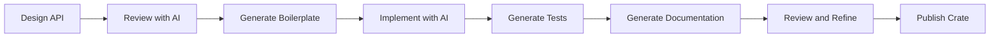
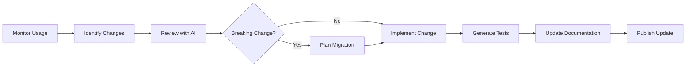

# Microcrate Architecture Plan

## Executive Summary

This document outlines a comprehensive plan for breaking down the Rust-Template project into microcrates from an **AI-native development perspective**. In AI-native development, the primary complexity comes from interface/API changes, not from having many crates. Strong boundaries keep components locked in place and enable rapid iteration, while boilerplate generation and maintenance overhead are negligible due to AI tooling.

**Current Crate Count:** 20 crates
**Proposed Microcrate Count:** 40-50 crates (expanded for stronger boundaries)
**Primary Goals:**
- Strong, stable interface boundaries that enable rapid iteration
- Clear domain boundaries that AI tools can understand and work with
- Enhanced reusability through focused, single-purpose microcrates
- API stability as the primary complexity concern to manage

**AI-Native Principles:**
- **Complexity is at boundaries** - The only real complexity comes when an interface or API changes
- **Strong boundaries are beneficial** - They keep things locked in place and can be rapidly iterated
- **Boilerplate is practically free** - AI tools can generate and maintain boilerplate easily
- **More crates = better isolation** - Each microcrate represents a stable contract that can evolve independently

---

## 1. Current Crate Analysis

### 1.1 Existing Crates Overview

| Crate | Purpose | Lines (est) | Dependencies | Status |
|-------|---------|-------------|--------------|--------|
| `acceptance` | BDD testing with Cucumber/Gherkin | ~300 | ac-kernel, adapters-spec-fs, app-http, business-core, spec-runtime, telemetry, testing | Keep |
| `ac-kernel` | Core AC governance logic | ~200 | spec-runtime | Keep |
| `adapters-db-sqlx` | PostgreSQL database adapter | ~150 | business-core, model, sqlx | Keep |
| `adapters-grpc` | gRPC adapter | ~100 | business-core, model, prost, tonic | Keep |
| `adapters-spec-fs` | Filesystem adapter for specs | ~100 | business-core, spec-runtime | Keep |
| `app-http` | HTTP application (large) | ~800+ | adapters-db-sqlx, adapters-spec-fs, business-core, gov-http, gov-model, model, spec-runtime, telemetry | **Split** |
| `business-core` | Business logic core | ~130 | gov-model, model | Keep |
| `gov-contracts` | Governance contracts and schemas | ~50 | gov-model | Keep |
| `gov-http` | Governance HTTP handlers | ~200 | axum, gov-contracts, gov-model, spec-runtime | Keep |
| `gov-model` | Governance models and context | ~330 | (minimal) | Keep |
| `gov-policy` | Rego policy bundle and runner | ~50 | gov-model | Keep |
| `gov-receipts` | Governance receipts (7 modules) | ~400 | (minimal) | **Split** |
| `gov-xtask-core` | Governance xtask utilities | ~50 | gov-model | Keep |
| `model` | Core models | ~60 | (minimal) | Keep |
| `rust_iac_config` | IaC configuration management | ~150 | (minimal) | Keep |
| `rust_iac_xtask_core` | XTask core commands | ~100 | (minimal) | Keep |
| `spec-runtime` | Runtime for spec-based workflows (11 modules) | ~600+ | gov-model | **Split** |
| `telemetry` | Telemetry utilities | ~50 | (minimal) | Keep |
| `testing` | Testing utilities | ~50 | parking_lot | Keep |
| `xtask` | Build and development tasks (74 commands) | ~2000+ | ac-kernel, business-core, gov-receipts, gov-xtask-core, spec-runtime, testing | **Split** |

### 1.2 Dependency Graph Summary

```
                    ┌─────────────┐
                    │   model     │
                    └──────┬──────┘
                           │
                    ┌──────▼──────┐
                    │ gov-model   │
                    └──────┬──────┘
                           │
        ┌──────────────────┼──────────────────┐
        │                  │                  │
┌───────▼───────┐ ┌──────▼──────┐ ┌──────▼──────┐
│ business-core │ │ spec-runtime│ │ gov-contracts│
└───────┬───────┘ └──────┬──────┘ └──────┬──────┘
        │                │                │
        │        ┌───────▼───────┐      │
        │        │  gov-http     │      │
        │        └───────┬───────┘      │
        │                │              │
┌───────▼───────┐ ┌─────▼─────┐ ┌────▼─────┐
│ adapters-db   │ │ app-http  │ │ gov-http │
│ adapters-grpc │ │           │ │          │
│ adapters-spec │ └─────┬─────┘ └──────────┘
└───────────────┘       │
        │               │
        │        ┌──────▼──────┐
        │        │ acceptance   │
        │        └─────────────┘
        │
┌───────▼───────┐
│     xtask     │
└───────────────┘
```

---

## 2. Microcrate Opportunities

### 2.1 High-Priority Splits

#### 2.1.1 `app-http` → Multiple Microcrates

**Current State:** Single crate with 800+ lines covering:
- HTTP routing and handlers
- Middleware (CORS, security headers, request ID, platform auth)
- Agent endpoints
- Platform endpoints (IDP, UI)
- Security (JWT, platform auth)
- Tasks and todos
- Metrics
- Error handling
- Shutdown handling

**Proposed Splits:**

1. **`http-middleware`** - Reusable HTTP middleware
   - CORS middleware
   - Security headers middleware
   - Request ID middleware
   - Platform authentication guard
   - **Rationale:** These are generic, reusable components that could benefit other projects
   - **Dependencies:** axum, serde, tracing, uuid
   - **Public API:** Middleware functions and configuration types

2. **`http-errors`** - Structured error handling
   - `AppError` type with error codes
   - AC/Feature ID tracking
   - JSON error envelopes
   - **Rationale:** Error handling is a cross-cutting concern that should be reusable
   - **Dependencies:** serde, serde_json, thiserror, tracing
   - **Public API:** `AppError`, `ErrorCode`, `ErrorSummary`, error builder methods

3. **`http-metrics`** - Metrics collection
   - Prometheus metrics middleware
   - Request latency tracking
   - Request counting
   - **Rationale:** Metrics infrastructure is a common need across HTTP services
   - **Dependencies:** prometheus, axum, tower
   - **Public API:** `metrics_middleware`, `metrics_handler`, metric types

4. **`http-platform`** - Platform-specific endpoints
   - IDP endpoints
   - UI endpoints
   - Platform introspection
   - **Rationale:** Platform-specific concerns should be isolated
   - **Dependencies:** axum, maud, spec-runtime, gov-model
   - **Public API:** Router builders for platform endpoints

5. **`http-agents`** - Agent endpoints
   - Agent-related HTTP handlers
   - **Rationale:** Agent functionality is a distinct domain
   - **Dependencies:** axum, business-core, model
   - **Public API:** Agent router and handlers

6. **`http-tasks`** - Task management endpoints
   - Task CRUD endpoints
   - Task status updates
   - **Rationale:** Task management is a core domain concern
   - **Dependencies:** axum, business-core, model
   - **Public API:** Task router and handlers

7. **`http-todos`** - Todo endpoints
   - Todo CRUD operations
   - **Rationale:** Todo functionality is a distinct domain
   - **Dependencies:** axum, business-core, model
   - **Public API:** Todo router and handlers

8. **`http-core`** - Core HTTP infrastructure
   - Application state management
   - Router composition
   - Health/version endpoints
   - Shutdown handling
   - **Rationale:** Core HTTP infrastructure should be reusable
   - **Dependencies:** axum, http-middleware, http-errors, http-metrics
   - **Public API:** `AppState`, router builders, core handlers

#### 2.1.2 `spec-runtime` → Multiple Microcrates

**Current State:** Single crate with 600+ lines covering:
- Configuration validation
- Spec ledger (stories, requirements, ACs)
- Developer experience flows
- Documentation indexing
- Governance graph
- Agent hints
- Kubernetes IaC
- Local Docker
- Schema management
- Service metadata
- Task management
- UI contract

**Proposed Splits:**

1. **`spec-config`** - Configuration validation
   - Schema-driven config validation
   - `ValidatedConfig` type
   - **Rationale:** Configuration is a common need across projects
   - **Dependencies:** serde, serde_yaml, jsonschema, anyhow
   - **Public API:** `validate_config`, `ValidatedConfig`

2. **`spec-ledger`** - Spec ledger management
   - Story, requirement, and AC types
   - Ledger loading and parsing
   - AC/REQ ID indexing
   - **Rationale:** Spec ledger is core governance functionality
   - **Dependencies:** serde, serde_yaml, anyhow
   - **Public API:** `SpecLedger`, `Story`, `Requirement`, `AcceptanceCriterion`, ID indexes

3. **`spec-graph`** - Governance graph
   - Graph builder (stories → REQs → ACs → tests → docs)
   - Graph traversal utilities
   - **Rationale:** Graph operations are a distinct concern
   - **Dependencies:** spec-ledger, anyhow
   - **Public API:** `Graph`, `Node`, `Edge`, `build_graph`

4. **`spec-devex`** - Developer experience flows
   - Flow definitions
   - Command specifications
   - **Rationale:** DevEx flows are a distinct concern
   - **Dependencies:** serde, serde_yaml, anyhow
   - **Public API:** `DevExFlows`, `Flow`, `Command`

5. **`spec-docs`** - Documentation indexing
   - Doc inventory
   - Doc health checking
   - **Rationale:** Documentation management is a separate concern
   - **Dependencies:** serde, serde_yaml, anyhow
   - **Public API:** `DocIndex`, `DocEntry`, `load_doc_index`

6. **`spec-hints`** - Agent hint engine
   - AC coverage tracking
   - Hint generation
   - Task prioritization
   - **Rationale:** Agent hints are AI/LLM-specific functionality
   - **Dependencies:** spec-ledger, anyhow
   - **Public API:** `HintEngine`, `Hint`, `AcCoverage`, `HintFilter`

7. **`spec-tasks`** - Task management
   - Task types and operations
   - Task sequencing
   - **Rationale:** Task management is a distinct domain
   - **Dependencies:** serde, serde_yaml, anyhow
   - **Public API:** `TasksSpec`, `Task`, `TaskStatus`

8. **`spec-schema`** - Schema management
   - Platform API schemas
   - Endpoint metadata
   - **Rationale:** Schema management is a separate concern
   - **Dependencies:** serde, serde_yaml, anyhow
   - **Public API:** `PlatformSchemas`, `EndpointSchema`, `SchemaInfo`

9. **`spec-ui-contract`** - UI contract management
   - UI region definitions
   - Screen specifications
   - **Rationale:** UI contracts are a distinct concern
   - **Dependencies:** serde, serde_yaml, anyhow
   - **Public API:** `UiContract`, `Region`, `Screen`

10. **`spec-iac`** - Infrastructure as Code support
    - Kubernetes IaC configuration
    - Local Docker configuration
    - **Rationale:** IaC support is a distinct concern
    - **Dependencies:** serde, serde_yaml, anyhow
    - **Public API:** `K8sIacConfig`, `LocalDockerConfig`

11. **`spec-metadata`** - Service metadata
    - Service information loading
    - **Rationale:** Service metadata is a separate concern
    - **Dependencies:** serde, serde_yaml, anyhow
    - **Public API:** `ServiceMetadata`, `load_service_metadata`

#### 2.1.3 `gov-receipts` → Multiple Microcrates

**Current State:** Single crate with 7 modules:
- `dossier` - PR analysis for casebook generation
- `economics` - DevLT and compute spend tracking
- `gate` - Gate execution results
- `meta` - Receipt metadata
- `quality` - Code quality metrics
- `telemetry` - Probe execution results
- `timeline` - PR evolution and convergence patterns

**Proposed Splits:**

1. **`receipts-core`** - Core receipt types
   - `ReceiptMeta` - Common receipt metadata
   - Builder patterns for receipts
   - **Rationale:** Core receipt types are shared across all receipts
   - **Dependencies:** serde, serde_json, chrono
   - **Public API:** `ReceiptMeta`, `ReceiptMetaBuilder`, confidence types

2. **`receipts-gate`** - Gate receipts
   - `GateReceipt` - Gate execution results
   - `GateStatus`, `GateResult`
   - Test details, selftest details
   - **Rationale:** Gate receipts are a distinct type of receipt
   - **Dependencies:** receipts-core, serde, chrono
   - **Public API:** `GateReceipt`, `GateStatus`, `GateResult`, `GateDetails`

3. **`receipts-quality`** - Quality receipts
   - `QualityReceipt` - Code quality metrics
   - Contract changes, boundary assessments
   - Test depth ratings
   - **Rationale:** Quality receipts are a distinct type of receipt
   - **Dependencies:** receipts-core, serde, chrono
   - **Public API:** `QualityReceipt`, `Quality`, `Contract`, `LlmBoundaryAssessment`

4. **`receipts-telemetry`** - Telemetry receipts
   - `TelemetryReceipt` - Probe execution results
   - Change surface analysis
   - Safety assessments
   - **Rationale:** Telemetry receipts are a distinct type of receipt
   - **Dependencies:** receipts-core, serde, chrono
   - **Public API:** `TelemetryReceipt`, `ProbeResult`, `ChangeSurface`, `Safety`

5. **`receipts-timeline`** - Timeline receipts
   - `TimelineReceipt` - PR evolution tracking
   - Convergence patterns, friction zones
   - **Rationale:** Timeline receipts are a distinct type of receipt
   - **Dependencies:** receipts-core, serde, chrono
   - **Public API:** `TimelineReceipt`, `Convergence`, `FrictionZone`, `Oscillation`

6. **`receipts-economics`** - Economics receipts
   - `EconomicsReceipt` - DevLT and compute spend
   - Value delivered tracking
   - **Rationale:** Economics receipts are a distinct type of receipt
   - **Dependencies:** receipts-core, serde, chrono
   - **Public API:** `EconomicsReceipt`, `DevLtMinutes`, `ComputeSpend`, `ValueDelivered`

7. **`receipts-dossier`** - Dossier receipts
   - `Dossier` - Structured PR analysis
   - Findings, intents, scopes
   - **Rationale:** Dossier receipts are a distinct type of receipt
   - **Dependencies:** receipts-core, serde, chrono
   - **Public API:** `Dossier`, `Finding`, `Intent`, `Scope`, `Erratum`

#### 2.1.4 `xtask` → Multiple Microcrates

**Current State:** Single crate with 74 command modules covering:
- AC-related commands (11 commands)
- ADR commands (2 commands)
- Agent commands
- Audit commands
- BDD commands
- Build time commands
- Bundle commands
- CI commands
- Config validation
- Contracts commands
- Coverage commands
- Deploy commands
- Design commands
- Dev environment commands
- Docs commands
- Doctor commands
- Environment mode commands
- Formatting commands
- Fork commands
- Friction commands
- GitHub commands
- Graph export commands
- Hakari commands
- Help flows commands
- IDP commands
- Install hooks commands
- Issues search commands
- Kernel commands (2 commands)
- Migrate commands
- Pin actions commands
- Policy test commands
- PR commands (2 commands)
- Precommit commands
- Questions commands
- Quickstart commands
- Receipts commands
- Release commands (3 commands)
- SBOM commands
- Selftest commands
- Service descriptor commands (2 commands)
- Skills commands
- Spellcheck commands
- Status commands
- Suggest next commands
- Tasks commands (2 commands)
- Test commands (2 commands)
- Tools checksum commands (2 commands)
- UI contract check commands
- Version commands (2 commands)
- Versioning commands

**Proposed Splits:**

1. **`xtask-core`** - Core xtask infrastructure
   - Command registration and dispatch
   - CLI argument parsing
   - Error handling
   - **Rationale:** Core infrastructure should be reusable
   - **Dependencies:** clap, anyhow, colored
   - **Public API:** Command trait, CLI builder, error types

2. **`xtask-ac`** - Acceptance criteria commands
   - AC coverage, linting, reporting
   - AC history, status, tests
   - AC suggest scenarios
   - **Rationale:** AC commands are a distinct domain
   - **Dependencies:** xtask-core, ac-kernel, spec-ledger, spec-hints
   - **Public API:** AC command implementations

3. **`xtask-adr`** - Architecture decision record commands
   - ADR check, new
   - **Rationale:** ADR commands are a distinct domain
   - **Dependencies:** xtask-core
   - **Public API:** ADR command implementations

4. **`xtask-build`** - Build-related commands
   - Build time measurement
   - Bundle commands
   - CI local commands
   - Clean commands
   - **Rationale:** Build commands are a distinct domain
   - **Dependencies:** xtask-core
   - **Public API:** Build command implementations

5. **`xtask-config`** - Configuration commands
   - Config validation
   - **Rationale:** Config commands are a distinct domain
   - **Dependencies:** xtask-core, spec-config
   - **Public API:** Config command implementations

6. **`xtask-contracts`** - Contract commands
   - Contract management
   - UI contract check
   - **Rationale:** Contract commands are a distinct domain
   - **Dependencies:** xtask-core, spec-contracts, spec-ui-contract
   - **Public API:** Contract command implementations

7. **`xtask-coverage`** - Coverage commands
   - Coverage reporting
   - PR coverage
   - **Rationale:** Coverage commands are a distinct domain
   - **Dependencies:** xtask-core
   - **Public API:** Coverage command implementations

8. **`xtask-deploy`** - Deployment commands
   - Deploy commands
   - Release commands (bundle, prepare, verify)
   - **Rationale:** Deployment commands are a distinct domain
   - **Dependencies:** xtask-core, gov-receipts
   - **Public API:** Deploy command implementations

9. **`xtask-devex`** - Developer experience commands
   - Design new
   - Dev up
   - Doctor
   - Help flows
   - Quickstart
   - **Rationale:** DevEx commands are a distinct domain
   - **Dependencies:** xtask-core, spec-devex
   - **Public API:** DevEx command implementations

10. **`xtask-docs`** - Documentation commands
    - Docs check
    - Docs frontmatter sync
    - Spellcheck
    - **Rationale:** Documentation commands are a distinct domain
    - **Dependencies:** xtask-core, spec-docs
    - **Public API:** Docs command implementations

11. **`xtask-governance`** - Governance commands
    - Fork commands
    - Friction commands
    - Issues search
    - Questions commands
    - Receipts commands
    - **Rationale:** Governance commands are a distinct domain
    - **Dependencies:** xtask-core, gov-http, gov-model
    - **Public API:** Governance command implementations

12. **`xtask-kernel`** - Kernel commands
    - Kernel smoke
    - Kernel status
    - **Rationale:** Kernel commands are a distinct domain
    - **Dependencies:** xtask-core, ac-kernel
    - **Public API:** Kernel command implementations

13. **`xtask-policy`** - Policy commands
    - Policy test
    - **Rationale:** Policy commands are a distinct domain
    - **Dependencies:** xtask-core, gov-policy
    - **Public API:** Policy command implementations

14. **`xtask-release`** - Release commands
    - Release bundle
    - Release prepare
    - Release verify
    - **Rationale:** Release commands are a distinct domain
    - **Dependencies:** xtask-core, gov-receipts
    - **Public API:** Release command implementations

15. **`xtask-security`** - Security commands
    - SBOM local
    - **Rationale:** Security commands are a distinct domain
    - **Dependencies:** xtask-core
    - **Public API:** Security command implementations

16. **`xtask-services`** - Service commands
    - Service descriptor
    - Service init
    - **Rationale:** Service commands are a distinct domain
    - **Dependencies:** xtask-core, spec-metadata
    - **Public API:** Service command implementations

17. **`xtask-skills`** - Skills commands
    - Skills management
    - **Rationale:** Skills commands are a distinct domain
    - **Dependencies:** xtask-core
    - **Public API:** Skills command implementations

18. **`xtask-tools`** - Tools commands
    - Tools checksum update
    - Tools checksum verify
    - **Rationale:** Tools commands are a distinct domain
    - **Dependencies:** xtask-core
    - **Public API:** Tools command implementations

19. **`xtask-versioning`** - Versioning commands
    - Version check
    - Version
    - Versioning
    - **Rationale:** Versioning commands are a distinct domain
    - **Dependencies:** xtask-core
    - **Public API:** Versioning command implementations

20. **`xtask-workspace`** - Workspace commands
    - Env mode
    - Fmt all
    - Graph export
    - Hakari
    - Install hooks
    - Migrate
    - Pin actions
    - Status
    - Suggest next
    - Tasks list
    - Test changed
    - **Rationale:** Workspace commands are a distinct domain
    - **Dependencies:** xtask-core
    - **Public API:** Workspace command implementations

### 2.2 Medium-Priority Splits

#### 2.2.1 `gov-http` → Split by Domain

**Current State:** Single crate with handlers for:
- Forks
- Friction
- Issues
- Questions
- Core handlers (health, status, schema, graph, etc.)

**Proposed Splits:**

1. **`gov-http-forks`** - Fork endpoints
   - Fork listing and management
   - **Rationale:** Forks are a distinct governance domain
   - **Dependencies:** gov-model, axum
   - **Public API:** Fork router and handlers

2. **`gov-http-friction`** - Friction endpoints
   - Friction tracking and resolution
   - **Rationale:** Friction is a distinct governance domain
   - **Dependencies:** gov-model, axum
   - **Public API:** Friction router and handlers

3. **`gov-http-issues`** - Issues endpoints
   - Issue tracking and management
   - **Rationale:** Issues are a distinct governance domain
   - **Dependencies:** gov-model, axum
   - **Public API:** Issues router and handlers

4. **`gov-http-questions`** - Questions endpoints
   - Question management and resolution
   - **Rationale:** Questions are a distinct governance domain
   - **Dependencies:** gov-model, axum
   - **Public API:** Questions router and handlers

5. **`gov-http-core`** - Core governance endpoints
   - Health, status, schema, graph, coverage
   - **Rationale:** Core endpoints are shared infrastructure
   - **Dependencies:** gov-model, spec-runtime, axum
   - **Public API:** Core router and handlers

#### 2.2.2 `adapters-*` → Extract Common Patterns

**Proposed New Crate:**

1. **`adapters-core`** - Common adapter patterns
   - Repository trait definitions
   - Common error types
   - Adapter utilities
   - **Rationale:** Common patterns can be shared across adapters
   - **Dependencies:** async-trait, thiserror
   - **Public API:** Repository traits, error types, utilities

### 2.3 Additional Aggressive Microcratization Opportunities

In AI-native development, the benefits of even stronger boundaries outweigh traditional concerns about crate count. The following additional splits are proposed to create even more focused, stable interfaces:

#### 2.3.1 Shared Utility Extracts

**Proposed New Crates:**

1. **`serde-utils`** - Shared serialization utilities
   - Common serde helpers
   - JSON/YAML conversion utilities
   - Validation helpers
   - **Rationale:** Serialization is a cross-cutting concern used across many crates
   - **Dependencies:** serde, serde_json, serde_yaml
   - **Public API:** Serialization helpers, validators, converters

2. **`tracing-utils`** - Shared tracing/logging utilities
   - Structured logging helpers
   - Span management utilities
   - Common tracing patterns
   - **Rationale:** Tracing is used throughout the codebase
   - **Dependencies:** tracing, tracing-subscriber
   - **Public API:** Logging macros, span builders, context utilities

3. **`error-utils`** - Shared error handling utilities
   - Common error types
   - Error conversion helpers
   - Result combinators
   - **Rationale:** Error handling patterns are repeated across crates
   - **Dependencies:** thiserror, anyhow
   - **Public API:** Error types, conversion traits, result helpers

4. **`validation-utils`** - Shared validation utilities
   - Common validators
   - Validation result types
   - Schema validation helpers
   - **Rationale:** Validation is needed across multiple domains
   - **Dependencies:** regex, thiserror
   - **Public API:** Validators, validation results, schema helpers

#### 2.3.2 Domain-Specific Microcrates

**Proposed New Crates:**

1. **`jwt-core`** - JWT token handling
   - JWT parsing and validation
   - Token generation
   - Claims management
   - **Rationale:** JWT handling is a distinct security concern
   - **Dependencies:** jsonwebtoken, serde
   - **Public API:** `JwtToken`, `Claims`, validation functions

2. **`cors-core`** - CORS configuration and handling
   - CORS policy configuration
   - CORS middleware utilities
   - Origin validation
   - **Rationale:** CORS is a cross-cutting HTTP concern
   - **Dependencies:** http, tower
   - **Public API:** `CorsConfig`, `CorsPolicy`, middleware builders

3. **`uuid-utils`** - UUID generation and handling
   - UUID generation helpers
   - UUID parsing and validation
   - UUID conversion utilities
   - **Rationale:** UUID handling is common across domains
   - **Dependencies:** uuid, serde
   - **Public API:** UUID generators, validators, converters

4. **`time-utils`** - Time handling utilities
   - Time parsing and formatting
   - Duration helpers
   - Timezone utilities
   - **Rationale:** Time handling is a common need
   - **Dependencies:** chrono, serde
   - **Public API:** Time parsers, formatters, duration helpers

#### 2.3.3 Further HTTP Layer Decomposition

**Proposed Additional Splits:**

1. **`http-auth`** - Authentication utilities
   - Authentication trait definitions
   - Common authentication schemes
   - Auth context management
   - **Rationale:** Authentication is a distinct concern from authorization
   - **Dependencies:** axum, async-trait
   - **Public API:** Auth traits, auth schemes, context types

2. **`http-axum-utils`** - Axum-specific utilities
   - Axum extractor helpers
   - Router composition utilities
   - State management helpers
   - **Rationale:** Axum-specific patterns can be reused
   - **Dependencies:** axum, tower
   - **Public API:** Extractor helpers, router builders, state utilities

3. **`http-response`** - Response builders and utilities
   - Standardized response builders
   - Response envelope types
   - Error response formatting
   - **Rationale:** Response handling is a distinct concern
   - **Dependencies:** axum, http, serde_json
   - **Public API:** Response builders, envelope types, error formatters

#### 2.3.4 Further Spec Runtime Decomposition

**Proposed Additional Splits:**

1. **`spec-validation`** - Spec validation rules
   - Validation rule definitions
   - Rule engine
   - Validation result types
   - **Rationale:** Validation is a distinct concern from config loading
   - **Dependencies:** spec-config, serde
   - **Public API:** Validation rules, rule engine, result types

2. **`spec-parsing`** - Spec parsing utilities
   - YAML/JSON parsing helpers
   - Parse error handling
   - Parser combinators
   - **Rationale:** Parsing is a distinct concern from validation
   - **Dependencies:** serde_yaml, serde_json, anyhow
   - **Public API:** Parsers, parse errors, parser utilities

3. **`spec-indexing`** - Spec indexing utilities
   - Index data structures
   - Index builders
   - Query utilities
   - **Rationale:** Indexing is a distinct concern from ledger storage
   - **Dependencies:** spec-ledger, anyhow
   - **Public API:** Index types, index builders, query utilities

#### 2.3.5 Further Receipt Decomposition

**Proposed Additional Splits:**

1. **`receipts-validation`** - Receipt validation
   - Validation rules for receipts
   - Receipt integrity checks
   - Confidence score validation
   - **Rationale:** Validation is a distinct concern from receipt storage
   - **Dependencies:** receipts-core, serde
   - **Public API:** Validation rules, integrity checks, confidence validators

2. **`receipts-serialization`** - Receipt serialization
   - Serialization formats
   - Deserialization utilities
   - Format converters
   - **Rationale:** Serialization is a distinct concern from receipt types
   - **Dependencies:** receipts-core, serde, serde_json
   - **Public API:** Serializers, deserializers, format converters

---

## 3. Proposed Microcrate Architecture

### 3.1 Layered Architecture

```
┌─────────────────────────────────────────────────────────────────┐
│                    Application Layer                           │
│  ┌──────────────┐  ┌──────────────┐  ┌──────────────┐      │
│  │  app-http    │  │ gov-http-*   │  │   xtask-*    │      │
│  │  (composed)  │  │  (composed)  │  │  (composed)  │      │
│  └──────────────┘  └──────────────┘  └──────────────┘      │
└─────────────────────────────────────────────────────────────────┘
                              │
┌─────────────────────────────────────────────────────────────────┐
│                    HTTP Layer                                 │
│  ┌──────────┐ ┌──────────┐ ┌──────────┐ ┌──────────┐       │
│  │http-core ││http-mid  ││http-err  ││http-met  │       │
│  └──────────┘ └──────────┘ └──────────┘ └──────────┘       │
│  ┌──────────┐ ┌──────────┐ ┌──────────┐ ┌──────────┐       │
│  │http-plat ││http-agt  ││http-tsk  ││http-tdo  │       │
│  └──────────┘ └──────────┘ └──────────┘ └──────────┘       │
└─────────────────────────────────────────────────────────────────┘
                              │
┌─────────────────────────────────────────────────────────────────┐
│                    Business Layer                             │
│  ┌──────────────┐  ┌──────────────┐  ┌──────────────┐      │
│  │business-core │  │ gov-model    │  │    model     │      │
│  └──────────────┘  └──────────────┘  └──────────────┘      │
└─────────────────────────────────────────────────────────────────┘
                              │
┌─────────────────────────────────────────────────────────────────┐
│                    Spec/Governance Layer                      │
│  ┌──────────┐ ┌──────────┐ ┌──────────┐ ┌──────────┐       │
│  │spec-led  ││spec-grph ││spec-hint ││spec-task │       │
│  └──────────┘ └──────────┘ └──────────┘ └──────────┘       │
│  ┌──────────┐ ┌──────────┐ ┌──────────┐ ┌──────────┐       │
│  │spec-conf ││spec-doc  ││spec-schm ││spec-ui   │       │
│  └──────────┘ └──────────┘ └──────────┘ └──────────┘       │
│  ┌──────────┐ ┌──────────┐ ┌──────────┐ ┌──────────┐       │
│  │spec-dev  ││spec-iac  ││spec-meta ││          │       │
│  └──────────┘ └──────────┘ └──────────┘ └──────────┘       │
└─────────────────────────────────────────────────────────────────┘
                              │
┌─────────────────────────────────────────────────────────────────┐
│                    Receipt Layer                              │
│  ┌──────────┐ ┌──────────┐ ┌──────────┐ ┌──────────┐       │
│  │rcpt-core ││rcpt-gate ││rcpt-qual ││rcpt-tel  │       │
│  └──────────┘ └──────────┘ └──────────┘ └──────────┘       │
│  ┌──────────┐ ┌──────────┐ ┌──────────┐ ┌──────────┐       │
│  │rcpt-tim  ││rcpt-eco  ││rcpt-doss ││          │       │
│  └──────────┘ └──────────┘ └──────────┘ └──────────┘       │
└─────────────────────────────────────────────────────────────────┘
                              │
┌─────────────────────────────────────────────────────────────────┐
│                    Adapter Layer                              │
│  ┌──────────┐ ┌──────────┐ ┌──────────┐ ┌──────────┐       │
│  │adap-core  ││adap-db    ││adap-grpc  ││adap-spec  │       │
│  └──────────┘ └──────────┘ └──────────┘ └──────────┘       │
└─────────────────────────────────────────────────────────────────┘
                              │
┌─────────────────────────────────────────────────────────────────┐
│                    Infrastructure Layer                        │
│  ┌──────────┐ ┌──────────┐ ┌──────────┐ ┌──────────┐       │
│  │ telemetry ││  testing  ││   model   ││gov-model │       │
│  └──────────┘ └──────────┘ └──────────┘ └──────────┘       │
└─────────────────────────────────────────────────────────────────┘
```

### 3.2 Microcrate Dependency Graph

```mermaid
graph TD
    subgraph Infrastructure
        model[model]
        gov_model[gov-model]
        telemetry[telemetry]
        testing[testing]
    end

    subgraph Adapters
        adapters_core[adapters-core]
        adapters_db[adapters-db-sqlx]
        adapters_grpc[adapters-grpc]
        adapters_spec[adapters-spec-fs]
    end

    subgraph Receipts
        receipts_core[receipts-core]
        receipts_gate[receipts-gate]
        receipts_quality[receipts-quality]
        receipts_telemetry[receipts-telemetry]
        receipts_timeline[receipts-timeline]
        receipts_economics[receipts-economics]
        receipts_dossier[receipts-dossier]
    end

    subgraph Spec
        spec_config[spec-config]
        spec_ledger[spec-ledger]
        spec_graph[spec-graph]
        spec_hints[spec-hints]
        spec_tasks[spec-tasks]
        spec_devex[spec-devex]
        spec_docs[spec-docs]
        spec_schema[spec-schema]
        spec_ui[spec-ui-contract]
        spec_iac[spec-iac]
        spec_metadata[spec-metadata]
    end

    subgraph Business
        business_core[business-core]
        gov_contracts[gov-contracts]
        gov_policy[gov-policy]
    end

    subgraph HTTP
        http_core[http-core]
        http_middleware[http-middleware]
        http_errors[http-errors]
        http_metrics[http-metrics]
        http_platform[http-platform]
        http_agents[http-agents]
        http_tasks[http-tasks]
        http_todos[http-todos]
        gov_http_core[gov-http-core]
        gov_http_forks[gov-http-forks]
        gov_http_friction[gov-http-friction]
        gov_http_issues[gov-http-issues]
        gov_http_questions[gov-http-questions]
    end

    subgraph XTask
        xtask_core[xtask-core]
        xtask_ac[xtask-ac]
        xtask_adr[xtask-adr]
        xtask_build[xtask-build]
        xtask_config[xtask-config]
        xtask_contracts[xtask-contracts]
        xtask_coverage[xtask-coverage]
        xtask_deploy[xtask-deploy]
        xtask_devex[xtask-devex]
        xtask_docs[xtask-docs]
        xtask_governance[xtask-governance]
        xtask_kernel[xtask-kernel]
        xtask_policy[xtask-policy]
        xtask_release[xtask-release]
        xtask_security[xtask-security]
        xtask_services[xtask-services]
        xtask_skills[xtask-skills]
        xtask_tools[xtask-tools]
        xtask_versioning[xtask-versioning]
        xtask_workspace[xtask-workspace]
    end

    subgraph Application
        app_http[app-http]
        gov_http[gov-http]
        xtask[xtask]
        acceptance[acceptance]
        ac_kernel[ac-kernel]
        gov_xtask_core[gov-xtask-core]
        rust_iac_config[rust_iac_config]
        rust_iac_xtask_core[rust_iac_xtask_core]
    end

    %% Infrastructure to Business
    model --> business_core
    gov_model --> business_core
    gov_model --> gov_contracts
    gov_model --> gov_policy

    %% Business to Adapters
    business_core --> adapters_db
    business_core --> adapters_grpc
    business_core --> adapters_spec

    %% Spec dependencies
    gov_model --> spec_config
    spec_ledger --> spec_config
    spec_graph --> spec_ledger
    spec_hints --> spec_ledger
    spec_devex --> spec_config
    spec_docs --> spec_config
    spec_schema --> spec_config
    spec_ui --> spec_config
    spec_iac --> spec_config
    spec_metadata --> spec_config

    %% Receipt dependencies
    receipts_core --> receipts_gate
    receipts_core --> receipts_quality
    receipts_core --> receipts_telemetry
    receipts_core --> receipts_timeline
    receipts_core --> receipts_economics
    receipts_core --> receipts_dossier

    %% HTTP dependencies
    http_middleware --> http_core
    http_errors --> http_core
    http_metrics --> http_core
    http_platform --> http_core
    http_agents --> http_core
    http_tasks --> http_core
    http_todos --> http_core

    app_http --> http_core
    app_http --> http_platform
    app_http --> http_agents
    app_http --> http_tasks
    app_http --> http_todos

    gov_http_core --> gov_model
    gov_http_core --> spec_schema
    gov_http_forks --> gov_model
    gov_http_friction --> gov_model
    gov_http_issues --> gov_model
    gov_http_questions --> gov_model

    gov_http --> gov_http_core
    gov_http --> gov_http_forks
    gov_http --> gov_http_friction
    gov_http --> gov_http_issues
    gov_http --> gov_http_questions

    %% XTask dependencies
    xtask_core --> xtask_ac
    xtask_core --> xtask_adr
    xtask_core --> xtask_build
    xtask_core --> xtask_config
    xtask_core --> xtask_contracts
    xtask_core --> xtask_coverage
    xtask_core --> xtask_deploy
    xtask_core --> xtask_devex
    xtask_core --> xtask_docs
    xtask_core --> xtask_governance
    xtask_core --> xtask_kernel
    xtask_core --> xtask_policy
    xtask_core --> xtask_release
    xtask_core --> xtask_security
    xtask_core --> xtask_services
    xtask_core --> xtask_skills
    xtask_core --> xtask_tools
    xtask_core --> xtask_versioning
    xtask_core --> xtask_workspace

    xtask --> xtask_core
    xtask --> xtask_ac
    xtask --> xtask_adr
    xtask --> xtask_build
    xtask --> xtask_config
    xtask --> xtask_contracts
    xtask --> xtask_coverage
    xtask --> xtask_deploy
    xtask --> xtask_devex
    xtask --> xtask_docs
    xtask --> xtask_governance
    xtask --> xtask_kernel
    xtask --> xtask_policy
    xtask --> xtask_release
    xtask --> xtask_security
    xtask --> xtask_services
    xtask --> xtask_skills
    xtask --> xtask_tools
    xtask --> xtask_versioning
    xtask --> xtask_workspace

    %% Application dependencies
    acceptance --> ac_kernel
    acceptance --> adapters_spec
    acceptance --> app_http
    acceptance --> business_core
    acceptance --> spec_config
    acceptance --> telemetry
    acceptance --> testing

    ac_kernel --> spec_config
    gov_xtask_core --> gov_model
```



---

## 4. Migration Strategy: AI-Native Approach

### 4.1 AI-Native Migration Principles

In AI-native development, migration is fundamentally different:

**Principle 1: AI-Assisted Boilerplate Generation**
- AI tools can generate boilerplate for new crates
- Migration boilerplate is handled automatically
- Focus human effort on API design, not mechanical tasks

**Principle 2: API Design is Primary Focus**
- The main effort should be on designing stable APIs
- Once APIs are stable, AI can handle the rest
- Breaking changes are the primary risk to manage

**Principle 3: Iterative Refinement**
- Start with stable API boundaries
- Let AI suggest improvements
- Refine based on AI analysis

**Principle 4: Documentation for AI Understanding**
- Document boundaries clearly for AI tools
- Provide examples of expected usage
- Include AI-friendly documentation patterns

### 4.2 Phased Migration Approach

#### Phase 1: Foundation Microcrates (Weeks 1-2)

**Goal:** Create low-risk, high-value microcrates with minimal dependencies

1. **`http-middleware`** - Extract middleware from `app-http`
   - Design stable API for middleware types
   - Use AI to generate crate boilerplate
   - Move middleware modules
   - Update `app-http` to use new crate
   - Run tests

2. **`http-errors`** - Extract error handling from `app-http`
   - Design stable error API
   - Use AI to generate error type definitions
   - Move error types
   - Update `app-http` to use new crate
   - Run tests

3. **`http-metrics`** - Extract metrics from `app-http`
   - Design stable metrics API
   - Use AI to generate metrics infrastructure
   - Move metrics module
   - Update `app-http` to use new crate
   - Run tests

4. **`receipts-core`** - Extract core receipt types from `gov-receipts`
   - Design stable receipt metadata API
   - Use AI to generate receipt types
   - Move core receipt types
   - Update `gov-receipts` to use new crate
   - Run tests

**AI-Native Success Criteria:**
- All tests pass
- Stable public APIs designed for long-term use
- AI can generate code for these microcrates
- Compilation time improved by at least 10%
- Documentation is AI-friendly

#### Phase 2: Spec Runtime Decomposition (Weeks 3-5)

**Goal:** Break down `spec-runtime` into focused microcrates

1. **`spec-config`** - Extract configuration validation
2. **`spec-ledger`** - Extract spec ledger
3. **`spec-graph`** - Extract governance graph
4. **`spec-hints`** - Extract hint engine
5. **`spec-tasks`** - Extract task management
6. **`spec-devex`** - Extract devex flows
7. **`spec-docs`** - Extract documentation indexing
8. **`spec-schema`** - Extract schema management
9. **`spec-ui-contract`** - Extract UI contract
10. **`spec-iac`** - Extract IaC support
11. **`spec-metadata`** - Extract service metadata

**Approach:**
- Create microcrates in dependency order (bottom-up)
- Start with `spec-config` (no dependencies on other spec crates)
- Then `spec-ledger` (depends on `spec-config`)
- Then `spec-graph` (depends on `spec-ledger`)
- Continue in dependency order
- Update dependent crates incrementally

**Success Criteria:**
- All spec-runtime functionality preserved
- Clear dependency boundaries
- Each crate has a single responsibility

#### Phase 3: Receipt Decomposition (Weeks 6-7)

**Goal:** Break down `gov-receipts` into focused microcrates

1. **`receipts-gate`** - Extract gate receipts
2. **`receipts-quality`** - Extract quality receipts
3. **`receipts-telemetry`** - Extract telemetry receipts
4. **`receipts-timeline`** - Extract timeline receipts
5. **`receipts-economics`** - Extract economics receipts
6. **`receipts-dossier`** - Extract dossier receipts

**Approach:**
- Each receipt type becomes its own crate
- All depend on `receipts-core`
- Update dependent crates incrementally

**Success Criteria:**
- All receipt functionality preserved
- Clear separation between receipt types
- Easy to add new receipt types

#### Phase 4: HTTP Layer Refinement (Weeks 8-9)

**Goal:** Complete `app-http` decomposition and split `gov-http`

1. **`http-core`** - Extract core HTTP infrastructure
2. **`http-platform`** - Extract platform endpoints
3. **`http-agents`** - Extract agent endpoints
4. **`http-tasks`** - Extract task endpoints
5. **`http-todos`** - Extract todo endpoints
6. **`gov-http-core`** - Extract core gov-http endpoints
7. **`gov-http-forks`** - Extract forks endpoints
8. **`gov-http-friction`** - Extract friction endpoints
9. **`gov-http-issues`** - Extract issues endpoints
10. **`gov-http-questions`** - Extract questions endpoints

**Approach:**
- Create `http-core` first (foundation)
- Then extract domain-specific crates
- Update `app-http` to compose from new crates
- Split `gov-http` similarly

**Success Criteria:**
- Clear separation of concerns
- Easy to add new HTTP endpoints
- Reusable HTTP components

#### Phase 5: XTask Decomposition (Weeks 10-14)

**Goal:** Break down `xtask` into focused command crates

1. **`xtask-core`** - Extract core infrastructure
2. **`xtask-ac`** - Extract AC commands
3. **`xtask-adr`** - Extract ADR commands
4. **`xtask-build`** - Extract build commands
5. **`xtask-config`** - Extract config commands
6. **`xtask-contracts`** - Extract contracts commands
7. **`xtask-coverage`** - Extract coverage commands
8. **`xtask-deploy`** - Extract deploy commands
9. **`xtask-devex`** - Extract devex commands
10. **`xtask-docs`** - Extract docs commands
11. **`xtask-governance`** - Extract governance commands
12. **`xtask-kernel`** - Extract kernel commands
13. **`xtask-policy`** - Extract policy commands
14. **`xtask-release`** - Extract release commands
15. **`xtask-security`** - Extract security commands
16. **`xtask-services`** - Extract services commands
17. **`xtask-skills`** - Extract skills commands
18. **`xtask-tools`** - Extract tools commands
19. **`xtask-versioning`** - Extract versioning commands
20. **`xtask-workspace`** - Extract workspace commands

**Approach:**
- Create `xtask-core` first (foundation)
- Then extract command groups by domain
- Update main `xtask` to use new crates
- Each command crate registers with `xtask-core`

**Success Criteria:**
- Clear separation of command domains
- Easy to add new commands
- Reduced compilation time for `xtask`

#### Phase 6: Adapter Refinement (Week 15)

**Goal:** Extract common adapter patterns

1. **`adapters-core`** - Extract common adapter utilities
   - Create new crate
   - Move common patterns from existing adapters
   - Update adapters to use new crate
   - Run tests

**Success Criteria:**
- Reduced code duplication across adapters
- Clear adapter patterns

#### Phase 7: Validation and Cleanup (Week 16)

**Goal:** Ensure all changes are working correctly

1. Run full test suite
2. Verify compilation time improvements
3. Update documentation
4. Clean up old code
5. Verify all public APIs are stable

**Success Criteria:**
- All tests pass
- Compilation time improved by at least 30%
- Documentation updated
- No deprecated code remaining

### 4.3 AI-Native Migration Process for Each Microcrate

#### Step 1: Design Stable API

Before creating the crate, design a stable API:

```markdown
# API Design for new-microcrate

## Purpose
[Describe the single responsibility of this microcrate]

## Public Types
[List the core types that will be exposed]

## Public Functions
[List the functions that will be part of the stable API]

## Invariants
[Document the invariants that the API maintains]

## AI-Friendly Documentation
[Provide examples that AI tools can understand and use]
```

**AI-Native Tip:** Use AI tools to review API design for stability and clarity before implementation.

#### Step 2: Generate Crate Boilerplate

Use AI tools to generate crate boilerplate:

```bash
# Ask AI to generate crate structure
# Prompt: "Create a Rust crate boilerplate for new-microcrate with the following API design..."

# Create new crate directory
mkdir -p crates/new-microcrate/src

# Create Cargo.toml (AI-generated)
cat > crates/new-microcrate/Cargo.toml << 'EOF'
[package]
name = "new-microcrate"
version = "0.1.0"
edition.workspace = true
publish.workspace = true
rust-version.workspace = true

[dependencies]
# Add dependencies here
EOF

# Create lib.rs with API stubs (AI-generated)
touch crates/new-microcrate/src/lib.rs
```

#### Step 3: Implement API

Use AI tools to implement the API:

```bash
# Ask AI to implement the API
# Prompt: "Implement the following API for new-microcrate..."

# Move relevant modules from source crate
mv crates/source-crate/src/module.rs crates/new-microcrate/src/
```

#### Step 4: Update Imports

Use AI tools to update imports across the codebase:

```rust
// In source crate, update imports
// Old: use crate::module::Type;
// New: use new_microcrate::Type;

// Ask AI to find and update all imports
// Prompt: "Find all uses of crate::module::Type and replace with new_microcrate::Type"
```

#### Step 5: Update Dependencies

```toml
# In source crate's Cargo.toml
[dependencies]
new-microcrate = { path = "../new-microcrate" }
```

#### Step 6: Generate Tests

Use AI tools to generate comprehensive tests:

```bash
# Ask AI to generate tests
# Prompt: "Generate comprehensive unit tests for new-microcrate..."

# Test the new crate
cargo test -p new-microcrate

# Test dependent crates
cargo test -p source-crate
```

#### Step 7: Update Workspace

```toml
# In workspace Cargo.toml
[workspace]
members = [
    # ... existing crates
    "crates/new-microcrate",
]
```

#### Step 8: Generate Documentation

Use AI tools to generate AI-friendly documentation:

```bash
# Ask AI to generate documentation
# Prompt: "Generate comprehensive documentation for new-microcrate that is friendly to AI tools..."

# Ensure documentation includes:
# - Clear type descriptions
# - Usage examples
# - Invariants and constraints
# - Common patterns
```

### 4.4 Backward Compatibility Strategy

During migration, maintain backward compatibility by:

1. **Re-export Types:** Keep old types available through re-exports

   ```rust
   // In old crate
   pub use new_microcrate::Type as OldType;
   ```

2. **Deprecation Warnings:** Add deprecation warnings for old paths

   ```rust
   #[deprecated(since = "0.2.0", note = "Use new_microcrate::Type instead")]
   pub use new_microcrate::Type as OldType;
   ```

3. **Feature Flags:** Use feature flags to enable/disable migration

   ```toml
   [features]
   default = []
   new-microcrate = ["dep:new-microcrate"]
   ```

4. **Documentation:** Update documentation to point to new locations

5. **Migration Guide:** Create a migration guide for users

### 4.5 AI-Native Testing Strategy

For each microcrate extraction:

1. **Unit Tests:** Ensure all existing tests pass
2. **Integration Tests:** Verify cross-crate functionality
3. **Compilation Tests:** Ensure all dependent crates compile
4. **Documentation Tests:** Run doctests
5. **Example Tests:** Verify examples work

### 4.6 AI-Native Rollback Plan

If a migration fails:

1. **Revert Changes:** Use git to revert the changes
2. **Document Issues:** Document what went wrong
3. **Adjust Plan:** Update the migration plan
4. **Retry:** Retry with adjusted approach

---

## 5. Trade-offs and Considerations: AI-Native Perspective

### 5.1 AI-Native Development Principles

In AI-native development, the traditional trade-offs of microcrate architecture are fundamentally different:

**Core Principle 1: Complexity is at Boundaries**
- The only real complexity comes when an interface or API changes
- Internal crate complexity is manageable by AI tools
- Stable boundaries enable rapid iteration without affecting other crates

**Core Principle 2: Strong Boundaries Are Beneficial**
- More crates with strong boundaries keep things locked in place
- Each microcrate represents a stable contract
- Changes are localized and can be rapidly iterated

**Core Principle 3: Boilerplate is Practically Free**
- AI tools can generate and maintain boilerplate easily
- The cost of additional crates is negligible
- Automation handles repetitive tasks

**Core Principle 4: API Stability is the Primary Concern**
- Design stable APIs/interfaces from the start
- Document boundaries clearly for AI understanding
- Minimize API changes to reduce complexity

### 5.2 Benefits: AI-Native Perspective

#### 5.2.1 Stable Interface Boundaries Enable Rapid Iteration

**AI-Native View:**
- Each microcrate represents a stable contract that can evolve independently
- Changes within a crate do not affect other crates
- AI tools can understand and work with clear boundaries
- Rapid iteration is possible without cascading changes

**Traditional View (for comparison):**
- More crates to manage
- Complex dependency graph

**AI-Native Reality:**
- Strong boundaries reduce the surface area for changes
- AI tools can navigate complex dependency graphs
- The cost of managing more crates is outweighed by the benefit of stable interfaces

#### 5.2.2 AI Tools Thrive on Clear Boundaries

**AI-Native View:**
- AI tools work best with well-defined, focused modules
- Clear public APIs make it easier for AI to understand code
- Microcrates provide natural boundaries for AI-assisted development
- AI can generate code for specific microcrates without understanding the entire system

**Traditional View (for comparison):**
- More documentation to maintain
- Higher cognitive load for developers

**AI-Native Reality:**
- Documentation is primarily for AI understanding, not just human developers
- AI can generate and maintain documentation
- Cognitive load is reduced because each crate is focused

#### 5.2.3 Boilerplate Generation is Automated

**AI-Native View:**
- AI tools can generate boilerplate for new crates
- Migration boilerplate is handled automatically
- Test scaffolding is generated by AI
- Cargo.toml files and module structures are created by AI

**Traditional View (for comparison):**
- Significant migration effort
- Time spent on migration vs. features

**AI-Native Reality:**
- Migration effort is primarily about API design, not boilerplate
- AI tools can assist with the mechanical aspects of migration
- The time cost is focused on designing stable interfaces

#### 5.2.4 API Changes Are the Primary Risk

**AI-Native View:**
- The main complexity comes from interface/API changes
- Once APIs are stable, internal changes are low-risk
- Version management is focused on API boundaries
- Breaking changes should be minimized and carefully planned

**Traditional View (for comparison):**
- Breaking changes during migration
- Impact on downstream users

**AI-Native Reality:**
- Design APIs with stability in mind from the start
- Use feature flags and deprecation strategies
- AI can help identify potential breaking changes before they occur

#### 5.2.5 Compilation Time Benefits Remain Relevant

**AI-Native View:**
- Faster compilation enables faster iteration cycles
- AI tools benefit from faster feedback loops
- Incremental compilation improvements are valuable
- Parallel compilation opportunities increase

**Traditional View (for comparison):**
- Improved compilation time

**AI-Native Reality:**
- This benefit remains unchanged and is still valuable
- Faster compilation = faster AI-assisted development cycles

### 5.3 Costs: AI-Native Perspective

#### 5.3.1 Increased Crate Count is Not a Cost

**Traditional Concern:**
- More crates to manage
- More complex dependency graph

**AI-Native Reality:**
- Crate count is not a meaningful cost metric
- AI tools can manage complex dependency graphs
- The benefit of strong boundaries outweighs any management overhead
- More crates = more stable boundaries = faster iteration

#### 5.3.2 Migration Effort is Focused on API Design

**Traditional Concern:**
- Significant effort to split crates
- Risk of introducing bugs

**AI-Native Reality:**
- Migration effort is primarily about designing stable APIs
- AI tools can handle the mechanical aspects of splitting crates
- The risk of bugs is reduced by clear boundaries
- Focus effort on interface design, not boilerplate

#### 5.3.3 Maintenance Overhead is Minimal

**Traditional Concern:**
- More crates to maintain
- More releases to coordinate
- More documentation to update

**AI-Native Reality:**
- AI tools can generate and maintain documentation
- Release coordination is simplified by stable APIs
- Maintenance is primarily about API stability, not crate count
- Boilerplate maintenance is automated

#### 5.3.4 Build Tooling Limitations are Manageable

**Traditional Concern:**
- Build tools may not handle many crates well
- Increased build configuration complexity

**AI-Native Reality:**
- Cargo is designed to handle workspaces with many crates
- AI tools can help optimize build configuration
- Tooling continues to improve
- The benefits outweigh any tooling limitations

### 5.4 Decision Matrix: AI-Native Perspective

| Factor | Traditional View | AI-Native View | Impact |
|--------|------------------|----------------|--------|
| Compilation Time | Positive | Positive | Positive |
| Code Organization | Positive | Positive | Positive |
| Reusability | Positive | Positive | Positive |
| Dependency Management | Positive | Positive | Positive |
| Testing | Positive | Positive | Positive |
| Onboarding | Positive | Positive | Positive |
| Crate Count | Negative | Neutral | Neutral |
| Complexity | Negative | Neutral | Neutral |
| Migration Effort | Negative | Neutral | Neutral |
| Maintenance Overhead | Negative | Neutral | Neutral |
| **API Stability** | **Neutral** | **Critical** | **Positive** |
| **AI Tool Compatibility** | **Neutral** | **Positive** | **Positive** |
| **Rapid Iteration** | **Positive** | **Very Positive** | **Very Positive** |

### 5.5 Risk Assessment: AI-Native Perspective

| Risk | Traditional Likelihood | AI-Native Likelihood | Impact | Mitigation |
|------|----------------------|---------------------|--------|------------|
| API instability | Medium | **Critical** | High | Design stable APIs from start, use feature flags |
| Breaking changes during migration | Medium | Low | High | Phased migration, AI-assisted change detection |
| Increased compilation time due to overhead | Low | Low | Low | Benchmark, optimize |
| Dependency hell | Low | Low | Low | Clear dependency graph, stable APIs |
| Tooling limitations | Low | Low | Low | Use workspace features, leverage AI for config |
| Loss of productivity during migration | High | Low | Medium | AI-assisted migration, focus on API design |
| Incomplete migration | Low | Low | Low | Phased approach, rollback plan |
| **AI misunderstanding of boundaries** | **N/A** | **Low** | **Medium** | **Clear documentation, well-defined APIs** |
| **API changes causing cascading effects** | **Medium** | **Critical** | **High** | **Stable API design, version management** |

### 5.6 Key Insights: AI-Native vs Traditional

| Aspect | Traditional View | AI-Native View |
|--------|------------------|----------------|
| **Primary Concern** | Crate count, complexity | API stability, boundary clarity |
| **Boilerplate Cost** | High | Negligible (AI-generated) |
| **Migration Effort** | High (mechanical work) | Medium (API design focus) |
| **Maintenance** | High (manual) | Low (AI-assisted) |
| **Documentation** | For developers | For AI and developers |
| **Iteration Speed** | Limited by complexity | Enabled by stable boundaries |
| **Crate Count** | Cost metric | Neutral/positive metric |
| **Complexity** | Negative | Manageable by AI tools |
| **Success Metric** | Fewer crates | Stable APIs, rapid iteration |

---

## 6. Recommendations: AI-Native Perspective

### 6.1 Immediate Actions

1. **Start with Foundation Microcrates:** Begin with `http-middleware`, `http-errors`, and `http-metrics` as they provide immediate value with minimal risk.

2. **Establish Naming Conventions:** Create clear naming conventions for microcrates to maintain consistency.

3. **Set Up CI/CD:** Ensure CI/CD pipeline can handle the increased number of crates.

4. **Document Dependencies:** Create and maintain dependency documentation.

5. **Monitor Compilation Time:** Establish baseline and track improvements.

6. **Set Up AI Tool Integration:** Configure AI tools to assist with microcrate development and maintenance.

### 6.2 Long-term Considerations

1. **Publish Reusable Crates:** Consider publishing generic microcrates (middleware, errors) to crates.io.

2. **Establish Crate Ownership:** Assign clear ownership for each microcrate.

3. **Regular Reviews:** Conduct regular reviews of crate boundaries and dependencies.

4. **Tooling Investment:** Invest in tooling to manage the increased complexity.

5. **Community Engagement:** Engage with the Rust community on best practices for microcrate architecture.

6. **AI Tool Optimization:** Continuously optimize AI tooling for better microcrate support.

### 6.3 Success Metrics: AI-Native Perspective

1. **Compilation Time:** 30-50% reduction in incremental compilation time
2. **Test Coverage:** Maintain or improve test coverage
3. **Code Quality:** Maintain or improve code quality metrics
4. **Onboarding Time:** Reduce time for new contributors to become productive
5. **Reusability:** Increase number of reusable components
6. **Maintenance Effort:** Keep maintenance effort manageable
7. **API Stability Rate:** Percentage of APIs that remain stable over time
8. **AI-Assisted Development:** Percentage of development tasks assisted by AI

---

---

## 7. AI-Native Best Practices

### 7.1 Designing Stable APIs for AI-Native Development

#### 7.1.1 API Design Principles

**Principle 1: Design for Stability First**
- APIs should be designed with long-term stability in mind
- Avoid breaking changes once an API is published
- Use semantic versioning to communicate changes
- Provide migration paths for breaking changes

**Principle 2: Minimize API Surface**
- Expose only what is necessary
- Keep public APIs small and focused
- Use feature flags for experimental functionality
- Document deprecation clearly

**Principle 3: Use Strong Types**
- Leverage Rust's type system to encode invariants
- Use newtypes for domain-specific values
- Avoid stringly-typed APIs
- Provide builders for complex types

**Principle 4: Document Invariants**
- Clearly document what invariants the API maintains
- Provide examples of valid and invalid usage
- Document error conditions
- Include AI-friendly documentation patterns

#### 7.1.2 API Documentation for AI Understanding

**AI-Friendly Documentation Pattern:**

```markdown
# TypeName

## Purpose
[Clear, concise description of what this type represents]

## Invariants
- [Invariant 1]
- [Invariant 2]
- [Invariant 3]

## Usage Example
```rust
// Clear, executable example
let instance = TypeName::new(...);
```

## Common Patterns

- Pattern 1: [Description]
- Pattern 2: [Description]

## Error Conditions

## Migration Notes

- [Any notes about migrating from previous versions]

```

**AI-Native Documentation Guidelines:**
1. **Be Explicit:** Avoid ambiguity in descriptions
2. **Provide Examples:** Include runnable examples for all public APIs
3. **Document Invariants:** Clearly state what the API guarantees
4. **Use Structured Formats:** Use consistent formatting for documentation
5. **Include Type Information:** Always specify types explicitly
6. **Document Error Cases:** List all possible error conditions
7. **Provide Migration Paths:** Document how to migrate between versions

### 7.2 Documenting Boundaries for AI Understanding

#### 7.2.1 Crate-Level Documentation

Each microcrate should include:

**1. Purpose Statement**
```markdown
# Crate Name

## Purpose
This crate provides [single responsibility].

## Scope
- [What is in scope]
- [What is out of scope]

## Dependencies
- [List of dependencies and why they are needed]
```

**2. Public API Documentation**

```markdown
## Public API

### Types
- [Type 1]: [Description]
- [Type 2]: [Description]

### Functions
- [Function 1]: [Description]
- [Function 2]: [Description]

### Traits
- [Trait 1]: [Description]
- [Trait 2]: [Description]
```

**3. Usage Patterns**

```markdown
## Usage Patterns

### Pattern 1: [Name]
```rust
// Example code
```

### Pattern 2: [Name]

```rust
// Example code
```

```

#### 7.2.2 Boundary Documentation

Document the boundaries between microcrates:

```markdown
# Boundary: Crate A → Crate B

## Contract
- [What Crate A provides to Crate B]
- [What Crate B expects from Crate A]

## Invariants
- [Invariants that must hold across the boundary]

## Error Handling
- [How errors are communicated across the boundary]

## Versioning
- [How changes to the boundary are versioned]
```

### 7.3 Leveraging AI Tools for Microcrate Maintenance

#### 7.3.1 AI-Assisted Code Generation

**Use AI for:**
1. **Boilerplate Generation**
   - Cargo.toml files
   - Module structures
   - Test scaffolding
   - Documentation templates

2. **API Implementation**
   - Implementing stable APIs
   - Generating test cases
   - Creating examples
   - Writing documentation

3. **Refactoring**
   - Extracting common patterns
   - Identifying code duplication
   - Suggesting microcrate splits
   - Optimizing dependencies

**Best Practices:**
- Provide clear context to AI tools
- Review AI-generated code before committing
- Use AI to identify potential issues
- Iterate on AI suggestions

#### 7.3.2 AI-Assisted Testing

**Use AI for:**
1. **Test Generation**
   - Unit tests for public APIs
   - Integration tests for boundaries
   - Property-based tests
   - Edge case tests

2. **Test Maintenance**
   - Updating tests when APIs change
   - Identifying missing test coverage
   - Generating test data
   - Refactoring test code

**Best Practices:**
- Generate comprehensive test suites
- Test all public APIs
- Test error conditions
- Test invariants
- Review AI-generated tests

#### 7.3.3 AI-Assisted Documentation

**Use AI for:**
1. **Documentation Generation**
   - API documentation
   - Usage examples
   - Migration guides
   - Architecture documentation

2. **Documentation Maintenance**
   - Updating docs when APIs change
   - Identifying outdated documentation
   - Generating changelogs
   - Creating examples

**Best Practices:**
- Use AI-friendly documentation patterns
- Provide clear examples
- Document all public APIs
- Keep documentation up to date
- Review AI-generated documentation

#### 7.3.4 AI-Assisted Migration

**Use AI for:**
1. **Migration Planning**
   - Identifying breaking changes
   - Planning migration steps
   - Estimating effort
   - Identifying risks

2. **Migration Execution**
   - Generating new crate boilerplate
   - Updating imports across codebase
   - Generating tests for new crates
   - Updating documentation

**Best Practices:**
- Use AI to identify potential breaking changes
- Generate comprehensive migration plans
- Test migrations thoroughly
- Document migration steps
- Use rollback plans

### 7.4 AI-Native Development Workflow

#### 7.4.1 Microcrate Creation Workflow



**Steps:**
1. **Design API:** Define stable API with clear boundaries
2. **Review with AI:** Use AI to review API design for stability
3. **Generate Boilerplate:** Use AI to generate crate structure
4. **Implement with AI:** Use AI to implement the API
5. **Generate Tests:** Use AI to generate comprehensive tests
6. **Generate Documentation:** Use AI to generate AI-friendly documentation
7. **Review and Refine:** Review all generated code and refine as needed
8. **Publish Crate:** Publish the crate with stable API

#### 7.4.2 Microcrate Maintenance Workflow



**Steps:**
1. **Monitor Usage:** Monitor how the microcrate is used
2. **Identify Changes:** Identify needed changes or improvements
3. **Review with AI:** Use AI to review proposed changes
4. **Check Breaking Changes:** Determine if changes are breaking
5. **Plan Migration:** If breaking, plan migration with AI assistance
6. **Implement Change:** Implement changes with AI assistance
7. **Generate Tests:** Use AI to generate tests for changes
8. **Update Documentation:** Use AI to update documentation
9. **Publish Update:** Publish the update with appropriate version bump

### 7.5 AI-Native Anti-Patterns

#### 7.5.1 Patterns to Avoid

**1. Avoid Frequent API Changes**
- **Problem:** Frequent API changes increase complexity
- **Solution:** Design stable APIs from the start
- **AI-Native:** Use AI to review API design for stability

**2. Avoid Large, Monolithic Crates**
- **Problem:** Large crates mix concerns and are hard to understand
- **Solution:** Split into focused microcrates
- **AI-Native:** Use AI to identify natural split points

**3. Avoid Unclear Boundaries**
- **Problem:** Unclear boundaries make AI understanding difficult
- **Solution:** Document boundaries explicitly
- **AI-Native:** Use AI to review boundary documentation

**4. Avoid Manual Boilerplate**
- **Problem:** Manual boilerplate is error-prone and time-consuming
- **Solution:** Use AI to generate boilerplate
- **AI-Native:** Automate all repetitive code generation

**5. Avoid Undocumented Invariants**
- **Problem:** Undocumented invariants lead to bugs
- **Solution:** Document all invariants explicitly
- **AI-Native:** Use AI to identify and document invariants

---

## 8. Appendix

### 7.1 Microcrate Naming Conventions

- **HTTP Layer:** `http-*` (e.g., `http-middleware`, `http-errors`)
- **Spec Layer:** `spec-*` (e.g., `spec-ledger`, `spec-graph`)
- **Receipt Layer:** `receipts-*` or `rcpt-*` (e.g., `receipts-gate`, `rcpt-core`)
- **XTask Layer:** `xtask-*` (e.g., `xtask-ac`, `xtask-build`)
- **Governance HTTP:** `gov-http-*` (e.g., `gov-http-forks`)
- **Adapters:** `adapters-*` (e.g., `adapters-core`, `adapters-db-sqlx`)

### 7.2 Dependency Management Best Practices

1. **Minimize Dependencies:** Each crate should have the minimum necessary dependencies
2. **Use Workspace Dependencies:** Leverage workspace dependencies for consistency
3. **Avoid Circular Dependencies:** Ensure dependency graph is acyclic
4. **Document Dependencies:** Document why each dependency is needed
5. **Regular Audits:** Regularly audit and update dependencies

### 7.3 Testing Best Practices

1. **Unit Tests:** Each crate should have comprehensive unit tests
2. **Integration Tests:** Test cross-crate functionality
3. **Documentation Tests:** Use doctests for examples
4. **Property-Based Tests:** Use property-based testing where appropriate
5. **Benchmark Tests:** Benchmark performance-critical code

### 7.4 Documentation Best Practices

1. **API Documentation:** Document all public APIs
2. **Architecture Documentation:** Document crate architecture and design decisions
3. **Migration Guides:** Provide guides for migrating between versions
4. **Examples:** Provide clear examples for common use cases
5. **Changelogs:** Maintain changelogs for each crate

---

---

## Conclusion

This plan provides a comprehensive approach to breaking down the Rust-Template project into microcrates from an **AI-native development perspective**. In AI-native development, the primary complexity comes from interface/API changes, not from having many crates. Strong boundaries keep components locked in place and enable rapid iteration, while boilerplate generation and maintenance overhead are negligible due to AI tooling.

The key to success is:
1. **Phased Migration:** Start with low-risk, high-value microcrates
2. **API Stability First:** Design stable APIs from the start; this is the primary complexity concern
3. **AI-Assisted Development:** Leverage AI tools for boilerplate, testing, and documentation
4. **Clear Boundaries:** Document boundaries explicitly for AI understanding
5. **Comprehensive Testing:** Ensure all changes are thoroughly tested
6. **Continuous Monitoring:** Monitor API stability, compilation time, and AI-assisted development metrics
7. **Regular Reviews:** Conduct regular reviews of crate boundaries and dependencies

By following this plan, the project will benefit from:
- **Improved compilation times** through smaller, focused crates
- **Clearer domain boundaries** that AI tools can understand and work with
- **Enhanced reusability** through focused, single-purpose microcrates
- **Rapid iteration** enabled by stable interface boundaries
- **Reduced boilerplate overhead** through AI-assisted development
- **Better API stability** as the primary complexity concern to manage

The AI-native perspective fundamentally changes how we think about microcrate architecture:
- **Crate count is not a cost** - it's a neutral or positive metric
- **Complexity is manageable** by AI tools when boundaries are clear
- **Boilerplate is practically free** - AI tools generate and maintain it
- **API stability is critical** - this is where we should focus our effort
- **Strong boundaries enable rapid iteration** - changes are localized and safe

By embracing these AI-native principles, the project will achieve faster development cycles, more stable APIs, and better maintainability through a well-designed microcrate architecture.
