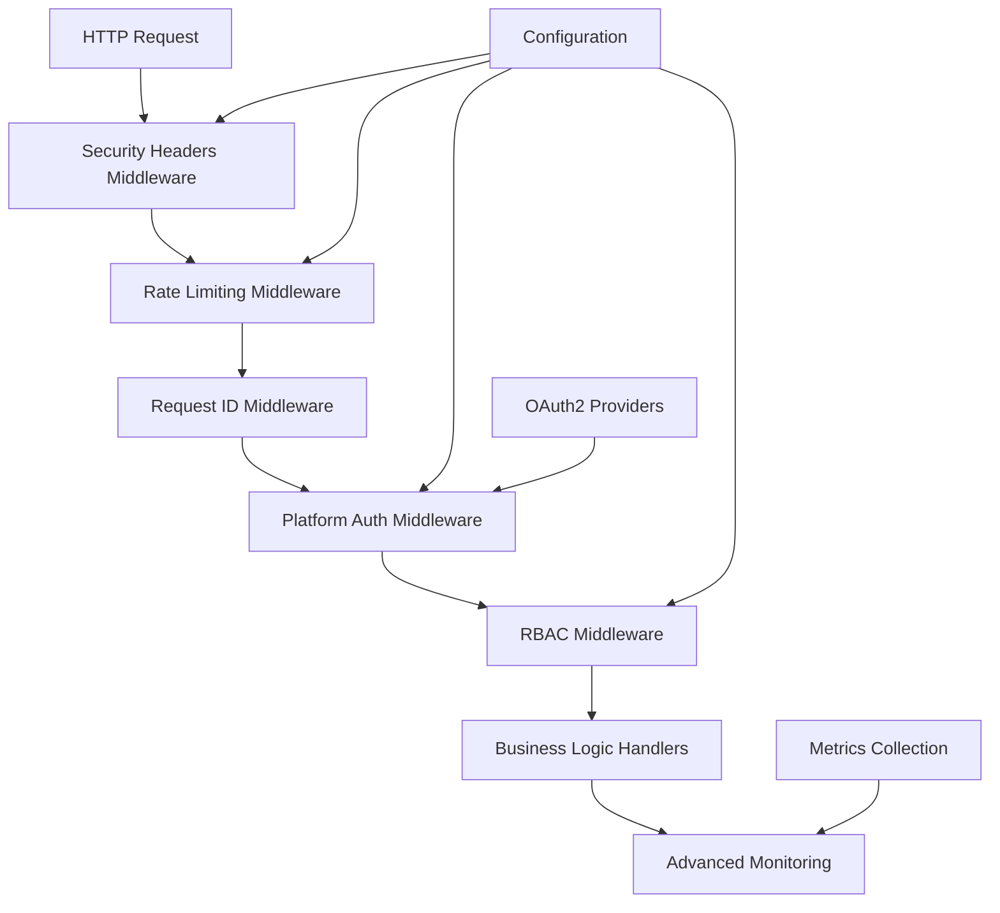

# Production Readiness Implementation Plan

## Overview

This document provides a comprehensive implementation plan to address the remaining 5% production readiness gaps in the Rust Template. The plan focuses on implementing security headers, rate limiting, advanced monitoring, OAuth2 integration, and RBAC system while maintaining backward compatibility and following existing architectural patterns.

## Current State Analysis

The template currently has:
- ✅ Database migrations
- ✅ JWT authentication (basic and JWT modes)
- ✅ Request ID correlation middleware
- ✅ Basic HTTP metrics and observability
- ✅ Structured error handling
- ✅ Configuration management

## Implementation Architecture



## Gap 1: Security Headers Middleware

### Success Criteria

- CORS headers properly configured for specific origins
- CSP headers prevent XSS attacks
- HSTS headers enforce HTTPS in production
- Security headers configurable per environment
- All security headers pass OWASP security tests

### Implementation Tasks

#### 1.1 Create Security Headers Configuration

- File: `crates/app-http/src/security/headers.rs`
- Define `SecurityHeadersConfig` struct with:
  - CORS origins (Vec<String>)
  - CSP policy (String)
  - HSTS max age (u64)
  - HSTS include subdomains (bool)
  - HSTS preload (bool)

#### 1.2 Implement Security Headers Middleware

- File: `crates/app-http/src/middleware/security_headers.rs`
- Implement `security_headers_middleware` function
- Add CORS headers based on configuration
- Add CSP headers with default policy
- Add HSTS headers for HTTPS enforcement
- Add other security headers (X-Frame-Options, X-Content-Type-Options)

#### 1.3 Update Configuration Schema

- Add security headers settings to `specs/config_schema.yaml`
- Environment-specific defaults (dev: permissive, prod: strict)

#### 1.4 Integration

- Add middleware to router in `crates/app-http/src/lib.rs`
- Ensure proper ordering (before auth middleware)

### Configuration Examples

```yaml
settings:
  security.cors.origins:
    - "https://app.example.com"
    - "https://admin.example.com"
  security.csp.policy: "default-src 'self'; script-src 'self' 'unsafe-inline'"
  security.hsts.max_age: 31536000
  security.hsts.include_subdomains: true
  security.hsts.preload: true
```

## Gap 2: Rate Limiting Middleware

### Success Criteria

- IP-based rate limiting with configurable limits
- Different limits per endpoint type (API vs UI)
- Sliding window implementation
- Redis-backed storage for distributed deployments
- Graceful degradation when storage unavailable

### Implementation Tasks

#### 2.1 Create Rate Limiting Configuration

- File: `crates/app-http/src/security/rate_limit.rs`
- Define `RateLimitConfig` struct:
  - Requests per minute (u32)
  - Burst size (u32)
  - Storage backend (in-memory/Redis)
  - Endpoint-specific overrides

#### 2.2 Implement Rate Limiting Middleware

- File: `crates/app-http/src/middleware/rate_limit.rs`
- Implement sliding window algorithm
- IP address extraction from request
- Rate limit checking and response headers
- Fallback to in-memory when Redis unavailable

#### 2.3 Add Dependencies

- Add `governor` crate for rate limiting
- Add `redis` crate for distributed storage
- Update `crates/app-http/Cargo.toml`

#### 2.4 Configuration Integration

- Add rate limiting settings to config schema
- Environment-specific defaults

### Configuration Examples

```yaml
settings:
  rate_limit.requests_per_minute: 100
  rate_limit.burst_size: 20
  rate_limit.storage_backend: "redis"
  rate_limit.redis_url: "redis://localhost:6379"
```

## Gap 3: Advanced Monitoring

### Success Criteria

- Business metrics beyond HTTP (user actions, feature usage)
- SLA tracking with alerts
- Custom metric registration API
- Dashboard integration points
- Performance baselines and anomaly detection

### Implementation Tasks

#### 3.1 Extend Metrics System

- File: `crates/app-http/src/metrics/business.rs`
- Add business metric types (counters, gauges, histograms)
- Implement SLA tracking metrics
- Create metric registration API

#### 3.2 Business Metrics Collection

- Track user actions (login, create, update, delete)
- Track feature usage patterns
- Track error rates by business context
- Track performance by operation type

#### 3.3 SLA Monitoring

- Define SLA thresholds (response time, error rate)
- Implement SLA breach detection
- Alert integration points
- SLA reporting endpoints

#### 3.4 Dashboard Integration

- Extend `/platform/status` with business metrics
- Add `/platform/metrics/business` endpoint
- Add `/platform/sla` endpoint
- Integration with existing UI

### Metric Examples

```rust
// Business metrics
metrics::counter!("user_login_total").increment(1);
metrics::counter!("feature_create_total", "feature" => "todos").increment(1);
metrics::histogram!("business_operation_duration", "operation" => "task_create").observe(duration);

// SLA metrics
metrics::gauge!("sla_response_time_p99").set(p99_latency);
metrics::counter!("sla_breaches_total", "sla_type" => "response_time").increment(1);
```

## Gap 4: OAuth2 Integration

### Success Criteria

- Google OAuth2 provider integration
- GitHub OAuth2 provider integration
- JWT token generation with user claims
- User profile retrieval and storage
- Session management with refresh tokens

### Implementation Tasks

#### 4.1 OAuth2 Configuration

- File: `crates/app-http/src/security/oauth2.rs`
- Define OAuth2 provider configurations
- Client ID and secret management
- Redirect URL configuration
- Scope definitions

#### 4.2 OAuth2 Flow Implementation

- Authorization endpoint (`/auth/oauth2/{provider}`)
- Callback endpoint (`/auth/oauth2/{provider}/callback`)
- Token exchange and JWT generation
- User profile retrieval

#### 4.3 User Management

- Extend user model with OAuth2 identities
- User profile storage in database
- Session management with refresh tokens
- Token revocation and logout

#### 4.4 Provider Implementations

- Google OAuth2 integration
- GitHub OAuth2 integration
- Extensible provider system for future additions

#### 4.5 Dependencies

- Add `oauth2` crate
- Add `reqwest` for HTTP calls
- Add user management database migrations

### Configuration Examples

```yaml
settings:
  oauth2.google.client_id: "your-google-client-id"
  oauth2.google.client_secret: "your-google-client-secret"
  oauth2.github.client_id: "your-github-client-id"
  oauth2.github.client_secret: "your-github-client-secret"
  oauth2.redirect_url: "https://app.example.com/auth/callback"
  oauth2.jwt_expiry: 3600
```

## Gap 5: RBAC System

### Success Criteria

- Role-based access control (admin, user, readonly)
- Permission system for fine-grained control
- Role assignment and management
- Permission checking middleware
- Integration with existing auth system

### Implementation Tasks

#### 5.1 RBAC Configuration

- File: `crates/app-http/src/security/rbac.rs`
- Define role and permission structures
- Create role hierarchy system
- Permission checking functions

#### 5.2 Database Schema

- Add roles table
- Add permissions table
- Add user_roles junction table
- Add role_permissions junction table
- Database migrations for new tables

#### 5.3 RBAC Middleware

- File: `crates/app-http/src/middleware/rbac.rs`
- Extract user roles from JWT claims
- Check permissions for endpoints
- Role-based access control

#### 5.4 Role Management

- Admin endpoints for role management
- User role assignment endpoints
- Permission management endpoints
- Role hierarchy management

### Role and Permission Structure

```rust
#[derive(Debug, Clone, PartialEq)]
pub enum Role {
    Admin,
    User,
    ReadOnly,
}

#[derive(Debug, Clone, PartialEq)]
pub enum Permission {
    // User management
    CreateUser,
    ReadUser,
    UpdateUser,
    DeleteUser,
    // Task management
    CreateTask,
    ReadTask,
    UpdateTask,
    DeleteTask,
    // System management
    ManageRoles,
    ViewMetrics,
    SystemConfig,
}
```

## Integration Strategy

### Middleware Ordering

1. Security Headers (first - applies to all requests)
2. Rate Limiting (second - protects all downstream)
3. Request ID (third - enables correlation)
4. Platform Auth (fourth - authentication)
5. RBAC (fifth - authorization)

### Configuration Management

- Extend existing `specs/config_schema.yaml`
- Environment-specific defaults
- Validation rules for new configurations
- Backward compatibility with existing configs

### Database Changes

- New migrations for OAuth2 and RBAC tables
- Indexes for performance
- Foreign key relationships
- Data migration strategies

## Testing Strategy

### Unit Tests

- Each middleware function tested in isolation
- Configuration validation tests
- Rate limiting algorithm tests
- OAuth2 flow tests
- RBAC permission tests

### Integration Tests

- End-to-end authentication flows
- Rate limiting integration tests
- Security headers validation tests
- Business metrics collection tests
- Role-based access control tests

### Security Tests

- OWASP security header validation
- Rate limiting bypass attempts
- OAuth2 attack vectors
- RBAC privilege escalation tests
- Input validation tests

## Migration Path

### Phase 1: Foundation

1. Implement security headers middleware
2. Implement rate limiting middleware
3. Update configuration schema
4. Add comprehensive tests

### Phase 2: Authentication Enhancement

1. Implement OAuth2 integration
2. Add user management
3. Update auth middleware
4. Migration scripts for existing users

### Phase 3: Authorization

1. Implement RBAC system
2. Add role management endpoints
3. Update all endpoints with RBAC
4. Default role assignment for existing users

### Phase 4: Monitoring

1. Implement business metrics
2. Add SLA tracking
3. Create monitoring dashboards
4. Alert integration

## Success Metrics

### Technical Metrics

- All middleware tests passing
- Security headers passing OWASP tests
- Rate limiting functioning under load
- OAuth2 flows working for all providers
- RBAC permissions correctly enforced

### Business Metrics

- Zero security vulnerabilities in new code
- 99.9% uptime during deployment
- <100ms response time for 95% of requests
- Zero data breaches
- Successful user migrations

### Operational Metrics

- Configuration validation passing
- Database migrations successful
- Monitoring dashboards functional
- Alert systems operational
- Documentation complete and accurate

## Dependencies and Risks

### New Dependencies

- `governor` for rate limiting
- `redis` for distributed rate limiting
- `oauth2` for OAuth2 flows
- Additional database migrations

### Implementation Risks

- Breaking changes to existing auth system
- Performance impact of additional middleware
- Configuration complexity
- Database migration challenges
- OAuth2 provider API changes

### Mitigation Strategies

- Feature flags for gradual rollout
- Comprehensive testing before deployment
- Backward compatibility maintenance
- Rollback procedures
- Monitoring during deployment

## Conclusion

This implementation plan addresses all remaining production readiness gaps while maintaining the template's architectural principles. The phased approach allows for incremental deployment and testing, reducing risk while ensuring comprehensive production readiness.

The plan integrates seamlessly with existing systems:
- Extends current middleware architecture
- Uses existing configuration patterns
- Maintains backward compatibility
- Follows established testing practices
- Integrates with governance framework
