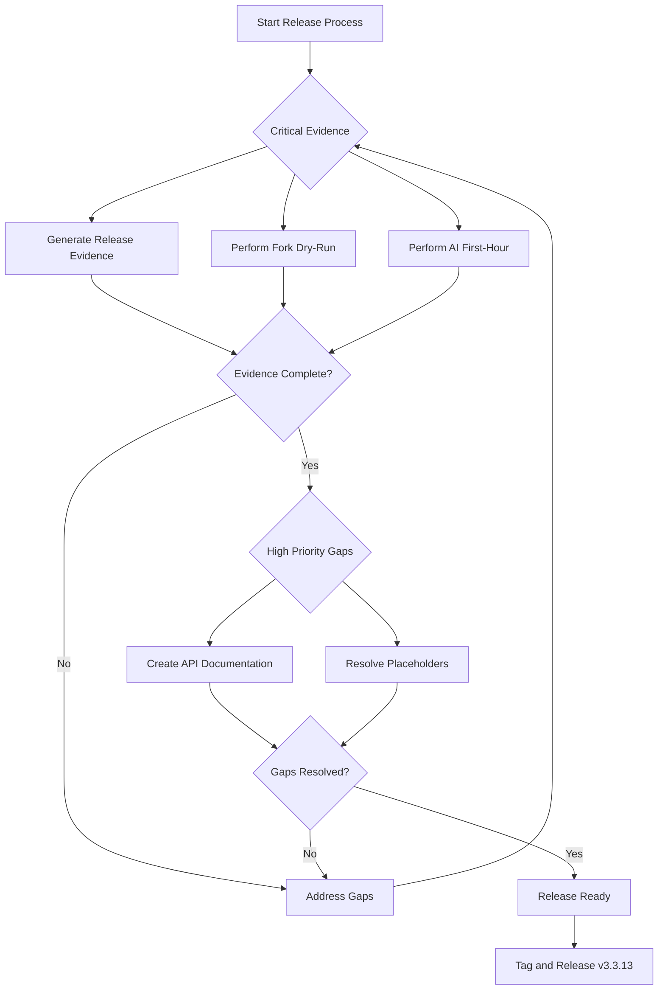

# Release Blocker Report: Rust Template v3.3.13

**Report Date:** 2025-12-27
**Target Version:** v3.3.13
**Canonical Version Source:** [`specs/spec_ledger.yaml`](../specs/spec_ledger.yaml:6)

---

## Executive Summary

Rust Template v3.3.13 is **approximately 75% ready for release**. The kernel functionality is solid with all 72 kernel acceptance criteria passing and all 11 selftest gates operational. However, critical release evidence artifacts are missing, and there are significant documentation gaps that must be addressed before the release can proceed.

| Category | Status | Count |
|-----------|--------|-------|
| Critical Blockers | 🔴 | 3 |
| High Priority Gaps | 🟠 | 2 |
| Medium/Low Priority Items | 🟡 | 1 |
| Non-Blockers (Good Shape) | 🟢 | 4 |

---

## Critical Blockers

These items **MUST** be resolved before v3.3.13 can be released.

### 1. Missing Release Evidence Document

**Severity:** 🔴 CRITICAL  
**Location:** [`release_evidence/v3.3.13.md`](../release_evidence/v3.3.13.md)  
**Status:** File does not exist

The release evidence document is the authoritative record of what changed in this version. Without it, there is no auditable trail of the release contents.

**Required Content:**
- All tasks completed in v3.3.13
- Linked REQs/ACs/ADRs
- Git log since last tag (v3.3.8)
- Selftest summary
- Policy status
- Resolved friction entries

**Resolution:**
Run `cargo xtask release-bundle 3.3.13` to generate the evidence document.

---

### 2. Missing Fork Dry-Run Receipt

**Severity:** 🔴 CRITICAL  
**Location:** [`docs/receipts/FORK_DRY_RUN_YYYY-MM-DD.md`](../docs/receipts/FORK_DRY_RUN_TEMPLATE.md)  
**Status:** No receipt exists for v3.3.13

The fork dry-run receipt proves that a competent user can adopt the kernel following only the documentation. This is a critical validation that the template is actually usable as-is.

**Template Reference:** [`docs/receipts/FORK_DRY_RUN_TEMPLATE.md`](../docs/receipts/FORK_DRY_RUN_TEMPLATE.md)

**Required Validation Steps:**
- `cargo xtask selftest` green immediately after checkout
- `cargo xtask selftest` green after `service-init`
- `/platform/status` and `/ui` reflect new identity
- Domain ACs still PASS
- No issues requiring unpublished knowledge

**Resolution:**
Perform a fork dry-run using the template and document the results.

---

### 3. Missing AI First-Hour Receipt

**Severity:** 🔴 CRITICAL  
**Location:** [`docs/receipts/AI_FIRST_HOUR_YYYY-MM-DD.md`](../docs/receipts/AI_FIRST_HOUR_RECEIPT.md)  
**Status:** No receipt exists for v3.3.13

The AI first-hour receipt proves that an AI agent can autonomously orient and begin work using the platform's structured APIs. This validates the agent-native interfaces.

**Template Reference:** [`docs/receipts/AI_FIRST_HOUR_RECEIPT.md`](../docs/receipts/AI_FIRST_HOUR_RECEIPT.md)

**Required Validation Steps:**
- Environment bootstrap succeeded (`cargo xtask dev-up`)
- Platform status queried (`/platform/status`)
- Agent hints retrieved (`/platform/agent/hints`)
- Context bundle generated (`cargo xtask bundle`)
- Validation loop executed (`cargo xtask check`)
- No blocking issues requiring human intervention

**Resolution:**
Perform an AI first-hour onboarding session and document the results.

---

## High Priority Gaps

These items should be addressed before release but may not be absolute blockers depending on release criteria.

### 1. Missing docs/api/ Directory

**Severity:** 🟠 HIGH  
**Location:** [`docs/api/`](../docs/)  
**Status:** Directory does not exist

The API documentation directory is expected to contain detailed documentation for platform endpoints. Without it, users and IDP integrations lack comprehensive API reference.

**Expected Contents:**
- `/platform/status` endpoint documentation
- `/platform/graph` endpoint documentation
- `/platform/agent/hints` endpoint documentation
- `/platform/docs/index` endpoint documentation
- `/platform/tasks` endpoint documentation
- `/platform/friction` endpoint documentation
- `/platform/questions` endpoint documentation
- `/platform/forks` endpoint documentation
- `/platform/schema` endpoint documentation

**Resolution:**
Create API documentation with examples for all platform endpoints.

---

### 2. Self-Referential Placeholders (99 found)

**Severity:** 🟠 HIGH  
**Pattern:** AC-XXX, REQ-XXX, etc.  
**Status:** 99 placeholders found across documentation

Self-referential placeholders indicate incomplete documentation or examples that haven't been updated with actual IDs. This makes the template harder to use and understand.

**Impact:**
- Reduced documentation clarity
- Potential confusion for new users
- Indicates incomplete documentation migration

**Resolution:**
Audit all documentation and replace placeholders with actual AC/REQ IDs or remove if not applicable.

---

## Medium/Low Priority Items

These are nice-to-have improvements that can be deferred if needed.

### 1. Fork Registry Outdated

**Severity:** 🟡 MEDIUM  
**Location:** [`forks/fork_registry.yaml`](../forks/fork_registry.yaml)  
**Status:** No forks based on v3.3.9-kernel

The fork registry shows 2 forks:
- FORK-TPL-SELF-001: kernel_version v3.3.3
- FORK-EXAMPLE-001: kernel_version v3.3.5

Neither fork is based on the current kernel version (v3.3.9-kernel), which suggests:
- Forks haven't been updated recently
- No validation that current kernel works in practice

**Resolution:**
Update existing forks to v3.3.9-kernel or perform a new fork dry-run to validate.

---

## Non-Blockers (Good Shape)

These areas are in good condition and do not block the release.

### 1. Version Alignment ✅

**Canonical Version:** 3.3.13 (from [`specs/spec_ledger.yaml`](../specs/spec_ledger.yaml:6))  
**Status:** Consistent across key documentation files

Version alignment is properly maintained across:
- [`specs/spec_ledger.yaml`](../specs/spec_ledger.yaml:6)
- [`README.md`](../README.md)
- [`CLAUDE.md`](../CLAUDE.md)
- [`docs/ROADMAP.md`](../docs/ROADMAP.md)
- [`docs/KERNEL_SNAPSHOT.md`](../docs/KERNEL_SNAPSHOT.md)

---

### 2. Test Coverage ✅

**Total ACs:** 133  
**Kernel ACs:** 72 (100% PASSING)  
**Selftest Gates:** 11/11 PASSING  
**BDD Tests:** 24 feature files

All kernel acceptance criteria are passing. The CI workflows are operational with proper gating. There are no test-related blockers.

---

### 3. Security Configuration Documentation ✅

**Location:** [`docs/SECURITY.md`](../docs/SECURITY.md)  
**Status:** Exists and properly linked

Security configuration documentation is present and accessible from key locations.

---

### 4. CI/CD Infrastructure ✅

**Status:** All operational with proper gating

CI workflows are functioning correctly:
- CI-NIX
- CI-TIER1-SELFTEST
- CI-SECURITY
- CI-POLICY-VERIFY
- CI-OPENAPI
- CI-DOCS
- And others

---

## Release Readiness Summary

| Component | Status | Notes |
|-----------|--------|-------|
| Kernel Functionality | 🟢 PASS | All 72 kernel ACs passing |
| Test Coverage | 🟢 PASS | 11/11 selftest gates passing |
| CI/CD Infrastructure | 🟢 PASS | All workflows operational |
| Version Alignment | 🟢 PASS | Consistent across key docs |
| Security Documentation | 🟢 PASS | Exists and properly linked |
| Release Evidence | 🔴 BLOCK | Missing v3.3.13.md |
| Fork Dry-Run Receipt | 🔴 BLOCK | No receipt for v3.3.13 |
| AI First-Hour Receipt | 🔴 BLOCK | No receipt for v3.3.13 |
| API Documentation | 🟠 GAP | docs/api/ directory missing |
| Documentation Placeholders | 🟠 GAP | 99 placeholders found |
| Fork Registry | 🟡 WARN | No forks on current kernel |

**Overall Release Readiness: 75%**

---

## Recommended Path Forward

### Phase 1: Critical Evidence Generation (Required for Release)

1. **Generate Release Evidence**
   ```bash
   cargo xtask release-bundle 3.3.13
   ```
   This will create [`release_evidence/v3.3.13.md`](../release_evidence/v3.3.13.md) with all required content.

2. **Perform Fork Dry-Run**
   - Copy [`docs/receipts/FORK_DRY_RUN_TEMPLATE.md`](../docs/receipts/FORK_DRY_RUN_TEMPLATE.md)
   - Perform the dry-run following the template steps
   - Document results and any gaps found

3. **Perform AI First-Hour Onboarding**
   - Copy [`docs/receipts/AI_FIRST_HOUR_RECEIPT.md`](../docs/receipts/AI_FIRST_HOUR_RECEIPT.md)
   - Run through the AI onboarding workflow
   - Document results and any friction encountered

### Phase 2: High Priority Gaps (Recommended for Release)

4. **Create API Documentation**
   - Create [`docs/api/`](../docs/api/) directory
   - Document all `/platform/*` endpoints
   - Include examples and schema references

5. **Resolve Documentation Placeholders**
   - Search for AC-XXX, REQ-XXX patterns
   - Replace with actual IDs or remove if not applicable
   - Validate documentation completeness

### Phase 3: Post-Release Improvements

6. **Update Fork Registry**
   - Update existing forks to v3.3.9-kernel
   - Or perform new fork validation

---

## Mermaid Diagram: Release Readiness Flow



---

## Conclusion

Rust Template v3.3.13 has solid kernel functionality with all tests passing. The primary blockers are procedural—missing release evidence artifacts that validate the template's usability for both humans and AI agents. Once the three critical receipts are generated and documented, the release can proceed. The high-priority gaps (API documentation and placeholder cleanup) should be addressed to improve user experience but are not absolute blockers.

**Key Recommendation:** Focus first on generating the three missing receipts (release evidence, fork dry-run, AI first-hour) as these are the absolute minimum required for a defensible release.
