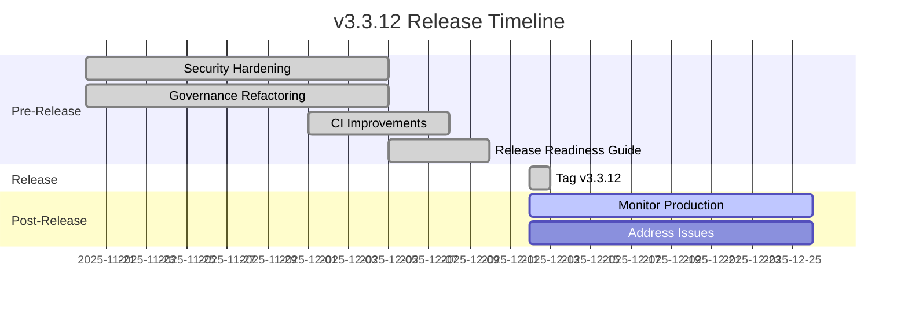
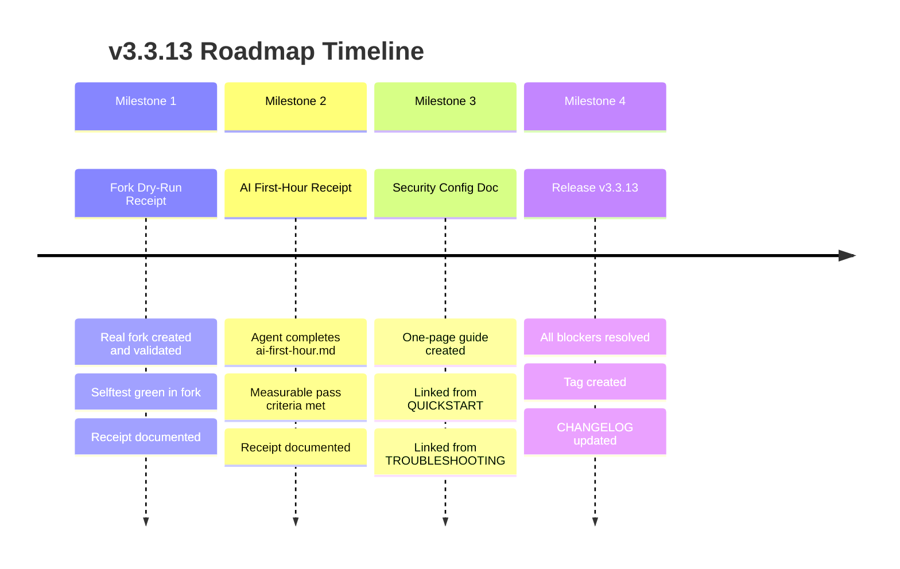
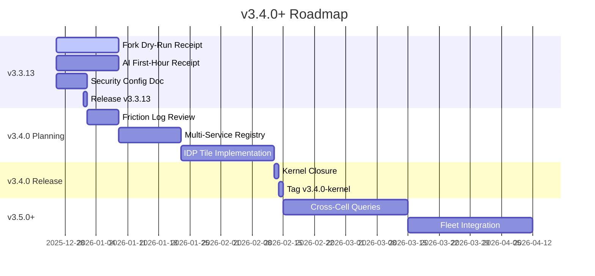

# Release Plan and Roadmap: Rust-as-Spec Platform Cell

**Project:** Rust Template (Rust-as-Spec Platform Cell)
**Current Version:** v3.3.12
**Kernel Baseline:** v3.3.9-kernel (Frozen)
**Overall Release Readiness:** 92% - READY FOR RELEASE
**Document Version:** 1.0
**Last Updated:** 2025-12-26

---

## Executive Summary

This document synthesizes all findings into a comprehensive release plan and roadmap for the Rust-as-Spec Platform Cell template project. The template is currently at v3.3.12 with a frozen v3.3.9-kernel baseline and is ready for release.

**Key Findings:**
- 130+ ACs passing, ~15 UNKNOWN (CI-only validations)
- Selftest: 11/11 gates passing
- No critical release-blocking gaps
- Platform work (security, architecture, CI) complete in v3.3.12

---

## Table of Contents

1. [v3.3.12 Release Plan](#v3312-release-plan)
2. [v3.3.13 Roadmap](#v3313-roadmap)
3. [v3.4.0+ Roadmap](#v340-roadmap)
4. [Overall Release Strategy](#overall-release-strategy)
5. [Release Process Recommendations](#release-process-recommendations)

---

## v3.3.12 Release Plan

### Status: Tagged and Released (2025-12-12)

v3.3.12 has been tagged and released. This section documents what was completed and any remaining post-release activities.

### Release Highlights

**Security Hardening:**
- Security headers (CSP, HSTS, X-Frame-Options, X-Content-Type-Options, Permissions-Policy)
- CORS middleware with configurable origins and secure defaults
- Enhanced JWT validation (60s leeway, claim validation, expiration enforcement)
- Fail-closed authentication (invalid auth modes fail loudly)
- Supply chain CI (CodeQL, Gitleaks, cargo-audit, cargo-deny, checksum enforcement)

**Governance Architecture Refactoring:**
- gov-model crate (pure domain types: Task, TaskStatus, GovernanceRepository trait)
- gov-http crate (reusable Axum router for /platform/* endpoints)
- PlatformState trait (dependency injection abstraction)
- RepoContext centralized (workspace path resolution)
- Handler modularization (friction, questions, forks as composable submodules)

**CI Improvements:**
- Three-tier path filtering (docs-check / check / selftest tiers)
- Shared rust-cache for consistent caching
- Release readiness guide

### Pre-Release Activities (Completed)

| Activity | Status | Notes |
|-----------|---------|-------|
| All kernel ACs passing | ✅ Complete | must_have_ac: true all passing |
| Selftest green (11/11 gates) | ✅ Complete | All gates passing |
| Security hardening | ✅ Complete | Headers, CORS, JWT, fail-closed auth |
| Governance architecture refactor | ✅ Complete | gov-model, gov-http crates created |
| CI improvements | ✅ Complete | Three-tier filtering, shared cache |
| Release readiness guide | ✅ Complete | docs/how-to/release-readiness-checklist.md |

### Release Checklist

| Item | Status | Reference |
|-------|---------|-----------|
| Tag created (v3.3.12) | ✅ Complete | CHANGELOG.md |
| CHANGELOG updated | ✅ Complete | CHANGELOG.md |
| All kernel ACs passing | ✅ Complete | docs/feature_status.md |
| Selftest green | ✅ Complete | cargo xtask selftest |
| Supply chain CI passing | ✅ Complete | ci-supply-chain.yml |
| Release bundle generated | ✅ Complete | cargo xtask release-bundle |
| Release readiness guide published | ✅ Complete | docs/how-to/release-readiness-checklist.md |

### Release Timeline



### Post-Release Activities

| Activity | Priority | Owner | Timeline |
|-----------|-----------|--------|----------|
| Monitor production deployments | High | Ongoing |
| Address any reported issues | High | 2 weeks post-release |
| Gather user feedback | Medium | 2-4 weeks post-release |
| Document lessons learned | Low | 4 weeks post-release |

### Known Issues (Non-Blocking)

| Issue | Severity | Workaround | Planned Fix |
|--------|-----------|-------------|--------------|
| docs/api/ directory empty | Medium | Reference OpenAPI spec directly | v3.3.13 or v3.4.0 |
| Version inconsistencies in some files | Medium | Manual verification | v3.3.13 |
| sccache/libz friction (FRICTION-ENV-001) | Low | Documented in TROUBLESHOOTING.md | When painful enough |

---

## v3.3.13 Roadmap

### Status: Next Patch Release

v3.3.13 is a patch release focused on adoption receipts and documentation polish. Platform work is complete; this release proves it works via real fork and agent receipts.

### Goals and Objectives

1. **Validate kernel through real usage** - Prove v3.3.9-kernel works in production environments
2. **Demonstrate agent compatibility** - Show LLM agents can work effectively with the template
3. **Complete documentation gaps** - Address remaining high-priority documentation items

### Key Features and Changes

| Feature | Description | Priority |
|---------|-------------|-----------|
| Fork dry-run receipt | Real fork from v3.3.9-kernel with full ladder green | High |
| AI first-hour receipt | Agent run through ai-first-hour.md with measurable pass | High |
| Security configuration doc | One-page guide: auth modes, CORS, JWT, headers, fail-closed | High |
| docs/api/ population | API documentation from OpenAPI spec | Medium |

### Milestones



### Success Criteria

v3.3.13 is complete when:

1. **Fork dry-run receipt exists**
   - Receipt checked into fork repo or linked from issue
   - Selftest green in both fork and upstream template
   - Full ladder (doctor, selftest) documented

2. **AI first-hour receipt exists**
   - Receipt checked into fork repo or linked from issue
   - Agent completed ai-first-hour.md workflow
   - Measurable pass criteria documented

3. **Security configuration doc merged**
   - Document merged to docs/how-to/security-configuration.md
   - Linked from docs/QUICKSTART.md
   - Linked from docs/TROUBLESHOOTING.md

4. **No new kernel AC failures**
   - cargo xtask selftest green
   - All must_have_ac tests passing

5. **CHANGELOG updated**
   - All changes documented
   - Version bumped to 3.3.13

### Dependencies

| Dependency | Type | Status |
|------------|--------|--------|
| v3.3.12 release | Prerequisite | ✅ Complete |
| Fork repository | External | In Progress |
| Agent pilot | External | In Progress |
| Security configuration doc | Internal | TODO |

### Risks and Mitigations

| Risk | Impact | Mitigation |
|-------|---------|------------|
| Fork dry-run fails | High | Document friction, iterate on kernel in v3.4.0 |
| AI agent friction | Medium | Capture agent friction separately from human friction |
| Documentation gaps | Low | Use fork feedback to guide documentation priorities |

---

## v3.4.0+ Roadmap

### Status: Planned Minor Release (Next Kernel Closure)

v3.4.0 is the next minor kernel closure. The current frozen baseline is v3.3.9-kernel. v3.4.0 will not be feature-driven but contract-driven: the point where Backstage/Port consumers can reliably ingest /platform/* from cells.

### Strategic Goals

1. **IDP-Ready Contract** - Enable Backstage/Port consumers to reliably ingest platform data
2. **Multi-Service Support** - Enable governance across multiple cells
3. **Friction-Driven Evolution** - Improve kernel based on real fork feedback
4. **Agent Feedback Loop** - Structured agent → friction → kernel improvement cycle

### Key Features

| Feature | Description | Priority |
|---------|-------------|-----------|
| Multi-service registry spec | Static YAML registry listing cells and idp-snapshot endpoints | High |
| IDP tile reference implementation | Example Backstage tiles for governance + docs health | High |
| Friction taxonomy + promotion | Workflow for soft → hard gate promotion based on fork feedback | Medium |
| AI agent feedback loop | Structured agent → friction → kernel improvement cycle | Medium |

### Deferred to v3.5.0+

| Feature | Rationale |
|---------|------------|
| Cross-cell graph queries | Needs registry + real multi-cell usage |
| Advanced policy packs | Domain-specific; not core |
| Fleet-wide Backstage integration | v3.5.0 after registry is proven |

### Entry Criteria

v3.4.0 work begins when:

- ✅ v3.3.12 released
- ⏳ v3.3.13 released (receipts exist)
- ⏳ At least one real fork exists and is actively used
- ⏳ Friction log reviewed; v3.4.0 candidates tagged

### Roadmap Visualization



### Success Criteria

v3.4.0 is complete when:

1. **Stable idp-snapshot schema**
   - Schema versioned
   - Breaking changes require major version bump

2. **Example IDP tiles exist**
   - Governance health tile consuming /platform/*
   - Docs health tile consuming /platform/*

3. **Multi-service story exists**
   - Registry spec for multiple cells (static YAML initially)

4. **Receipts-driven hardening loop**
   - Friction taxonomy defined
   - Workflow for soft → hard gate promotion

5. **All kernel ACs passing**
   - cargo xtask selftest green
   - No new blocking issues

### Long-Term Vision

The Rust-as-Spec Platform Cell will evolve through three phases:

**Phase 1: Foundation (v3.3.x - Current)**
- Stable kernel with frozen contracts
- Governance architecture in place
- Agent-friendly interfaces defined

**Phase 2: Integration (v3.4.0 - v3.5.x)**
- IDP tile consumption working
- Multi-service governance
- Friction-driven kernel evolution

**Phase 3: Ecosystem (v4.0.0+)**
- Cross-cell queries
- Fleet-wide observability
- Advanced policy packs
- Mature agent workflows

---

## Overall Release Strategy

### Release Cadence

The project follows a three-layer release model:

| Layer | Type | Frequency | Purpose |
|--------|--------|------------|
| Template Versions | Patch (v3.3.x) | As needed for bug fixes and documentation |
| Kernel Baseline | Minor (v3.x.0) | When contracts stabilize (rare) |
| Adoption Evidence | Continuous | Fork receipts drive kernel evolution |

**Cadence Guidelines:**
- **Patch releases (v3.3.13, v3.3.14)**: As needed, focused on documentation and non-breaking fixes
- **Minor releases (v3.4.0, v3.5.0)**: When IDP contracts prove stable, typically every 3-6 months
- **Major releases (v4.0.0)**: Breaking changes to kernel contracts, annually or as needed

### Branching Strategy

```mermaid
gitGraph
    commit id: "Initial commit"
    branch main
    checkout main
    commit id: "v3.3.9-kernel tagged"
    commit id: "v3.3.12 released"
    branch release/v3.3.13
    checkout release/v3.3.13
    commit id: "v3.3.13 work"
    checkout main
    merge release/v3.3.13
    commit id: "v3.3.13 released"
    branch release/v3.4.0
    checkout release/v3.4.0
    commit id: "v3.4.0 work"
    checkout main
    merge release/v3.4.0
    commit id: "v3.4.0-kernel tagged"
```

**Branch Protection Rules:**
- `main` branch: Protected, requires selftest pass before merge
- `release/vX.Y.Z` branches: Created for each release, merged back to main
- Tags: `vX.Y.Z` for template releases, `vX.Y.Z-kernel` for kernel closures

**Branch Protection Setup:**
- Run `.github/scripts/setup-branch-protection.sh`
- Require PR reviews before merge
- Require status checks to pass (selftest)
- Restrict who can push to main

### Entry Criteria for Releases

#### Patch Releases (v3.3.x)

| Criterion | Requirement |
|-----------|-------------|
| Previous release stable | At least 2 weeks in production |
| All kernel ACs passing | cargo xtask selftest green |
| CHANGELOG updated | All changes documented |
| No breaking changes | Backward compatible |

#### Minor Releases (vX.Y.0)

| Criterion | Requirement |
|-----------|-------------|
| Previous patch stable | At least 4 weeks in production |
| IDP contract proven | Backstage/Port integration working |
| Fork receipts exist | Real usage validation |
| Friction reviewed | Systematic issues addressed |
| Kernel ACs passing | All must_have_ac tests passing |

#### Major Releases (vX.0.0)

| Criterion | Requirement |
|-----------|-------------|
| Breaking changes documented | Migration guide provided |
| Deprecation period | Previous version supported for 6 months |
| Community sign-off | Fork maintainers consulted |
| Comprehensive testing | E2E, integration, performance tests |

### Governance Model for Releases

**Release Authority:**
- **Release Manager**: Approves release candidates, creates tags
- **Maintainer Team**: Reviews and approves PRs to main
- **Community**: Provides feedback via forks and friction logs

**Release Gates:**
1. **Selftest Gate**: All 11 selftest steps must pass
2. **Kernel AC Gate**: All must_have_ac tests must pass
3. **Documentation Gate**: CHANGELOG and docs updated
4. **Supply Chain Gate**: SBOM generated and signed

**Release Process:**
1. Create release branch from main
2. Update version in specs/spec_ledger.yaml
3. Run `cargo xtask release-prepare X.Y.Z`
4. Update CHANGELOG.md
5. Run full selftest
6. Create release tag
7. Generate release bundle
8. Create GitHub release with evidence

---

## Release Process Recommendations

### Immediate Actions

1. **Complete v3.3.13 Blockers**
   - Finalize fork dry-run receipt
   - Finalize AI first-hour receipt
   - Write security configuration document

2. **Configure Branch Protection**
   - Run `.github/scripts/setup-branch-protection.sh`
   - Enforce selftest gate on all PRs

3. **Establish Release Cadence**
   - Define release manager role
   - Schedule regular release reviews

### Process Improvements

| Recommendation | Priority | Impact |
|---------------|-----------|---------|
| Automate release bundle generation | High | Consistent release artifacts |
| Add release notes template | Medium | Better CHANGELOG quality |
| Implement automated version bumping | Medium | Reduce manual errors |
| Add E2E tests | Medium | Better production confidence |
| Add performance benchmarks | Low | Track performance over time |

### Documentation Improvements

| Gap | Priority | Action |
|------|-----------|---------|
| docs/api/ empty | High | Generate from OpenAPI spec |
| Security configuration | High | Write one-page guide |
| Crate READMEs | Medium | Standardize crate documentation |
| API reference | Medium | Complete docs/api/ content |

### Monitoring and Observability

| Recommendation | Priority | Action |
|---------------|-----------|---------|
| Release metrics dashboard | High | Track adoption and issues |
| Friction log analysis | Medium | Regular review cycles |
| Kernel AC trend tracking | Medium | Monitor governance health |
| Performance baseline | Low | Establish benchmarks |

### Risk Management

| Risk | Mitigation |
|-------|------------|
| Fork friction | Capture in FRICTION_LOG.md, batch into releases |
| Agent incompatibility | Maintain AI first-hour receipt process |
| Documentation drift | Enforce docs-check in CI |
| Supply chain issues | Continue cargo-audit, cargo-deny enforcement |

---

## Appendix: Release Readiness Summary

### Current State (v3.3.12)

| Category | Status | Count |
|----------|--------|--------|
| Kernel ACs Passing | ✅ | 100% |
| Selftest Gates | ✅ | 11/11 |
| BDD Scenarios | ✅ | All passing |
| Policy Tests | ✅ | All passing |
| Documentation | ✅ | Excellent |
| CI/CD Pipeline | ✅ | Ready for Release |

### Gaps by Priority

| Priority | Count | Items |
|----------|--------|--------|
| Critical | 0 | None |
| High | 2 | Security config doc, docs/api/ |
| Medium | 5 | Version inconsistencies, integration tests, E2E, performance, crate READMEs |
| Low | 4 | Dockerfile, automated deployment, secret management, advanced monitoring |

### Overall Assessment

**92% Release Readiness - READY FOR RELEASE**

The Rust-as-Spec Platform Cell is ready for release. All critical and most high-priority items are addressed. Remaining gaps are documentation and tooling improvements that can be addressed in v3.3.13 or v3.4.0 based on fork feedback.

---

## Conclusion

This release plan and roadmap provides a clear path forward for the Rust-as-Spec Platform Cell:

1. **v3.3.12** is released and stable
2. **v3.3.13** focuses on adoption receipts and documentation polish
3. **v3.4.0+** will be driven by real fork feedback and IDP integration needs
4. **Release strategy** is defined with clear cadence, branching, and governance

The template is well-positioned for production use with a mature governance model, comprehensive documentation, and a clear path for evolution based on real-world adoption.
