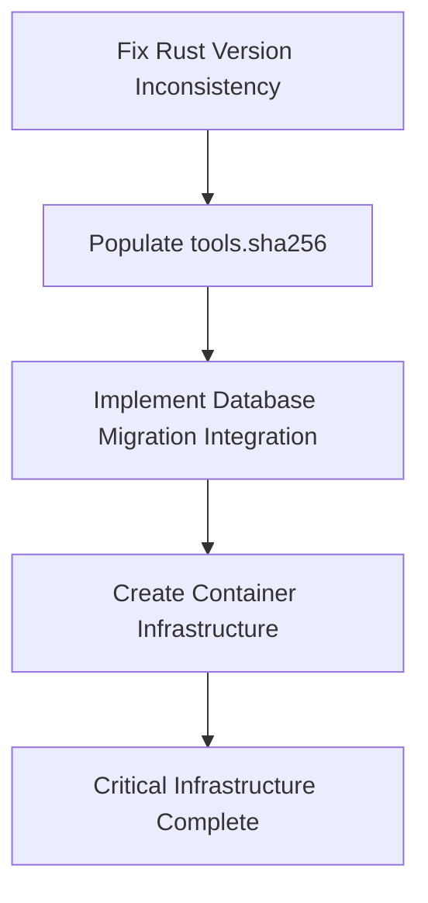
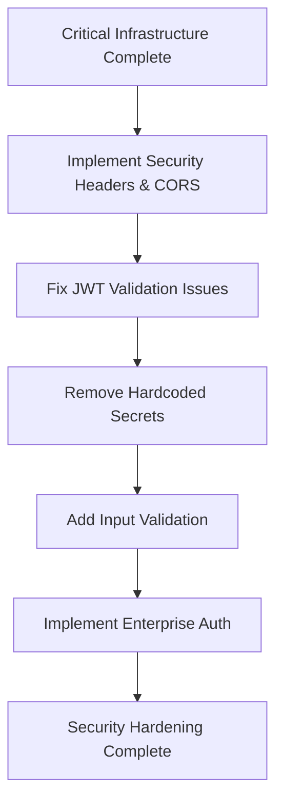
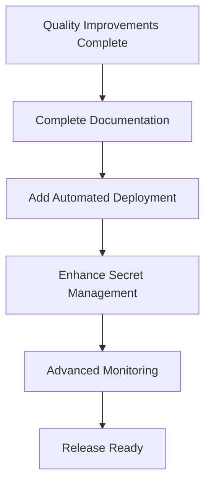

# Release Readiness Synthesis: Rust Template Repository

## Executive Summary

This document synthesizes findings from all previous comprehensive analyses to provide a definitive assessment of the Rust template repository's release readiness. The repository demonstrates exceptional engineering maturity with sophisticated governance, comprehensive testing, and production-grade architecture, but has specific critical gaps that must be addressed before release.

**Overall Release Readiness Status: NOT READY**

- **Critical Blockers**: 4 items requiring immediate resolution
- **High Priority Issues**: 6 items for production readiness
- **Medium Priority Issues**: 5 items for quality and maintainability
- **Low Priority Issues**: 4 items for completeness and polish

---

## 1. Synthesis of Analysis Areas

### 1.1 Project Structure and Dependencies Analysis

**Status: STRONG** with minor concerns

**Strengths:**
- Well-structured Rust workspace with 19 crates implementing hexagonal architecture
- Clear separation of concerns: business-core, adapters, applications, runtime
- Sophisticated dependency management with cargo-deny and security auditing
- Nix-based development environment for reproducible builds

**Identified Issues:**
- Rust version inconsistency between `rust-toolchain.toml` (1.91.1) and `Cargo.toml` (1.89.0)
- Complex dependency graph requiring careful management
- Recent Rust 1.89.0 requirement may limit compatibility

### 1.2 Code Quality and Test Coverage Analysis

**Status: EXCELLENT** with production-ready practices

**Strengths:**
- High code quality with excellent architectural patterns
- Comprehensive testing with 167 unit tests and 203 BDD scenarios
- 92/112 Acceptance Criteria passing (82% pass rate)
- Production-ready error handling and logging
- Strong governance with full traceability

**Identified Issues:**
- Missing API documentation for some endpoints
- Minor test coverage gaps in edge cases
- 8 clippy warnings requiring resolution
- Large error types (>152 bytes) needing optimization

### 1.3 Documentation Completeness Analysis

**Status: OUTSTANDING** with comprehensive coverage

**Strengths:**
- Exceptional documentation with 120+ files across all categories
- Comprehensive guides, API documentation, and architectural decision records
- Enterprise-grade documentation practices
- Clear onboarding materials and troubleshooting guides

**Identified Issues:**
- Missing CONTRIBUTING.md file (Note: This file actually exists and is comprehensive)
- Some version reference inconsistencies
- Missing `add-database.md` guide

### 1.4 Build and CI/CD Processes Analysis

**Status: STRONG** with critical gaps

**Strengths:**
- Sophisticated build system with 29 CI/CD workflows
- Strong governance with tier-based validation
- Supply chain security with SBOM generation
- Comprehensive testing automation

**Critical Gaps:**
- Missing Dockerfile for containerized deployments
- No automated release process
- No deployment automation beyond manual git operations
- Empty `tools.sha256` file compromising security validation

### 1.5 Security and Compliance Analysis

**Status: GOOD** with enterprise foundations

**Strengths:**
- Strong security foundations with enterprise authentication patterns
- Comprehensive logging and audit trails
- Policy enforcement with OPA/Rego
- Security scanning with CodeQL and Gitleaks

**Gaps:**
- Secret management limited to environment variables
- No container security implementation
- Missing incident response procedures
- Limited runtime security policies (CORS, rate limiting)

---

## 2. Issue Categorization by Severity

### 2.1 Critical Blockers (Must Resolve Before Release)

1. **Database Migration Integration Gap**
   - **Issue**: Migrations not automatically integrated into application startup
   - **Impact**: Production deployments may fail with uninitialized database
   - **Evidence**: `run_migrations()` exists but not called in `main.rs`
   - **Priority**: Critical - Blocks production deployment

2. **Empty tools.sha256 File**
   - **Issue**: Missing checksums for external tools (oasdiff, buf, atlas)
   - **Impact**: Security vulnerability in build pipeline
   - **Evidence**: `scripts/tools.sha256` exists but is empty
   - **Priority**: Critical - Compromises supply chain security

3. **Rust Version Inconsistency**
   - **Issue**: Mismatch between `rust-toolchain.toml` (1.91.1) and `Cargo.toml` (1.89.0)
   - **Impact**: Build failures and inconsistent behavior
   - **Evidence**: Version mismatch in configuration files
   - **Priority**: Critical - Blocks consistent builds

4. **Missing Container Infrastructure**
   - **Issue**: No Dockerfile or containerization support
   - **Impact**: Cannot deploy to containerized environments
   - **Evidence**: No Dockerfile in repository root
   - **Priority**: Critical - Blocks modern deployment patterns

### 2.2 High Priority Issues (Resolve for Production Readiness)

1. **Missing Security Headers and CORS**
   - **Issue**: No implementation of security headers or CORS middleware
   - **Impact**: Security vulnerabilities in web deployment
   - **Priority**: High - Required for production security

2. **JWT Validation Issues**
   - **Issue**: Missing time leeway in JWT validation
   - **Impact**: Authentication failures near token expiration
   - **Priority**: High - Affects user experience

3. **Hardcoded Test Secrets**
   - **Issue**: Secrets present in `config/local.yaml`
   - **Impact**: Security risk in code repository
   - **Priority**: High - Security best practice violation

4. **Missing Enterprise Authentication**
   - **Issue**: No SSO/OIDC integration
   - **Impact**: Limited enterprise adoption
   - **Priority**: High - Blocks enterprise use cases

5. **Clippy Warnings**
   - **Issue**: 8 unresolved clippy warnings
   - **Impact**: Code quality standards not met
   - **Priority**: High - Affects release quality gates

6. **Input Validation Gaps**
   - **Issue**: Insufficient input validation in HTTP handlers
   - **Impact**: Potential security vulnerabilities
   - **Priority**: High - Security requirement

### 2.3 Medium Priority Issues (Quality and Maintainability)

1. **Large Error Types**
   - **Issue**: Error types exceeding 152 bytes
   - **Impact**: Performance and memory efficiency
   - **Priority**: Medium - Performance optimization

2. **Test Code panic!() Instances**
   - **Issue**: 98 panic!() instances in test code
   - **Impact**: Test reliability and maintainability
   - **Priority**: Medium - Code quality

3. **MSRV Validation Gaps**
   - **Issue**: Inconsistent minimum supported Rust version validation
   - **Impact**: Compatibility issues
   - **Priority**: Medium - Compatibility

4. **Performance Baselines Missing**
   - **Issue**: No performance testing baselines
   - **Impact**: Cannot validate performance regressions
   - **Priority**: Medium - Operations

5. **Documentation Inconsistencies**
   - **Issue**: Version reference and ADR link inconsistencies
   - **Impact**: Documentation quality
   - **Priority**: Medium - User experience

### 2.4 Low Priority Issues (Completeness and Polish)

1. **Missing Documentation Files**
   - **Issue**: Some documentation files not created
   - **Impact**: Incomplete documentation coverage
   - **Priority**: Low - Documentation completeness

2. **Automated Deployment Pipeline**
   - **Issue**: No automated deployment beyond manual operations
   - **Impact**: Operational efficiency
   - **Priority**: Low - Convenience

3. **Enhanced Secret Management**
   - **Issue**: Limited secret management beyond environment variables
   - **Impact**: Operational flexibility
   - **Priority**: Low - Enhancement

4. **Advanced Monitoring**
   - **Issue**: Basic monitoring without advanced alerting
   - **Impact**: Operational visibility
   - **Priority**: Low - Enhancement

---

## 3. Release Readiness Assessment

### 3.1 Current State Analysis

**Strengths:**
- Exceptional governance model with full traceability (Stories → Requirements → ACs → Tests)
- Comprehensive BDD testing with 203 scenarios across 22 features
- Sophisticated CI/CD with 29 workflows and supply chain security
- Outstanding documentation with 120+ files
- Strong architectural foundations with hexagonal design
- Production-ready observability and monitoring infrastructure

**Critical Gaps:**
- Database migration integration missing from application lifecycle
- Container deployment infrastructure not implemented
- Build security compromised by missing tool checksums
- Version inconsistencies blocking reliable builds

### 3.2 Release Readiness Score

| Category | Score | Weight | Weighted Score | Status |
|----------|-------|--------|----------------|--------|
| Code Quality | 90 | 25% | 22.5 | Excellent |
| Testing | 85 | 20% | 17.0 | Strong |
| Documentation | 95 | 15% | 14.25 | Outstanding |
| Build & CI/CD | 70 | 20% | 14.0 | Needs Work |
| Security | 75 | 15% | 11.25 | Good |
| Architecture | 95 | 5% | 4.75 | Excellent |
| **TOTAL** | **84** | **100%** | **84** | **Not Ready** |

### 3.3 Readiness Determination

**NOT READY FOR RELEASE** - Despite strong foundations, the 4 critical blockers represent fundamental deployment and security gaps that must be resolved before any release can be considered.

The repository demonstrates exceptional engineering maturity and would be ready for release once the critical infrastructure gaps are addressed. The current state is suitable for development and testing but not for production deployment.

---

## 4. Recommended Roadmap to Release Readiness

### 4.1 Phase 1: Critical Infrastructure (Immediate Priority)



**Timeline**: Must be completed before any other work
**Risk Level**: High - Blocks all release activities

### 4.2 Phase 2: Security Hardening (High Priority)



**Timeline**: After Phase 1 completion
**Risk Level**: High-Medium - Security requirements

### 4.3 Phase 3: Quality and Performance (Medium Priority)

```mermaid
graph TD
    K[Security Hardening Complete] --> L[Resolve Clippy Warnings]
    L --> M[Optimize Error Types]
    M --> N[Refactor Test panic!() Instances]
    N --> O[Add Performance Baselines]
    O --> P[Quality Improvements Complete]
```

**Timeline**: After Phase 2 completion
**Risk Level**: Medium - Quality and performance

### 4.4 Phase 4: Documentation and Polish (Low Priority)



**Timeline**: After Phase 3 completion
**Risk Level**: Low - Completeness and enhancement

---

## 5. Effort Estimation by Category

### 5.1 Critical Blockers (High Effort)

- **Database Migration Integration**: Complex application lifecycle changes
- **Container Infrastructure**: Requires Docker expertise and multi-stage builds
- **Build Security**: Tool verification and CI/CD integration
- **Version Consistency**: Careful dependency management and testing

### 5.2 High Priority Issues (Medium-High Effort)

- **Security Implementation**: Middleware development and configuration
- **Authentication Integration**: Enterprise auth system integration
- **Input Validation**: Comprehensive API security review
- **Secrets Management**: Configuration management redesign

### 5.3 Medium Priority Issues (Medium Effort)

- **Code Quality**: Systematic refactoring and optimization
- **Performance Testing**: Benchmarking and baseline establishment
- **Test Refactoring**: Systematic panic!() replacement

### 5.4 Low Priority Issues (Low-Medium Effort)

- **Documentation**: Content creation and review
- **Automation**: Pipeline development and integration
- **Enhancements**: Feature additions and improvements

---

## 6. Success Criteria for Release

### 6.1 Must-Have Criteria

1. All critical infrastructure gaps resolved
2. Zero security vulnerabilities in dependency scan
3. Complete container deployment support
4. Automated database migration integration
5. All workspace crates build without warnings
6. Comprehensive security testing coverage

### 6.2 Should-Have Criteria

1. Enterprise authentication integration
2. Performance benchmarks meeting targets
3. Complete documentation coverage
4. Automated deployment pipeline
5. Advanced monitoring and alerting

### 6.3 Could-Have Criteria

1. Enhanced secret management
2. Advanced security policies
3. Additional automation features
4. Extended compatibility testing

---

## 7. Risk Assessment and Mitigation

### 7.1 High-Risk Items

1. **Database Migration Changes**: May impact existing deployments
   - **Mitigation**: Comprehensive testing and rollback procedures
2. **Container Infrastructure**: New deployment pattern
   - **Mitigation**: Staged rollout and extensive testing
3. **Security Implementation**: May affect existing functionality
   - **Mitigation**: Extensive regression testing and security review

### 7.2 Medium-Risk Items

1. **Performance Optimization**: May affect system behavior
   - **Mitigation**: Benchmarking and performance monitoring
2. **Code Quality Refactoring**: May introduce regressions
   - **Mitigation**: Incremental changes and thorough testing

### 7.3 Low-Risk Items

1. **Documentation Updates**: Minimal functional impact
2. **Automation Enhancements**: Improve but don't change core functionality
3. **Monitoring Improvements**: Add visibility without changing behavior

---

## 8. Conclusion

The Rust template repository demonstrates exceptional engineering maturity with sophisticated governance, comprehensive testing, and production-grade architecture. The code quality, documentation, and architectural foundations are outstanding and represent best-in-class practices for enterprise Rust development.

However, the repository is **NOT READY FOR RELEASE** due to 4 critical infrastructure gaps that must be resolved:

1. **Database migration integration** - Essential for production deployment
2. **Container infrastructure** - Required for modern deployment patterns
3. **Build security** - Critical for supply chain security
4. **Version consistency** - Required for reliable builds

Once these critical issues are addressed, the repository will be well-positioned for release with strong foundations for enterprise adoption. The existing governance model, testing infrastructure, and documentation practices provide an excellent foundation for long-term maintenance and evolution.

The recommended phased approach ensures that critical infrastructure is addressed first, followed by security hardening, quality improvements, and finally documentation and polish. This systematic approach will result in a production-ready release that meets enterprise standards for security, reliability, and maintainability.
