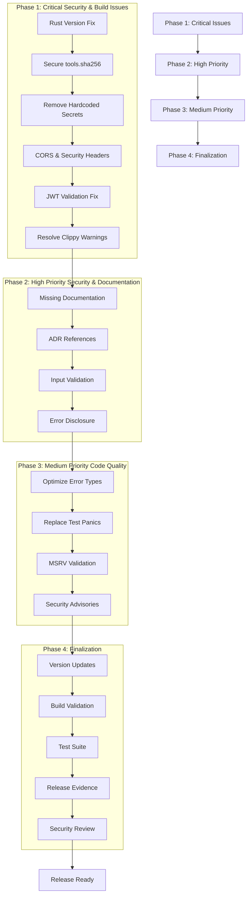
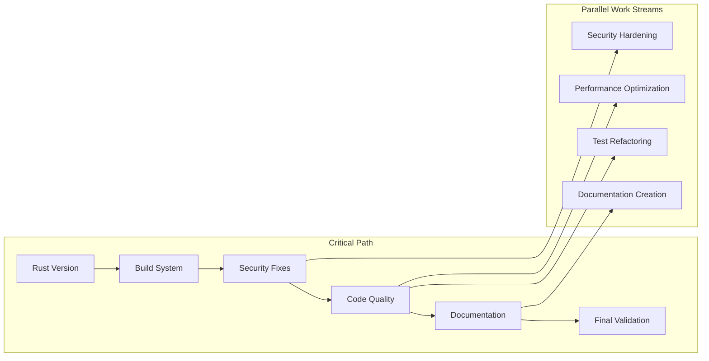
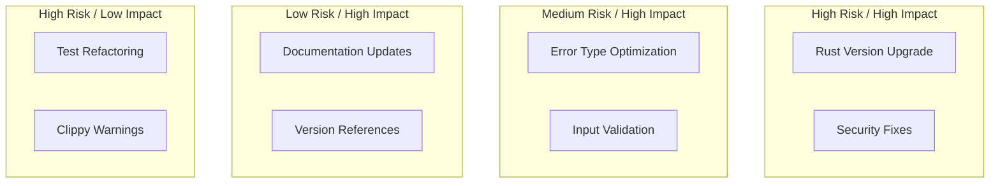
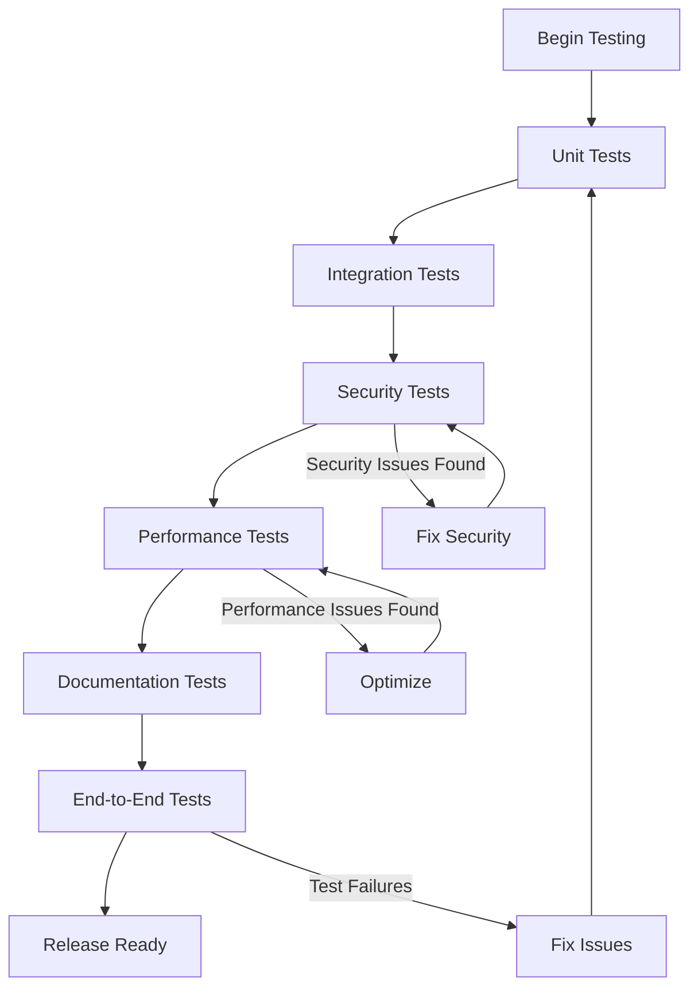
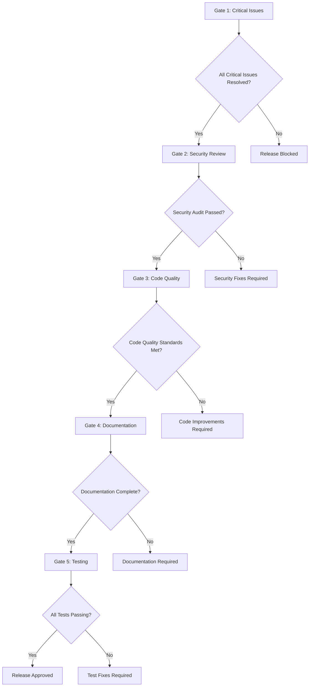

# Release Workflow Visualization

## Release Process Flow



## Dependency Relationships



## Risk Assessment Matrix



## Testing Strategy Flow



## Release Gates



## Implementation Timeline

```mermaid
gantt
    title Rust Template Release Timeline
    dateFormat  YYYY-MM-DD
    section Phase 1: Critical
    Rust Version Fix     :crit, 2025-01-01, 2d
    Security Fixes       :crit, 2025-01-03, 3d
    Build System         :crit, 2025-01-06, 2d

    section Phase 2: High Priority
    Documentation        :2025-01-08, 3d
    Input Validation     :2025-01-08, 2d
    Security Review      :2025-01-10, 2d

    section Phase 3: Medium Priority
    Code Quality         :2025-01-11, 3d
    Performance          :2025-01-11, 2d
    Test Refactoring     :2025-01-13, 2d

    section Phase 4: Finalization
    Final Testing        :crit, 2025-01-15, 2d
    Release Evidence     :2025-01-17, 1d
    Release              :crit, 2025-01-18, 1d
